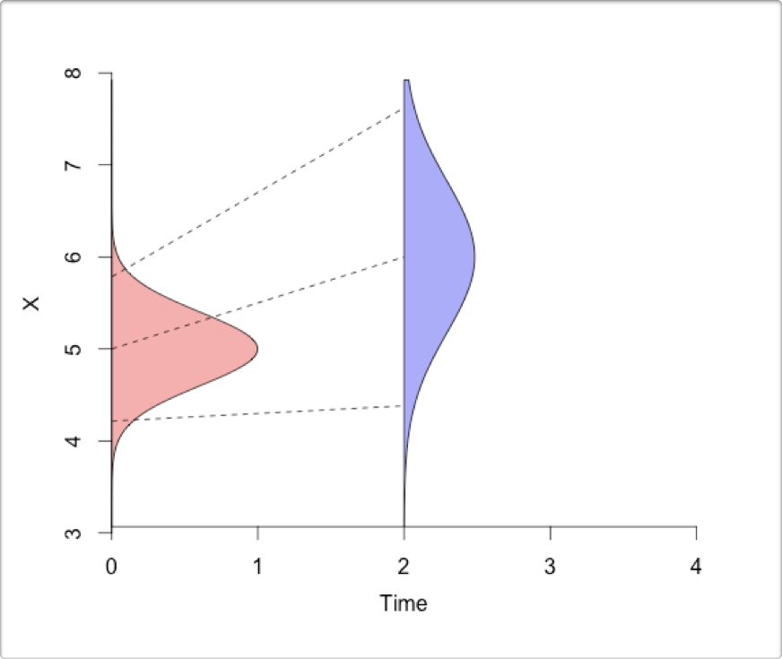
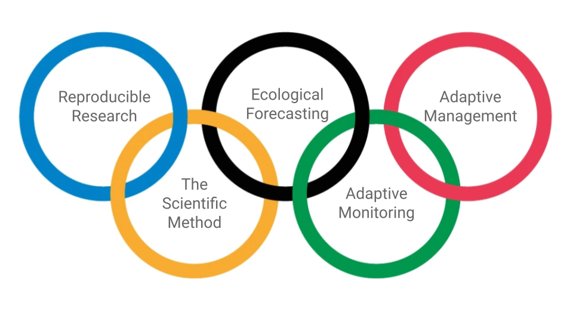

# Models and decision making {#models}

This section is also available as a slideshow hold `Ctrl` or `Command` and [click this link](presentations/1_Introduction.html) to view in full screen.

<div>

```{=html}
<iframe width="600" height="400" marginheight="0" marginwidth="0" src="presentations/1_Introduction.html"></iframe>
```

</div>

<br>

**What factors do you consider when making a decision?**

```{r, echo = F}
#knitr::include_url("https://docs.google.com/spreadsheets/d/e/1RxYCQaUkklkHyiAMPvktNsR5QhG7XhFtOBHZGn2-RIU/pubhtml?gid=665289068&amp")
```

<iframe src="https://docs.google.com/spreadsheets/d/1RxYCQaUkklkHyiAMPvktNsR5QhG7XhFtOBHZGn2-RIU/htmlembed/sheet?gid=665289068&range=B2:20" width="700" height="895" frameborder="0" marginheight="0" marginwidth="0"> </iframe>

<br>

## The basics of making a decision

Informing decisions typically requires knowing (or guessing at) something about the future. To this end, once a problem and the need to make a decision have been identified, the factors we consider when making that decision usually include:

* Evidence
* Experience
* Expectation
* Uncertainty

<br>

The relationship between these can be represented like so:

```{r decisions1, echo=FALSE, fig.cap = "The factors considered when making a decision.", fig.width=3, fig.align = 'center'}
knitr::include_graphics("img/decisions1.png")
```

<br>

Your decision is typically based on your **expectation of the outcome**. This expectation is based on **existing evidence** and/or **previous experience**. **Uncertainty** is a part of each step. There are a number of reasons why the existing evidence or previous experience may be imperfect for the decision at hand, leading to uncertainty in the expectations. There may also be uncertainty in the way in which you use the evidence and experience to develop your expectation. 

We'll come back to these sources of uncertainty later in the module, but needless to say, quantifying and understanding the uncertainty is crucial in any decision. **If uncertainty is high your expectation may be no better than random, and thus useless for informing your decision.** Quantifying uncertainty properly helps us circumvent two evils which could mislead decision makers: 

a) being **falsely overconfident** in our predictions (potentially leading to a "wrong" decision), or 
b) being **falsely uncertain** in our predictions (which would encourage overly conservative decisions/actions which may be wasteful or less effective). 

Lastly, ignoring or quantifying uncertainty incorrectly can lead to bias predictions.

<br>

## Getting quantitative

The nice thing about the framework above is that it is similar whether you are approaching the decision qualitatively or quantitatively (i.e. using models and data to inform your decision).

```{r decisions2, echo=FALSE, fig.cap = "Using models and data when making a decision.", fig.width=3, fig.align = 'center'}
knitr::include_graphics("img/decisions2.png")
```

<br>

Following a quantitative approach the **"evidence"** is typically empirical **data**, which can be fed into a model to make forecasts that can help inform the decision. The **"experience"** are the **current state of knowledge and your prior belief**, which you use to specify the type and structure of your model (or ensemble of models) and the scenario(s) you want to evaluate. The "experience" can also help you evaluate the assumptions of your model(s), and, if you are using a Bayesian model, can be included directly in the model when specifying your _prior beliefs_ (more on this later in the module).

```{r gettingquantitative, echo=F, message=F, fig.cap = "A hypothetical example where a model can help you make a decision. The **data** (points) are the **evidence**, while the **experience** or current state of knowledge are used to specify the model (a linear model in this case). Here the relationship between ***effort*** invested and ***reward*** is nearly 1 to 1, suggesting to the decision-maker that the more effort you invest, the more reward you will reap. That said, there is scatter around in the points around the 1:1 line, suggesting some **uncertainty**."}
library(tidyverse)
library(hrbrthemes)

dat <- data.frame(Reward = 2:21 + rnorm(20, mean = 0, sd = 2), Effort = 2:21 + rnorm(20, mean = 0, sd = 2))

dat %>%
  ggplot(aes(x=Effort, y=Reward)) +
    geom_point(shape=21, color="black", fill="#69b3a2", size=2) +
    theme_ipsum() +
  geom_smooth(method = "lm") +
  ylim(-2,30) +
  xlim(-2,30)

```

<br>

## Iterative decision-making

**Few decisions in natural resource management are once-off**, and most are made repeatedly at some time-step (e.g. daily, monthly, seasonally, annually, decadally, etc). Should you burn, cull, harvest, restore, etc? While one should always evaluate the outcome of your decision, this does not always happen... Evaluating the outcome is especially important when the decision will need to be repeated, so that you can **learn from experience**. 

<br>

```{r decisions3, echo=FALSE, fig.cap = "Iterative decision making.", fig.width=3, fig.align = 'center'}
knitr::include_graphics("img/decisions3.png")
```

<br>

When using quantitative forecasts this can be done by collecting new data and updating your prior knowledge by evaluating the outcomes of the decision against the original model forecasts. **This can tell you whether your forecast was any good and whether you need to refine or replace your model, consider additional scenarios or inputs, etc.** We'll discuss doing this quantitatively in section \@ref(datafusion), by fusing your new data and knowledge into a new forecast.

```{r iterativedecisions, echo=F, message=F, fig.cap = "Revisiting our *Effort to Reward* example, what would you do if the decision-maker decided to invest huge effort, but the next few data points looked like this?"}

dat <- bind_rows(dat, data.frame(Reward = 30:37 + rnorm(8, mean = 0, sd = 2), Effort = seq(30,65,5) + rnorm(8, mean = 0, sd = 2)))

dat %>%
  ggplot(aes(x=Effort, y=Reward)) +
    geom_point(shape=21, color="black", fill="#69b3a2", size=2) +
    theme_ipsum() +
  geom_abline(intercept = 0, slope = 1) +
  ylim(-2,40) +
  xlim(-2,70)

```

<!--Implementing this process quantitatively requires careful management of the data and workflow and would greatly benefit from automation (i.e. it needs to be _reproducible_).-->

<br>

## Iterative decision-making and the scientific method

It's worth highlighting the similarity between the iterative decision making cycle I've outlined in Figure \@ref(fig:decisions3) and ***the scientific method***, i.e.:

- _Observation > Hypothesis > Experiment > Analyze > Interpret > Report > (Repeat)_

<br>

```{r scimethod, echo=FALSE, fig.cap = "_The Scientific Method_ overlain on iterative decision making.", fig.width=3, fig.align = 'center'}
knitr::include_graphics("img/scimethod.png")
```

<br>

**So a focus on iterative decision-making facilitates iterative learning (i.e. scientific progress).**

<br>

## The importance of prediction in ecology

> _"prediction is the only way to demonstrate scientific understanding"_ [@Houlahan2017]

While this view may be slightly overstated, it is a very good point. **If we cannot make reasonably good predictions, we're missing something**. Unfortunately, prediction has not been a central focus in ecology, impeding progress in the improvement of our ecological understanding. 

In ecology we mostly  test  qualitative, imprecise hypotheses: _"Does X have an effect on Y?"_ rather than _"What is the relationship between X and Y?"_ or better yet _"What value would we expect Y to be, given a particular value of X?"_. **Without testing precise hypotheses and using the results to make _testable predictions_ we don't know if our findings are generalizable beyond the specific data set we collected.** If our results are not generalizable, then we're not really making progress towards a better understanding of ecology.

<br>

```{r prediction, echo=FALSE, fig.cap = "Prediction... from [xkcd.com/2370](https://xkcd.com/2370), used under a [CC-BY-NC 2.5 license](https://creativecommons.org/licenses/by-nc/2.5/).", fig.width=3, fig.align = 'center', out.width="75%"}
knitr::include_graphics("img/prediction.png")
```

<br>

**To make predictions we need models**, and **models provide structured summaries of our current ecological understanding** (conceptual or quantitative, but preferably quantitative, because these are easier to compare). Without making predictions and comparing the skill of new models to old ones, we can't track if we are making progress!

A key point here is that the _predictions must be testable_! We do use a lot of models in ecology, and even use them to make predictions (e.g. species distribution models (SDMs), dynamic vegetation models (DVMs), etc), but these predictions are typically 50+ years into the future, which is way to long to wait to see if our predictions were reasonable or useful.

<br>

> **A quick aside on model validation vs testing predictions:** 
Testing predictions with new data collected after you've made your predictions is the most robust way to validate a model, but you usually want to do some form of validation before you make your final predictions to make sure the model is working reasonably well. For this we most commonly do some form of cross-validation, whereby we split the data into a "training" subset (that we use for fitting (or training) the model) and a "test" subset (that we try to predict). If your model is no good at predicting your test data, there's probably no point in making predictions into the future...

<br>

## Iterative near-term ecological forecasting

The recent growth in interest in iterative ecological forecasting seeks to not only **make prediction a central focus in ecology**, but to do so **on a time scale that is both useful for decision makers and allows us to learn** from testing our predictions (days to decades). 

The **"gold standard"** here is an informatics pipeline that can ingest new data and **make new forecasts automatically** with minimal user input. This is a great initiative, but as we will see it poses a number of major challenges and requires a big improvement in quantitative skills in biology (hence this course...). Fortunately, as we will see during the module, any steps towards the gold standard is likely to be useful, even if you never get there.

Here I break down the individual components of ecological forecasting (using figures from a [lecture on data assimilation by Michael Dietze](https://www.dropbox.com/s/pqjozune75m7wl0/09_DataAssimilation.pptx?dl=0)):

1. You start with your initial conditions (data and knowledge that feeds into designing and fitting your model)

```{r initialconditions, echo=FALSE, fig.width=3, fig.align = 'center', out.width="70%"}
knitr::include_graphics("img/initialconditions.png")
```

2. You make forecasts (i.e. predictions into the future) using your model, based on your initial conditions.

```{r forecast, echo=FALSE, fig.width=3, fig.align = 'center', out.width="70%"}

```

3. You monitor and collect new observations to compare with your forecasts and original observations (i.e. initial conditions).

```{r newobservations, echo=FALSE, fig.width=3, fig.align = 'center', out.width="70%"}
knitr::include_graphics("img/newobservations.png")
```

4. Finally, you analyze the new observations in the context of your forecasts and original observations, and update the initial conditions for the next iteration of the forecast. 

```{r analyzeandupdate, echo=FALSE, fig.width=3, fig.align = 'center', out.width="70%"}
knitr::include_graphics("img/analyzeandupdate.png")
```

<br>

```{r ecoforecastingloop, echo=FALSE, fig.cap = "The iterative ecological forecasting cycle in the context of the scientific method, demonstrating how we stand to learn from making iterative forecasts. From [lecture on data assimilation by Michael Dietze](https://www.dropbox.com/s/pqjozune75m7wl0/09_DataAssimilation.pptx?dl=0). (Please excuse that the colours of the distributions have changed from above...).", fig.width=3, fig.align = 'center', out.width="70%"}
knitr::include_graphics("img/ecoforecastingloop.png")
```

<br>

The key steps are:

1. Make a **forecast** based on your current data and understanding
2. Collect new observations and **compare** them to your forecast
3. **Analyze** the new observations in the context of your forecast and original data
4. **Update** estimates of the current state of the system (data and understanding), before making a new forecast

Two things not indicated in this diagram are:

- that when making the forecast and analyzing the new observations you can learn about the various sources and drivers of **uncertainty** in your forecast and use that to **adapt or guide what and how to monitor** so that you can reduce those uncertainties
- developing this into an **automated** informatics pipeline is best done in a **reproducible research** framework

Iterative ecological forecasts are thus aimed at:

1. **applied** outcomes, through providing evidence to support **decision making**
2. **knowledge generation** through iterative learning i.e. **the scientific method**

So it's a great way of getting scientists to engage in real-world problems, demonstrating the value of our science, and **learning by doing**!

<br>

## Iterative ecological forecasting in context

The figure below from @Dietze2018 provides an expanded representation of these conceptual links between iterative ecological forecasting, the scientific method, and decision making (here in the context of _adaptive management_, which is a management paradigm that focuses on learning by doing).

<br>

```{r dietze2018F1, echo=FALSE, fig.cap = "Conceptual relationships between iterative ecological forecasting, adaptive decision-making, adaptive monitoring, and the scientific method cycles [@Dietze2018].", fig.width=3, fig.align = 'center'}
knitr::include_graphics("img/dietze2018_F1.jpg")
```

<br>

**The iterative ecological forecasting cycle is tightly aligned to the scientific method cycle:**

Hypotheses (A) are embedded in models (B). The models integrate over uncertainties in initial conditions (IC), inputs, and parameters to make probabilistic forecasts (the purple distributions, Fx, in step C), sometimes for multiple alternative scenarios. New observations are then compared with these predictions (D) to update estimates of the current state of the system (Analysis) and assess model performance (E), allowing for the selection among alternative model hypotheses (Test and Refine). 

<br>

**The iterative forecasting cycle also feeds into adaptive management and monitoring:**

In **Adaptive Management** and decision analysis, alternative decision scenarios are generated (2) based on an assessment of a problem (1). These decision scenarios are typically used to define the scenarios (or boundary conditions) for which models are run ("Scenarios" arrow), but can also feed into scientific hypotheses (not shown). Forecasts (Fx) are key in assessing the trade-offs and relative merits between alternative decision options (3). The decision(s) taken (4) determine the monitoring requirements (5), which allow us to evaluate the outcomes and reassess the problem (1), and start the adaptive management cycle again. 

Note that the iterative forecast cycle is also useful for adaptive management in that the analysis and partitioning of forecast uncertainties (from step C) can provide further guidance on what and how to monitor, so as to optimize the reduction in model uncertainties. This represents **Adaptive Monitoring** (dashed line) and is a cycle of itself [@Lindenmayer2009], but is largely subsumed by the other cycles here so we won't go into it any further here. Thus the iterative cycles of science, forecasting, management and monitoring are tightly intertwined and can interact continuously.

<br>

## Reproducible research

What isn't clear from Figure \@ref(fig:dietze2018F1) is that all of this needs to be founded on a **highly efficient informatics pipeline that is robust and rapidly updateable**. Since the emphasis here is on _near-term_ forecasts to inform management, if the process of adding new data and updating the forecasts is too slow, the value of the forecasts is lost. 

As we'll see in future lectures, the best way to build a highly efficient informatics pipeline is to follow **reproducible research** principles (section \@ref(reproducibility)), including good (and rapid) **data management** (section \@ref(data)). Adding this link to Figure \@ref(fig:dietze2018F1) helps to highlight what I like to think of as _"The Olympian Challenge of data-driven ecological decision making"_.
 
<br>

```{r olympiangoal, echo=FALSE, fig.cap = "The Olympian Challenge of data-driven ecological decision making.", fig.width=3, fig.align = 'center'}

```

<br>

Working reproducibly requires learning a lot of skills and can take a lot of effort, but is well worth it beyond it's utility for ecological forecasting - for you as an individual, and for science in general. This is why I decided to make it part of the title for the module and the focus of at least two lectures and the practical.

<br>

