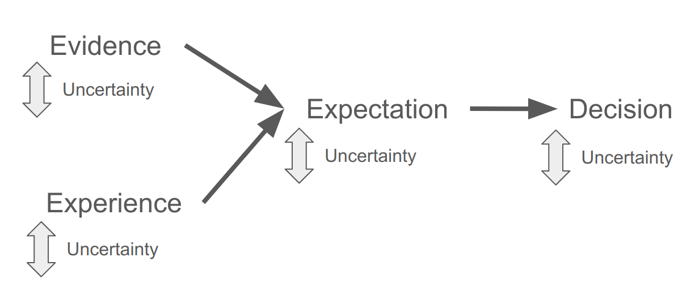
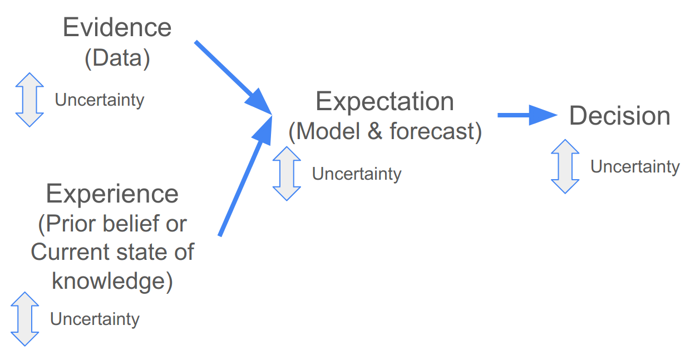

# Models and decision making {#intro}

## The basics of making a decision

Informing decisions typically requires knowing (or guessing at) something about the future. To this end, once a problem and the need to make a decision have been identified, the factors we consider when making that decision usually include:

* Evidence
* Experience
* Expectation
* Uncertainty

<br>

The relationship between these can be represented like so:

```{r decisions1, echo=FALSE, fig.cap = "The factors considered when making a decision.", fig.width=3, fig.align = 'center'}

```

<br>

Your decision is typically based on your expectation of the outcome. This expectation is based on existing evidence and/or previous experience. Uncertainty is a part of each step. There are a number of reasons why the existing evidence or previous experience may be imperfect for the decision at hand, leading to uncertainty in the expectations. There may also be uncertainty in the way in which you use the evidence and experience to develop your expectation. We will come back to these sources of uncertainty later in the module, but needless to say, quantifying and understanding the uncertainty is crucial in any decision, because if uncertainty is high your expectation may be no better than random, and thus useless for informing your decision.

<br>

## Getting quantitative

The nice thing about the framework above is that it is similar whether you are approaching the decision qualitatively or quantitatively (i.e. using models and data to inform your decision).

```{r decisions2, echo=FALSE, fig.cap = "Using models and data when making a decision.", fig.width=3, fig.align = 'center'}

```

<br>

Following a quantitative approach the "evidence" is typically empirical data, which can be fed into a model to make forecasts that can help inform the decision. The "experience" are the current state of knowledge and your prior belief, which you use to specify the type and structure of your model (or ensemble of models) and the scenario(s) you want to evaluate. The "experience" can also help you evaluate the assumptions of your model(s), and if you are using a Bayesian model, can be included directly in the model when specifying _priors_ (more on this later in the module).

<br>

## Iterative decision-making

Few decisions in natural resource management are once-off, and most are made repeatedly at some time-step (e.g. daily, monthly, seasonally, annually, decadally, etc). Should you burn, cull, harvest, restore, etc? While one should always evaluate the outcome of your decision, this is especially important when the decision will need to be repeated. 

<br>

```{r decisions3, echo=FALSE, fig.cap = "Iterative decision making.", fig.width=3, fig.align = 'center'}
knitr::include_graphics("img/decisions3.png")
```

<br>

When using quantitative forecasts this can be done by collecting and adding new data, and by updating your prior knowledge by evaluating the outcomes of the decision against the original model forecasts. This can tell you whether your forecast was any good and whether you need to refine or replace your model, consider additional scenarios or inputs, etc. 

Implementing this process quantitatively requires careful management of the data and workflow and would greatly benefit from automation (i.e. it needs to be _reproducible_ and _repeatable_).


## Delete from here once done... - How to reference


<br>

You can label chapter and section titles using `{#label}` after them, e.g., we can reference Chapter \@ref(intro). If you do not manually label them, there will be automatic labels anyway, e.g., Chapter \@ref(methods).

Figures and tables with captions will be placed in `figure` and `table` environments, respectively.

```{r nice-fig, fig.cap='Here is a nice figure!', out.width='80%', fig.asp=.75, fig.align='center'}
par(mar = c(4, 4, .1, .1))
plot(pressure, type = 'b', pch = 19)
```

Reference a figure by its code chunk label with the `fig:` prefix, e.g., see Figure \@ref(fig:nice-fig). Similarly, you can reference tables generated from `knitr::kable()`, e.g., see Table \@ref(tab:nice-tab).

```{r nice-tab, tidy=FALSE}
knitr::kable(
  head(iris, 20), caption = 'Here is a nice table!',
  booktabs = TRUE
)
```

You can write citations, too. For example, we are using the **bookdown** package [@R-bookdown] in this sample book, which was built on top of R Markdown and **knitr** [@xie2015].
