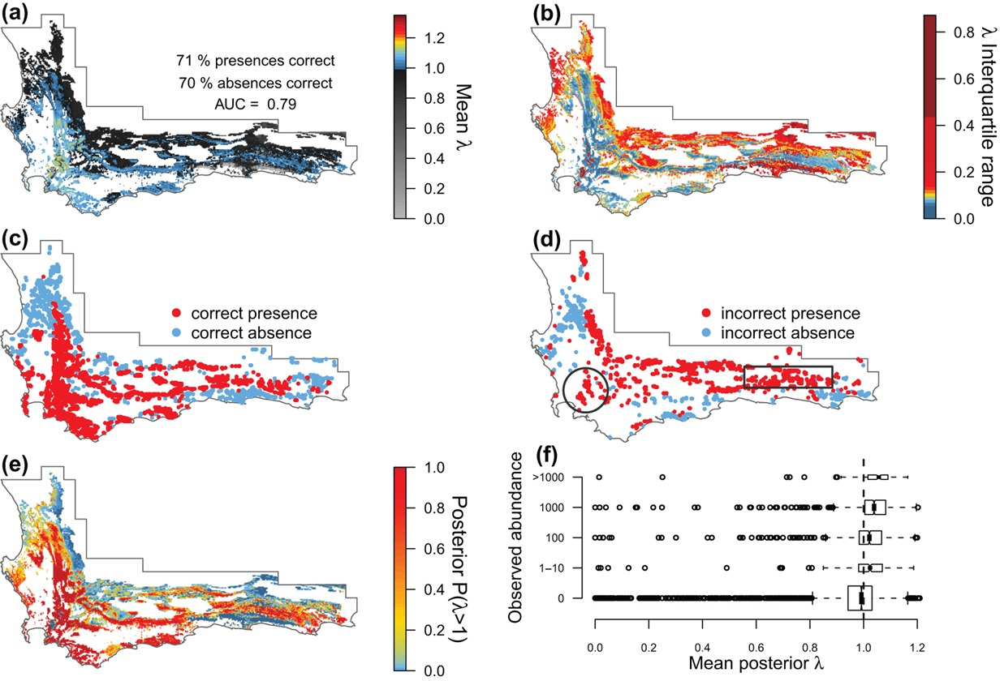

# Making forecasts {#forecasts}

This section is also available as a slideshow below or [full screen](presentations/2_makingforecasts.html){target="_blank"}.

<div>

```{=html}
<iframe width="600" height="400" marginheight="0" marginwidth="0" src="presentations/2_makingforecasts.html"></iframe>
```

</div>

<br>

You're probably wondering _"What are ecological forecasts?"_ or _"Where are we going with all this?"_ The focus of this section is to provide some context.

Firstly, there's a long list of existing (or in development) ecological forecasting projects on the [Ecological Forecasting Initiative's website](https://ecoforecast.org/member-forecasting-profiles/) that you can peruse. These include diverse forecasts for (_inter alia_):

- species population sizes
- plant or ecosystem phenology
- land cover change
- tree/forest die-off
- carbon stocks and sequestration rates
- water quality
- disease spread/risk
- fishing quotas
- risk of bycatch of species of concern
- risk of shipping collisions with whales
- risk of harmful algal blooms
- etc

For the rest of this section, I'm going to focus on an example of what I believe is one forecasting need and opportunity in the Fynbos Biome. I was going to give 3 examples, but rapidly realized it would be too long a lecture. I'll be using the other examples to illustrate various principles in later lectures, but hopefully this example will provide some practical context for some of the issues we'll address in the rest of the module.

> **Note:** This example has not yet been developed into full _near-term iterative ecological forecast_ sensu Dietze et al (2018). I also don't think they necessarily have to get all the way there to be useful. Think of it as an "ecological forecasting spectrum" where the gold standard is fully developed and automated near-term iterative ecological forecasts.

<br>

```{r dietze2018F1F, echo=FALSE, fig.cap = "Conceptual relationships between iterative ecological forecasting, adaptive decision-making, adaptive monitoring, and the scientific method cycles [@Dietze2018].", fig.width=3, fig.align = 'center'}
knitr::include_graphics("img/dietze2018_F1.jpg")
```

<br>

I'll start with a reminder that the goal here is to focus the forecasting effort on an **applied real-world problem** and to do so in a manner that allows us to **learn and improve our scientific understanding** of the system.

<br>

```{r proteacynaroides, echo=FALSE, fig.cap = "", fig.width=3, fig.align = 'center', out.width="90%"}
knitr::include_graphics("img/cynaroideslive.jpg")
```

## Proteaceae as model organisms

The Proteaceae are probably the **best studied and understood plant family in the Fynbos Biome**. They have been the focus of a number of large, focused research programmes and are used as indicator species for various conservation management applications. There has been **extensive locality and demographic data** have been collected by conservation authorities (CapeNature and SANParks), citizen scientists (Protea Atlas Project and iNaturalist) and researchers since the late 1970s and before, and this is reflected in the large (and growing) scientific literature on the family.

<br>

```{r protearesearch, echo=FALSE, fig.cap = "Temporal dynamics of publications on South African Proteaceae based on a Web of Science search on 13 June 2012. Figure from @Schurr2012.", fig.width=3, fig.align = 'center', out.width="90%"}
knitr::include_graphics("img/protearesearch.png")
```

<br>

A huge benefit of the herculean Proteaceae data collection (and management) effort is that it provides **the data we need to parameterize various types of models**. In fact, data on the Proteaceae have been hugely important for the global development of species distribution and demographic models (see @Schurr2012, but also many subsequent papers).

Because they are the best-studied group of plants in the Fynbos, they are heavily-utilized for informing conservation planning, management and monitoring. Some examples include informing:

- protected area planning
- wildfire management
- wildflower harvesting
- climate change vulnerability assessment and monitoring
- I'm sure there are others I've forgotten...

<br>

## Proteaceae as management indicators

Our knowledge of Proteaceae demography is used for management of Fynbos in two ways:

1. At the _species level_, for setting guidelines for **sustainable wild harvesting** of their inflorescences
2. At the _ecosystem level_, to help determine **acceptable fire return intervals**

<br>

**A quick refresher on Proteaceae life cycles and demography:**

```{r proteacones, echo=FALSE, fig.cap = "*Protea cynaroides* on Table Mountain showing current inflorescences and older (grey), closed 'cones' that protect seeds from fire and release them into the post-fire environment.", fig.width=3, fig.align = 'center', out.width="80%"}
knitr::include_graphics("img/proteacones.jpeg")
```

<br>

```{r proteaharvesting, echo=FALSE, fig.cap = "The fire-driven life-cycle of Fynbos Proteaceae species, including harvesting, taken from [@Treurnicht2021]. Population size/stability are determined by ***key demographic rates*** of adult **fecundity** (size of the canopy seed bank), post-fire seedling **recruitment** and adult fire **survival** (blue–grey boxes). These rates are affected in various ways by environmental conditions, life-history traits, density dependence, the timing, intensity and severity of fire, wildflower harvesting, etc", fig.width=3, fig.align = 'center', out.width="90%"}
knitr::include_graphics("img/proteaharvesting.jpg")
```

<br>

The management guidelines are currently set by "rule of thumb"^[https://en.wikipedia.org/wiki/Rule_of_thumb]:

> 1. **Wildflower harvesting:** _"[There should be no] harvesting until at least 50% of the population had commenced flowering, a harvest of up to 50% of current season flower heads after this stage, and no harvesting at least one year prior to a prescribed burn" [@vanWilgen2016]_
> 2. **Fire return intervals:** _"No fire should be permitted in fynbos until at least 50% of the population of the slowest-maturing species in an area have flowered for at least three successive seasons (or at least 90% of the individuals of the slowest maturing species in the area have flowered and produced seed). Similarly, a fire is probably not necessary unless a third or more of the plants of these slow-maturing species are senescent (i.e. dying or no longer producing flowers and seed)." [@CapeNatureFire]_

<br>

Both these rules are based on the **premise that maintaining seed banks is the key to the persistence of Proteaceae populations**. i.e. that there is a large enough seed bank present when a fire occurs for the population to recover.

But is focusing on seeds alone reasonable? And if so, do the thresholds in the guidelines allow for enough seed?

<br>

## Potential issues with the rules of thumb...

Figure \@ref(fig:protearates) presents extensive field data for 26 Proteaceae species from @Treurnicht2016. 

What issues might these data suggest for the rules of thumb?

<br>

```{r protearates, echo=FALSE, fig.cap = "Variation in demographic rates of 26 serotinous Proteaceae species of seeder and sprouter life-history types across their distribution range [@Treurnicht2016]. (a) Adult fire survival; (b) Individual fecundity (F); and (c) Per-capita recruitment rate (R).", fig.width=3, fig.align = 'center', out.width="100%"}
knitr::include_graphics("img/protearates.jpg")
```

<br>

These issues include:

- **species differ in their reliance on seed** for their survival (e.g. sprouters vs seeders)
  - sprouters have high persistence of adults through fires and need fewer new recruits from seed
  - seeder adults are killed by fire, so populations depend entirely on recruitment from seed
- **species vary in their fecundity** (total number of seeds)
  - fecundity = number of inflorescences produced multiplied by the number of seeds per inflorescence
- **species vary in seed viability and recruitment success**
  - viability depends on pathogens, seed predators and other factors - many linked to the age of the seed or inflorescence
  - seed-specific recruitment depends on viability and seed properties (size etc), conditions during the establishment phase (rainfall etc), finding suitable microsites, etc.
  - per-capita recruitment is the combination of fecundity and seed-specific recruitment

<br>

Figure \@ref(fig:proteavariation) present variation within one species that suggests more issues...

```{r proteavariation, echo=FALSE, fig.cap = "Intraspecific variation in (a) fecundity and (b) recruitment in response to range-wide variation in fire return interval (time since fire), adult population density and soil moisture stress (% days with soil moisture stress) for *Protea punctata* [@Treurnicht2016].", fig.width=3, fig.align = 'center', out.width="80%"}
knitr::include_graphics("img/proteavariation.jpg")
```

<br>

- there is also **intraspecific variation** in fecundity and recruitment along climatic, soil, fire regime, population density, pollinator availability and other gradients
- and there is **interspecific variation** in this intraspecific variation 
  - i.e. species vary among populations in their response to climatic, soil, pollinator availability and other gradients

<br>

## Assessing population viability

Fortunately, we can address these issues by using the data in demographic models to perform population viability analysis under varying harvesting rates [e.g. @Treurnicht2021]. 

```{r, echo=FALSE}
knitr::include_graphics("img/proteasensitivity.jpg")
```

```{r proteasensitivity, echo=FALSE, fig.cap = "Sensitivity to wildflower harvesting for various Proteaceae species [@Treurnicht2021]. **Above: Intraspecific variation in sensitivity** to harvesting depicted as maps for four different species with pink dots highlighting where the change in population-level extinction probability (the difference between extinction probabilities under 0% and 50% harvesting) is greater than 0.1. The white and black areas depict species-specific occurrence records and the geographical distribution of all Proteaceae in the Cape Floristic Region, respectively. **Below: Interspecific variation in sensitivity** to harvesting depicted as the proportion of populations per species that are highly vulnerable to harvesting.", fig.width=3, fig.align = 'center', out.width="90%"}
knitr::include_graphics("img/proteasensitivity2.jpg")
```

<br>

These models suggest that following **the current harvesting guidelines can greatly increase the probability of many populations going extinct** (Figure \@ref(fig:proteasensitivity); @Treurnicht2021), and that they would threaten a large portion of populations for some species, including the most commercially valuable ones!

**But is that enough?** So what should the harvesting guidelines be? Are we sure they would be effective and what if there are "ecological surprises" that make them inappropriate? For example, @Treurnicht2021 did not consider changing climate or fire regimes? 

Should we just **ban wildflower harvesting** altogether to be safe? While it isn't a huge industry, a ban would be undesirable for a number of reasons:

- many **livelihoods depend on wildflower harvesting**, often among the very poor
- while some species are targeted and may decline as a result, at least it's still Fynbos. Removing the option to earn from that land would **risk forcing the landowner to consider more destructive land use** activities or potentially convert it to other land cover types
- while some species may struggle under the existing guidelines, **some species are largely unaffected** and can quite happily be harvested

What we really need is **ongoing monitoring and updated forecasts** that respond and adjust the guidelines to allow sustainable harvesting while not threatening the species. Ideally, these forecasts would **include the impacts of changing climate and fire**.

<br>

## Climate and fire-driven changes in demographic rates and distribution

@Merow2014 combined demographic modelling and species distribution modelling using a **"Demographic Distribution Model"** whereby they used spatial covariation between demographic rates and environmental conditions to infer **where the species can maintain positive population growth rates** under current and future climate and fire conditions.

> **Interesting side note**: This analysis used _integral projection models_ (IPMs), which you can think of as the "next generation" of the Leslie matrix model that you will encounter in Res Altwegg's lectures. In IPMs the state variable is size (not age) and there are far more classes (i.e. rows and columns in the "matrix"). The (very oversimplified explanation of) the advantage of this is that you can build regression models for the vital rates as a function of plant size and environmental parameters and then relate those back to your transition matrix. This allows you to explore the effect of spatial covariates (climate, soil, fire, etc) on demographic rates, which would be very difficult to do if you only had a few size classes. This also allow you to make projections for different conditions, allowing you to explore the effects of climate change, altered fire regimes, etc.

<br>

```{r merow2014vitalrates, echo=FALSE, fig.cap = "Estimated vital rates of _Protea repens_ across the CFR. Figure from @Merow2014.", fig.width=3, fig.align = 'center', out.width="80%"}
knitr::include_graphics("img/merow2014vitalrates.jpg")
```

<br>

First, they modeled the species' **individual vital rates** as a function of environmental variation across its range (Figure \@ref(fig:merow2014vitalrates)).

Then they combined them to **estimate the population growth rates $\lambda$ per pixel**, providing an indication of where the population should remain stable or increase ($\lambda>1$) or decline and go extinct ($\lambda<1$). This was used as a **threshold to map the species' distribution** (Figure \@ref(fig:merow2014lambda)).

<br>

```{r merow2014lambda, echo=FALSE, fig.cap = "Model evaluation of the predicted population growth rate ($\\lambda$) and distribution of _Protea repens_ across the CFR. (a) Mean $\\lambda$ and (b) interquartile range of $\\lambda$. (c–d) Evaluation of (a) using presence/absence data. (e) Posterior probability that $\\lambda$ > 1, representing a viable population. (f) Evaluation of (a) using ordinal abundance data. Figure from @Merow2014.", fig.width=3, fig.align = 'center', out.width="90%"}

```

<br>

Once they'd done this validation and established that the model worked reasonably well they were able to do projections under altered fire regimes or climate conditions (Figure \@ref(fig:merow2014projections)).

<br>

```{r merow2014projections, echo=FALSE, fig.cap = "Projections of the change in population growth rates of _Protea repens_ under different scenarios. (a–b) Reducing (increasing) the observed fire return time by 4 yr. (c) Variation of mean population growth rate as a function of fire return time. The horizontal dashed line indicates where the growth rate = 1. (d) The difference between present day predictions and projections under future climate change scenario with temperature increased by 1 degree and precipitation reduced by 10%. Figure from @Merow2014.", fig.width=3, fig.align = 'center', out.width="90%"}
knitr::include_graphics("img/merow2014projections.jpg")
```

<br>

There's a lot of interesting spatial variation in the species' expected response to changing conditions! The beauty of this analysis is that it:

a. can tell us where we are most likely to see a negative response - **guiding where to monitor**
b. can break that response down into its **component vital rates** - i.e. growth, seed production (fecundity), survival, etc - which are all things that are relatively easy to monitor!
c. can easily include or be used to **derive sustainable harvesting rates**

<br>

## Near-term iterative ecological forecasts?

So we have the initial data and models required to be **able to monitor and forecast multiple Proteaceae species responses to harvesting, wildfire and changing climatic conditions**.

While the work by @Merow2014, @Treurnicht2021 and others represent ecological forecasts, they currently **aren't iterative**, so we are missing the opportunity to learn and refine the models. This also means that we're not feeding up-to-date information to planners and decision makers.

What do we need to do to develop them into *near-term iterative ecological forecasts*?

<br>

```{r ecoforecastingloop2, echo=FALSE, fig.cap = "The iterative ecological forecasting cycle in the context of the scientific method, demonstrating how we stand to learn from making iterative forecasts. From [lecture on data assimilation by Michael Dietze](https://www.dropbox.com/s/pqjozune75m7wl0/09_DataAssimilation.pptx?dl=0). (Please excuse that the colours of the distributions have changed from above...).", fig.width=3, fig.align = 'center', out.width="70%"}
knitr::include_graphics("img/ecoforecastingloop.png")
```

<br>

**Firstly,** they are either not specific about when they are forecasting to (e.g. @Treurnicht2021 ran their models to estimate extinction probabilities over 100 years in response to different harvesting regimes), or they are too far into the future to be amenable to iterative assessment, learning and updating (e.g. @Merow2014 project to 2050). We need to make the forecasts **near-term**, such as a range of scenarios 5-10 years into the future, or 1-2 years into the next fire cycle.

**Secondly,** while various parties hold various datasets, we need to **coordinate data collection** among citizen scientists, conservation authorities, scientists, etc and **centralize data management** so that it can feed data back into the modelling workflow.

**Thirdly,** we need to adapt the models and workflow to be able to **ingest and assimilate new data** and produce new **forecasts automatically**.

**Lastly,** we need to make sure that the models adequately **characterize and propagate uncertainty** throughout the analyses so that we can indicate the uncertainty to the decision maker, and so we can focus data collection and model development to reduce the uncertainty in forecasts. Fortunately, the models are built in a **Bayesian framework** and already do a pretty good job of handling uncertainty.

Clearly, while huge effort has been invested into the demography of Proteaceae, and they are likely to be **one of the lowest hanging fruit for development into near-term iterative ecological forecasts**, there is a lot more work to be done! Still, the history of productive research on Proteaceae shows it would clearly be worth the effort, and we already have decades of data that allow us to learn by backcasting or forecasting from old to more recently collected data. Even if early forecasts are woefully wrong, they will help us learn and improve.

Once the **informatics pipeline** is developed, we could start adding **other species** - e.g. restios, ericas, animals, etc. This is important because the fire requirements for Proteaceae are not necessarily representative of all Fynbos species...

> "The need to start forecasting is now; the time for making ecology more predictive is here, and learning by doing is the fastest route to drive the science forward." - @Dietze2018

<br>
