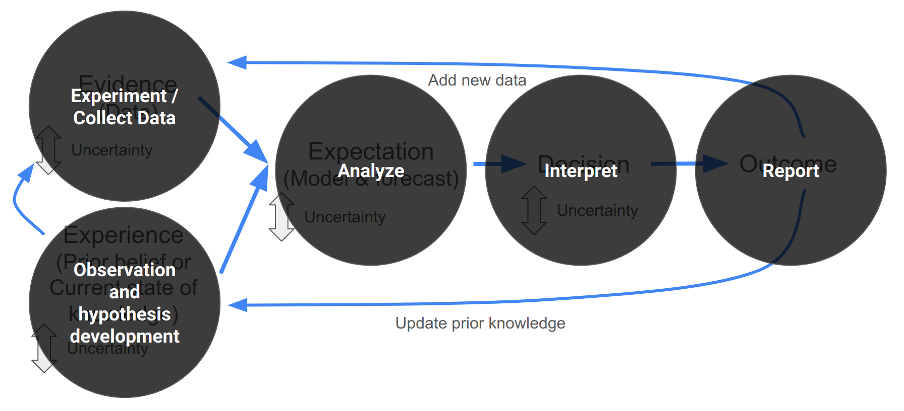

# Reproducible research

Before we continue, it's worth highlighting the similarity between the iterative decision making cycle I've outlined in figure \@ref(fig:decisions3) and _the scientific method_, i.e.:

- _Observation > Hypothesis > Experiment > Analyze > Interpret > Report > (Repeat)_

```{r scimethod, echo=FALSE, fig.cap = "_The Scientific Method_ overlain on iterative decision making.", fig.width=3, fig.align = 'center'}

```

<br>

It's also worth noting that _reproducibility is one of the fundamental tenets of science_. In other words, published research should be robust enough and the methods described in enough detail that anyone else should be able to repeat the study (using the publication only) and find similar results. Sadly, this is rarely the case!!!

<br>

## The Reproducibility Crisis

Bits from Peng 2011 (some is direct text, forgotten which - edit)
Replication is the ultimate standard by which scientific claims are judged. 

With replication,independent investigators address a scientific hypothesis and build up evidence for or against it. The scien-tific community’s“culture of replica-tion”has served to quickly weed outspurious claims and enforce on thecommunity a disciplined approach toscientific discovery.

Reproducibility falls short of full replication because the same data are analyzed again, rather than analyzing independently collected data. 

reproducibility helps us:
- track down errors
- build on previous findings and analyses

Barriers to reproducibility:
- Access to data
- Access to the computational workflow


[More on the reproducibility crisis...]

[Working reproducibly and Peng et al. 2011 figure.]

Working reproducibly is clearly not just a requirement for using quantitative approaches in iterative decision-making, it is central to scientific progress!!!

<br>

## Scientific Workflows

```{r xkcd_data_pipeline, echo=FALSE, fig.cap = "", fig.width=3, fig.align = 'center'}
knitr::include_graphics("img/xkcd_data_pipeline_2x.png")
```

<br>

## The Data Life Cycle

### Why you need to manage your data

- loss (Michener "data decay curve" fig)
- future self (lose it before ou're finished with it)
- value to yourself for sharing, credit etc (publications and citations), 
- science on general (esp long-term ecology in a time of global change)
- Transparency and accountability

### The steps involved in data management

```{r data_life_cycle, echo=FALSE, fig.cap = "The Data Life Cycle, adapted from https://www.dataone.org/", fig.width=6, fig.align = 'center'}
# load library
library(ggplot2)

# Create test data.
data <- data.frame(
  category=c("1.Plan", "2.Collect", "3.Assure", "4.Describe", "5.Preserve", "6.Discover", "7.Integrate", "8.Analyze"),
  count=rep(12.5, 8)
)
 
# Compute percentages
data$fraction <- data$count / sum(data$count)

# Compute the cumulative percentages (top of each rectangle)
data$ymax <- cumsum(data$fraction)

# Compute the bottom of each rectangle
data$ymin <- c(0, head(data$ymax, n=-1))

# Compute label position
data$labelPosition <- (data$ymax + data$ymin) / 2

# Compute a good label
data$label <- paste0(data$category, "\n value: ", data$count)

# Make the plot
ggplot(data, aes(ymax=ymax, ymin=ymin, xmax=4, xmin=3, fill=category)) +
  geom_rect() +
  geom_text(x=3.5, aes(y=labelPosition, label=category, color=category)) + # x here controls label position (inner / outer)
  scale_fill_brewer(palette="Blues") +
  scale_color_brewer(palette="Blues", direction = -1) +
  coord_polar(theta="y") +
  xlim(c(2, 4.5)) +
  theme_void() +
  theme(legend.position = "none")
```


#### Plan (DMPs)

#### Create

#### Process

#### Document and use

#### Share and preserve

#### Reuse

<br>
