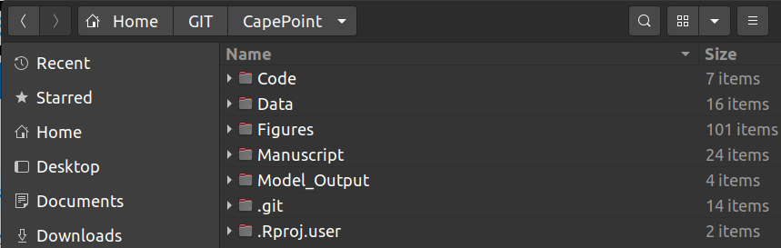
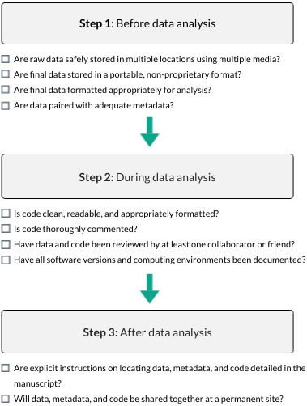

# Reproducible research {#reproducibility}

## The Reproducibility Crisis

> _"**Replication** is the ultimate standard by which scientific claims are judged."_ [@Peng2011]

_Replication is one of the fundamental tenets of science_ and if the results of a study or experiment cannot by replicated by an independent set of investigators then whatever scientific claims were made should be treated with caution! At best, it suggests that evidence for the claim is weak or mixed, or specific to particular ecosystems or other circumstances and cannot be generalized. At worst, there was error (or even dishonesty) in the original study and the claims were plainly false.

In other words, published research should be robust enough and the methods described in enough detail that anyone else should be able to repeat the study (using the publication only) and find similar results. Sadly, this is rarely the case!!!

```{r reprocrisis, echo=FALSE, fig.cap = "'Is there a reproducibility* crisis?' Results from a survey of >1500 top scientists [@Baker2016; @Penny2016]. *Note that they did not discern between reproducibility and replicability, and that the terms are often used interchangeably.", fig.width=6, fig.align = 'center', warning = F, message = F, out.width="125%"}
# load library
library(tidyverse)

# Get Baker data.
cridata <- read_delim("/home/jasper/GIT/BIO3019S_Ecoforecasting/data/Reproducibilitysurveyrawdata20160523.txt", delim = "\t")

#20 (is there a crisis)
names(cridata)[20] <- "Crisis"

cridata <- cridata %>% group_by(Crisis) %>% summarize(count = n()) %>%na.omit()

cridata$Crisis <- c("7% \n I don't know", "52% \n Significant crisis", "Slight crisis \n 38%", "No crisis \n 3%")

cridata$Crisis <- factor(cridata$Crisis, levels = c("52% \n Significant crisis", "No crisis \n 3%", "7% \n I don't know", "Slight crisis \n 38%"))

# Compute percentages
cridata$fraction <- cridata$count / sum(cridata$count)

# Compute the cumulative percentages (top of each rectangle)
cridata$ymax <- cumsum(cridata$fraction)

# Compute the bottom of each rectangle
cridata$ymin <- c(0, head(cridata$ymax, n=-1))

# Compute label position
cridata$labelPosition <- (cridata$ymax + cridata$ymin) / 2

# # Compute a good label
# data$label <- paste0(data$category, "\n value: ", data$count)
# 
# Make the plot
ggplot(cridata, aes(ymax=ymax, ymin=ymin, xmax=4, xmin=3, fill=Crisis)) +
  geom_rect() +
  geom_text(x=4.6, aes(y=labelPosition, label=Crisis, color=Crisis)) + # x here controls label position (inner / outer)
  scale_fill_brewer(palette="Set1", direction = 1) +
  scale_color_brewer(palette="Set1", direction = 1) +
  coord_polar(theta="y") +
  xlim(c(2, 4.5)) +
  theme_void() +
  theme(legend.position = "none")
```

<br>

We have a problem...

Since we're failing the [gentleman's agreement](https://en.wikipedia.org/wiki/Gentlemen%27s_agreement)^[I know many may find the use of this term offensive. In fact, I have used it here because that offense highlights my point. "Gentlemen's agreements" have been used for nefarious purposes since the dawn of time should have no place in science as we strive to make the discipline more transparent, open and inclusive.] that we'll describe our methods in enough detail that anyone else should be able to repeat the study (using the publication only) and find similar results, modern scientists are trying to formalize the process in the form of ***Reproducible Research***. Reproducible research makes use of modern software tools to share data, code and other resources required to allow others to reproduce the same result as the original study, thus making all analyses open and transparent.

As you will learn in this module, working reproducibly is not just a requirement for using quantitative approaches in iterative decision-making, it is central to scientific progress!!!

While full replication is a huge challenge (and sometimes impossible) to achieve, it is something all scientists should be working towards.

<br>

## Replication and the Reproducibility Spectrum

Understandably, some studies may not be entirely replicable purely due to the nature of the data or phenomenon (e.g. rare phenomena, long term records, loss of species or ecosystems, or very expensive once-off science projects like space missions). In these cases the "gold standard" of full replication (from new data collection to results) cannot be achieved, and we have to settle for a lower rung on the reproducibility spectrum (Figure \@ref(fig:peng)).

<br>

```{r peng, echo=FALSE, fig.cap = "The Reproducibility Spectrum [@Peng2011].", fig.width=3, fig.align = 'center'}
knitr::include_graphics("img/peng_reproducibility.jpg")
```

<br>

**Reproducibility** falls short of full **replication** because it focuses on reproducing the same result _from the same data set_, rather than analyzing independently collected data. While this may seem trivial, you'd be surprised at how few studies are even reproducible, let alone replicable.

<br>

## Why work reproducibly?

```{r miracle, echo=FALSE, fig.cap = "Let's start being more specific about our miracles... Cartoon &copy; Sidney Harris. Used with permission [ScienceCartoonsPlus.com](www.ScienceCartoonsPlus.com)", fig.width=6, fig.align = 'center', out.width="150%"}
knitr::include_graphics("img/miracle.jpg")
```

<br>

***In addition to basic scientific rigour, working reproducibly is hugely valuable, because:***

(Adapted from "Five selfish reasons to work reproducibly" [@Markowetz2015])

1. _**It helps us avoid mistakes and/or track down errors in analyses**_
- This is what highlighted the importance of working reproducibly for me. In 2017 I published the first evidence of observed climate change impacts on biodiversity in the Fynbos Biome [@Slingsby2017]. The analyses were quite complicated, and when working on the revisions I found an error in my R code. Fortunately, it didn't change the results qualitatively, but it made me realize how easy it is to make a mistake and potentially put the wrong message out there! This encouraged me to make all data and R code from the paper available, so that anyone is free to check my data and analyses and let me (and/or the world) know if they find any errors.
2. _**It makes it easier to write papers**_
- e.g. Dynamic documents like RMarkdown or Jupyter Notebooks update automatically when you change your analyses, so you don't have to copy/paste or save/insert all tables and figures (or worry about whether you included the latest versions.
3. _**It helps the review process**_
- Often issues picked at by reviewers are matters of clarity/confusion. Sharing your data and analyses allows them to see exactly what you did, not just what you said you did, allowing them to identify the problem and make constructive suggestions.
- It's also handy to be able to respond to a reviewer's comment with something like _"That's a great suggestion, but not really in line with the objectives of the study. We have chosen not to include the suggested analysis, but do provide all data and code so that interested readers can explore this for themselves."_ (Feel free to copy and paste - [CCO 1.0](https://creativecommons.org/publicdomain/zero/1.0/))
4. _**It enables continuity of the research**_
- When people leave a project (e.g. students/postdocs), or you forget what you did _X_ days/weeks/months/years ago, it can be a serious setback for a project and make it difficult for you or a new student to pick up where things left off. If the data and workflow are well curated and documented this problem is avoided. _Trust me, this is a very common problem!!!_ I have many papers that I (or my students) never published and may never go back to, because I know it'll take me a few days or weeks to understand the datasets and analyses again...
- This is obviously incredibly important for long-term projects!!!
5. _**It helps to build your reputation**_
- Working reproducibly makes it clear you're an honest, open, careful and transparent researcher, and should errors be found in your work you're unlikely to be accused of dishonesty (e.g. see my paper example under point 1 - although no one has told me of any errors yet...).
- When others reuse your data, code, etc you're likely to get credit for it - either just informally, or formally through citations or acknowledgements (depending on the licensing conditions you specify - see "Preserve" in the Data Life Cycle).

And some less selfish reasons (and relevant for ecoforecasting):

6. _**It allows you (or others) to rapidly build on previous findings and analyses**_
7. _**It allows easy comparison of new analytical approaches to older ones**_
8. _**It makes it easy to repeat the same analyses when new data are collected or added**_

And one more selfish reason (but don't tell anyone I said this): _**Should you decide to leave biology, reproducible research skills are highly sought after in other careers like data science etc...**_

<br>

## Barriers to working reproducibly
(Adapted from "A Beginner's Guide to Conducting Reproducible Research" [@Alston2021])

**1. Complexity**

- There can be a bit of a learning curve in getting to know and use the tools for reproducible research effectively.
- One is always tempted by the "easy option" of doing it the way you already know or using "user-friendly" proprietary software.

**2. Technological change**

- Hardware and software used in analyses change over time - either changing with updates or going obsolete altogether - making it very difficult to rerun old analyses.
- This should be less of a problem going forward because it is something people are aware of. Documenting hardware and software versions with analyses is an easy baseline. One can also use contained computing environments as we'll discuss below.

**3. Human error**

- Simple mistakes or failure to fully document protocols or analyses can easily make a study irreproducible.
- Most reproducible research tools are aimed at solving this problem.

**4. Intellectual property rights**

- Rational self-interest can lead to hesitation to share data and code via many pathways:
  - Fear of not getting credit; Concern that the materials shared will be used incorrectly or unethically; etc
- Hopefully most of these issues will be solved by better awareness of licensing issues, attribution, etc, as the culture of reproducible research grows

<br>

## Reproducible Scientific Workflows

```{r datapipeline, echo=FALSE, fig.cap = "'Data Pipeline' from [xkcd.com/2054](https://xkcd.com/2054), used under a [CC-BY-NC 2.5 license](https://creativecommons.org/licenses/by-nc/2.5/).", fig.width=3, fig.align = 'center'}
knitr::include_graphics("img/xkcd_data_pipeline_2x.png")
```

<br>

Working reproducibly requires careful planning and documentation of each step in your scientific workflow from _planning_ your data collection to _sharing_ your results.

This entails a number of overlapping/intertwined components, namely:

- Data management - which we'll spend more time on in Chapter \@ref(data)
- File and folder management
- Coding and code management - i.e. the data manipulation and analyses performed
- Computing environment and software
- Sharing of the data, metadata, code, publications and any other relevant materials

For the rest of this section we'll work through these components and some of the tools that help you achieve this.

<br>

### File and folder management

Project files and folders can get unwieldy fast, and can really bog you down and inhibit productivity when you don't know where your files are or what the latest version is.

```{r documentnaming, echo=FALSE, fig.cap = "'Documents' from [xkcd.com/1459](https://xkcd.com/1459), used under a [CC-BY-NC 2.5 license](https://creativecommons.org/licenses/by-nc/2.5/).", fig.width=3, fig.align = 'center', out.width="35%"}
knitr::include_graphics("img/documentnaming.png")
```

<br>

The two main considerations for addressing this issue are a) defining a simple, common **folder structure**, and b) using informative **file names**.

**Folders**

Most ecological projects have similar requirements. Here's a screenshot of how I usually manage my folders.

<br>

```{r folderstructure, echo=FALSE, fig.width=3, fig.align = 'center', out.width="75%"}

```

<br>

- Within "Data" I often have separate folders of "Raw" and "Processed" data. 
- "Output" contains figures and tables, often in separate folders.
- "Code" we'll deal with in the next section.
- I also often have a "Manuscript" folder if I'm working in LaTeX/Sweave or RMarkdown, although this is often in the "Code" folder (since you can embed code in RMarkdown and Sweave documents).

<br>

**File and folder naming**

Your naming conventions should be: 

- machine readable
  - i.e. avoid spaces and funny punctuation
  - support searching and splitting of names
- human readable
  - the contents should be self evident from the file name
- support sorting
  - i.e. use numeric or character prefixes to separate files into different components or steps (e.g. "data_raw_localities.csv", "data_clean_localities.csv", etc)
  - some of this can be handled with folder structure, but you don't want too many folders either

Find out more about file naming [here](https://www.earthdatascience.org/slide-shows/2-file-naming-jenny-bryan/#1).

<br>

### Coding and code management

**Why write code?**

Working in point-and-click GUI-based software like Excel, Statistica, SPSS, etc may seem easier, but you'll regret it in the long run...

The beauty of writing code lies in"

- **Automation**
  - You will inevitably have to adjust and repeat your analysis as you get feedback from supervisors, collaborators and reviewers. Rerunning code is one click, and you're unlikely to introduce errors. Rerunning analyses in GUI-based software is lots of clicks and it's easy to make mistakes, alter default settings, etc etc.
  - Next time you need to do the same analysis on a different dataset you can just copy, paste and tweak your code.
- You code/script provides a **record of your analysis**
- Linked to the above, mature scientific coding languages like Python or R allow you to **run almost any kind of analysis in one scrpited workflow**, even if it has diverse components like GIS, phylogenetics, multivariate or Bayesian statistics, etc. 
  - Most proprietary software are limited to one or a few specialized areas (e.g. ArcGIS, etc), which leaves you manually exporting and importing data between multiple software packages...
- Most scripting environments are **open source** (e.g. R, Python, JavaScript, etc)
  - Anyone wanting to use your code doesn't have to pay for a software license
  - It's great for transparency - Lots of people can and have checked the background code and functions you're using, versus only the software owner's employees have access to the raw code for most analytical software
  - There's usually a culture of sharing code (online forums, with publications, etc)

[Here's](https://fynbos.saeon.ac.za/docs/learningr/why-learn-r/) a motivation and some tutorials to help you learn R.

<br>

**Some coding rules**

It's easy to write messy code. This can make it virtually indecipherable to others (and even yourself), slowing you and your collaborations down. It also makes it easy to make mistakes and not notice them. The overarching rule is to ***write code for people***, not computers. Some basic rules:

- use consistent, meaningful and distinct names for variables and functions
- use consistent code and formatting style
- use commenting to document and explain what you're doing at each step or in each function - purpose, inputs and outputs
- write functions rather than repeating the same code
- check for mistakes at every step!!!
- modularize code into manageable steps/chunks
  - or even separate them into separate scripts that can all be called in order from a master script or Makefile
- start with a "recipe" that outlines the steps/modules (usually as commented headers etc). This is very valuable for keeping you organized and on track, e.g. a common recipe:
  - #Header indicating purpose, author, date, version etc
  - #Define settings
  - #Load required libraries
  - #Read in data
  - #Wrangle/reformat/clean/summarize data as required
  - #Run analyses (often multiple steps)
  - #Wrangle/reformat/summarize analysis outputs for visualization
  - #Visualize outputs as figures or tables
- avoid proprietary formats
  - i.e. use an open source scripting langauge and open source file formats only
- "notebooks" like RMarkdown or Jupyter Notebooks are very handy for fulfilling roles like documentation, master/makefiles etc and can be developed into reports or manuscripts
- use version control!!!

<br>

**Version control**

Using version control tools like Git, SVN, etc can be challenging at first, but they can also hugely simplify your code development (and adaptation) process. While they were designed by software developers for software development, they are hugely useful for quantitative biology.

I can't speak authoritatively on version control systems (I've only ever used Git and [GitHub](https://github.com/)), but here are the advantages as I see them. This version is specific to Git, but I imagine they all have similar functions and functionality:

> Words in _italics_ are technical terms used within GitHub. You can look them up [here](https://docs.github.com/en/get-started/quickstart). You'll also cover it in the brief tutorial you'll do when setting up your computer for the practical.

- They generally help project management, especially **collaborations**
- They allow you to **easily share code** with collaborators or the public at large - through _repositories_ or _gists_ (code snippets)
- Users can easily **adapt or build on each others' code** by _forking_ repositories and working on their own _branch_. 
  - This is truly powerful!!! It allows you to **repeat/replicate analyses** but even build websites (like this one!), etc
- While the whole **system is online**, you **can also work offline** by _cloning_ the _repository_ to your local machine. Once you have a local version you can _push_ to or _pull_ from the online repository to keep everything updated
- **Changes are tracked and reversible** through _commits_. If you change the contents of a _repository_ you must _commit_ them and write a _commit message_ before pulling or pushing to the online _repository_. Each _commit_ is essentially a recoverable _version_ that can be _compared_ or _reverted_ to
  - This is **the essence of version control** and magically frees you from folders full of lists of files named "mycode_final.R", "mycode_finalfinal.R", "myfinalcode_finalfinal.R" etc as per Figure \@ref(fig:documentnaming)
- They allow collaborators or the public at large to **propose changes** via _pull requests_ that allow you to _merge_ their _forked branch_ back to the _main (or master) branch_
- They allow you to **accept and integrate changes seamlessly** when you accept and merge _pull requests_
- They allow you to **keep written record of changes** through comments whenever a _commit_ or _pull request_ is made - these also track the user, date, time, etc and are useful for _blaming_ when things go wrong
- There's a system for **_assigning_ logging and tracking _issues_ and _feature requests_**

I'm sure this is all a bit much right now, but should make more sense after the practical...

<br>

### Computing environment and software

We've already covered why you should **use open source software** whenever possible, but it bears repeating. Using proprietary software means that others have to purchase software, licenses, etc to build on your work and essentially makes it not reproducible by putting it behind a pay-wall. This is self-defeating...

Another issue is that **software and hardware change with upgrades, new versions or changes in the preferences within user communities** (e.g. you'll all know MicroSoft Excel, but have you heard of Quattro Pro or Lotus that were the preferred spreadsheet software of yesteryear?).

Just sharing your code, data and workflow does not make your work reproducible if we don't know what language the code is written in or if functions change or are deprecated in newer versions, breaking your code.

The **simplest way** to avert this problem is to **carefully document the hardware and versions of software** used in your analyses so that others can recreate that computing environment if needed. This is very easy in R, because you can simply run the `sessionInfo()` function, like so:

```{r}
sessionInfo()
```

**A "better" way** to do this is to use **containers** like [docker](https://www.docker.com/) or [singularity](https://sylabs.io/singularity/). These are contained, lightweight computing environments similar to [virtual machines](https://en.wikipedia.org/wiki/Virtual_machine), that you can package with your software/workflow. You set your container up to have everything you need to run your code etc (and nothing extra), so anyone can download (or clone) your container, code and data and run your analyses perfectly first time.

<br>

### Sharing of the data, code, publication etc

This is touched on in more detail when we discuss data management in Chapter \@ref(data), but suffice to say there's no point working reproducibly if you're not going to share all the components necessary to complete your workflow...

Another key component here is that ideally all your data, code, publication etc are shared _Open Access_ - i.e. they are not stuck behind some paywall

<br>

```{r reproducibilitysteps, echo=FALSE, fig.cap = "A 3-step, 10-point checklist to guide researchers toward greater reproducibility in their research [@Alston2021].", fig.width=3, fig.align = 'center', out.width="60%"}

```

<br>
