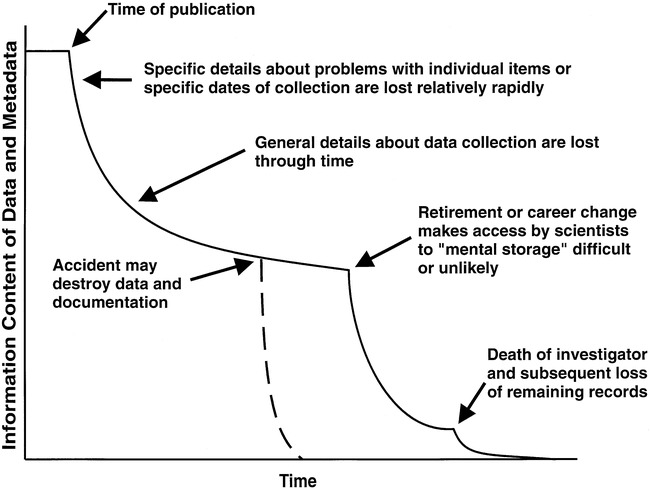
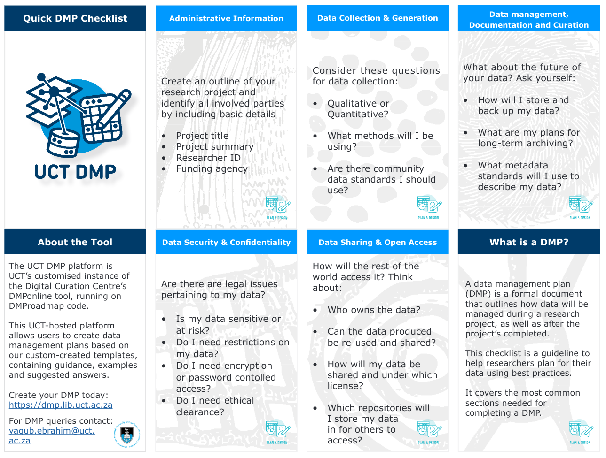
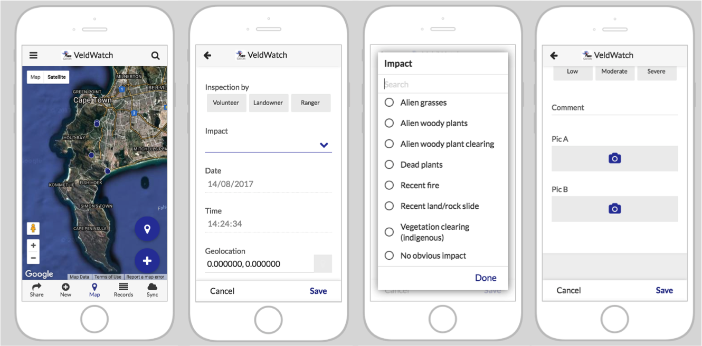
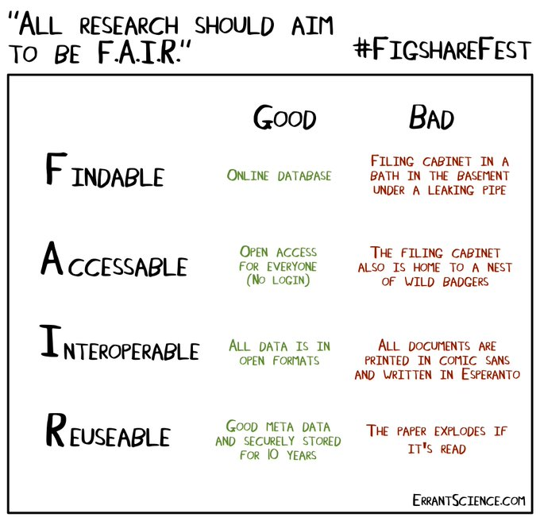

# Data Management {#data}

## Why do you need to manage your data?

Data management is often the last thing on a scientists mind when doing a new study - "I have a cool idea, and I'm going to test it!". You don't want to "waste" time planning how you're going to manage your data and implementing that plan... 

Unfortunately, this never ends well and really is a realm where "haste makes waste".

<br>

```{r datadecay, echo=FALSE, fig.cap = "The 'Data Decay Curve' [@Michener1997]", fig.width=3, fig.align = 'center', out.width="75%"}

```

<br>

Here are a bunch of reasons you really want to focus on doing good data management:

- **Bad data management leads to data loss**... (Figure \@ref(fig:datadecay))
- **Your future self will hate you if you lose it before you're finished with it!!!** This is less likely in the world of Dropbox, Google Drive, iCloud etc, but I know people who had to repeat their PhD's because they lost their data because it was on a laptop that crashed or was stolen... Also, ***beware cloud storage!!!*** It's very easy for you or a collaborator to delete/overwrite/lose access to items, e.g. 
    - if someone leaves the project and deletes the folder on their Dropbox without "leaving" it first
    - if the "owner" of the Google Drive folder loses access to their Google account (***as will happen to your UCT Google Drive access as soon as you graduate!!!***)
    - through all manner of random "accidents"
    
- **Data has value beyond your current project**: 
  - to yourself for reuse in future projects, collaborations, etc (i.e. publications and citations), 
  - for others for follow-up studies, or combining multiple datasets for meta-analyses or synthesis etc
  - for science on general (especially long-term ecology in a time of global change)
  
- We've covered this before, but **sharing your data is key for transparency and accountability**.
- Data collection is expensive, and is often paid for with taxpayers' money. **You owe it to your funder (and humanity in general) to make sure that science gets the most out of your data** in the long term.
- Lastly, **good planning and data management can help iron out issues** up front, like: 

  - intellectual property, 
  - permissions for ethics, collection permits, etc, 
  - outlining expectations for who will be authors on the paper(s),
  - responsibilities for managing different aspects of the data etc 
  
If you don't establish these permissions and ground rules early they can result in data loss, not being able to publish the study, damage relationships in collaborations (including student-supervisor), and ultimately damage careers... 

To avoid data (and relationship) decay, and to reap the benefits of good data management, it is important to consider the full *Data Life Cycle*.

<br>

## The Data Life Cycle

```{r datalifecycle, echo=FALSE, fig.cap = "The Data Life Cycle, adapted from https://www.dataone.org/", fig.width=6, fig.align = 'center', out.width="110%"}
# load library
#library(ggplot2)

# Create test data.
data <- data.frame(
  category=c("1.Plan", "2.Collect", "3.Assure", "4.Describe", "5.Preserve", "6.Discover", "7.Integrate", "8.Analyze"),
  count=rep(12.5, 8)
)
 
# Compute percentages
data$fraction <- data$count / sum(data$count)

# Compute the cumulative percentages (top of each rectangle)
data$ymax <- cumsum(data$fraction)

# Compute the bottom of each rectangle
data$ymin <- c(0, head(data$ymax, n=-1))

# Compute label position
data$labelPosition <- (data$ymax + data$ymin) / 2

# Compute a good label
data$label <- paste0(data$category, "\n value: ", data$count)

# Make the plot
ggplot(data, aes(ymax=ymax, ymin=ymin, xmax=4, xmin=3, fill=category)) +
  geom_rect() +
  geom_text(x=3.5, aes(y=labelPosition, label=category)) + #, color=category)) + # x here controls label position (inner / outer)
  scale_fill_brewer(palette="Blues") +
#  scale_color_brewer(palette="Blues", direction = -1) +
  coord_polar(theta="y") +
  xlim(c(2, 4.5)) +
  theme_void() +
  theme(legend.position = "none")
```

<br>

Note that there are quite a few **different versions** of the data life cycle out there. **This is the most comprehensive one I know of**, and covers all the steps relevant to a range of different kinds of research projects. A full description of this data life cycle and related ecoinformatics issues can be found in [@Michener2012]. 

**Not all projects need to do all steps, nor will they necessarily follow the order here**, but it is worth being aware of and considering all steps. For example: 

- Often the first thing you do when you have a new hypothesis is **start by searching for any existing data** that could be used to test it without having to spend money and time collecting new data (i.e. skip to step 6 - "Discover"). In this case I would argue that you should still do step 1 (Plan), and you'd want to do some checking to assure the quality of the data (step 3), but you can certainly skip steps 2, 4 and 5. A meta-analysis or synthesis paper would probably do the same. 
- If you're collecting new data you would do steps 1 to 5 and possibly skip 6 and 7, although in my experience few studies do not reuse existing data (e.g. weather or various GIS data to put your new samples into context).

<br>

### Plan 
Good data management begins with planning. In this step you essentially **outline the plan for every step of the cycle in as much detail as possible**. Usually this is done by constructing a document or **Data Management Plan (DMP)**. 

While developing DMPs can seem tedious, they are essential for the reasons I gave above, and because **most funders and universities now require them**.

Fortunately, there are a number of **online data management planning tools** that make it easy by providing templates and prompts to ensure that you cover all the bases, like the Digital Curation Centre's [DMPOnline](https://dmponline.dcc.ac.uk/) and [UCT's DMP Tool](https://dmp.lib.uct.ac.za/).

<br>

```{r uctdmp, echo=FALSE, fig.cap = "Screenshot of [UCT's Data Management Planning Tool's Data Management Checklist.](http://www.digitalservices.lib.uct.ac.za/dls/systems/uct-dmp)", fig.width=3, fig.align = 'center', out.width="90%"}

```

<br>

A key thing to bear in mind is that **a DMP is a living document and should be regularly revised during the life of a project**, especially when big changes happen - e.g. new team members, new funding, new direction, change of institution, etc.

I typically develop one overarching DMP for an umbrella project (e.g. a particular grant), but then add specifics for subprojects (e.g. separate student projects etc).

<br>

### Collect and Assure

There are many, many different kinds of data that can be collected in a vast number of ways!

```{r datatypes, echo=FALSE, fig.cap = "[Springer Nature Infographic](https://doi.org/10.6084/m9.figshare.5883193.v1) illustrating the vast range of research data types.", fig.width=3, fig.align = 'center', out.width="90%"}
knitr::include_graphics("img/datatypes.png")
```

<br>

While "Collect" and "Assure" are different steps in the life cycle, I advocate that **it is foolish to collect data without doing quality assurance and quality control (QA/QC) as you go**, irrespective of how you are collecting the data.

For example:

- automated logging instruments (weather stations, cameras, acoustic recorders) need to be **checked** that they're logging properly, are **calibrated/focused**, are reporting **sensible values**, etc
- if you're filling in data sheets, you need to check that all fields have been completed (**no gaps**), that there are **no obvious errors** and that any numbers or other **values look realistic**. In fact, if you're using handwritten data sheets it's best to **capture them as soon as possible** (i.e. that evening), because that helps you spot errors and omissions, you have a better chance of deciphering bad handwriting or cryptic notes, and you can plot any values to see if there are suspicious outliers (e.g. because someone wrote down a measurement in centimetres when they were meant to use metres).

When transcribing or capturing data into a spreadsheet or database it is often best to **use data validation** tricks like drop-down menus, conditional formatting, restricted value ranges etc to avoid spelling mistakes and highlight data entries that are outside the expected range of the data field. ***It may seem like a lot of effort to set this up, but it'll save you a lot of time and pain in the long run!!!***

Increasingly, I've started moving towards **capturing data directly into a spreadsheet** with data validation rules using a phone or tablet. There are also a number of "no code" app builders these days like [**AppSheet**](https://www.appsheet.com) that allows you to easily collect data on your phone and sync data directly into Google Sheets and photos to your Google Drive. AppSheet is proprietary software, but does allow a lot of utility with their free accounts. [**QField**](https://qfield.org/) is another handy open source app built on QGIS, allowing you to setup maps and forms in QGIS on your workstation and deploy them to your phone, tablet etc. It seems to be getting better all the time.

<br>

```{r appsheet, echo=FALSE, fig.cap = "An example data collection app I built in [AppSheet](https://www.appsheet.com) that allows you to log GPS coordinates, take photos, record various fields, etc.", fig.width=3, fig.align = 'center', out.width="90%"}

```

<br>

**Tidy Data**

Last, but not least. We haven't discussed different data formats etc, but if you are working with tabular data (i.e. spreadsheets, tables) I strongly recommend you read this short paper on **[how to keep your data Tidy](http://dx.doi.org/10.18637/jss.v059.i10)** [@Wickham2014]. Following these principles will make life much easier for you once you get to the analysis step...

<br>

### Describe {#describe}

There are few things worse than having a spreadsheet of what you think is the data you need, but you don't know what the column names mean, how variables were measured, what units they're reported in, etc... - *Especially when you were the one who collected and captured the data!!!* 

This descriptive data about the data is called ***metadata*** and is essential for making the data reusable, but is also useful for many other purposes like making the data findable (e.g. using keyword searches). In fact, metadata makes up the majority of what are called the [**FAIR data principles**](https://www.go-fair.org/fair-principles/) [@Wilkinson2016], which largely focus on this and the next few steps of the Data Life Cycle. I'm not going to dwell on them other than to say that they are a key component of making your work reproducible, and that like reproducibility, practicing FAIR data principles is a spectrum.

<br>

```{r fairdata, echo=FALSE, fig.cap = "The FAIR data principles [ErrantScience.com](https://errantscience.com/).", fig.width=3, fig.align = 'center', out.width="75%"}

```

<br>

**Some key kinds of metadata:**

- the study context
  - why the data were generated
  - who funded, created, collected, assured, managed and owns the data (not always the same person)
    - contact details for the above
  - when and where the data were collected
  - where the data are stored
- the data format
  - what is the file format
  - what softwares were used (and what version)
- the data content
  - what was measured
  - how it was measured
  - what the columns and rows are
  - what units it's reported in
  - what QA/QC has been applied
  - is it raw data or a derived data product (e.g. spatially interpolated climate layers)
    - if derived, how it was analyzed
  - etc


<br>

**Metadata standards and interoperability**

Many data user communities have developed particular metadata standards or schemas in an attempt to enable the best possible description and interoperability of a data type for their needs.

They are typically human and machine-readable data, so that the metadata records can also be read by machines, to **facilitate storing and querying multiple datasets** in a common database (or across databases).

Imagine how difficult it would be to pay for something electronically **if banks didn't use common metadata standards?** Each transaction would require someone to manually look things up in multiple tables etc etc. Chaos!!!

<br>

```{r datastandards, echo=FALSE, fig.cap = "How standards proliferate... from [xkcd.com/927](https://xkcd.com/927), used under a [CC-BY-NC 2.5 license](https://creativecommons.org/licenses/by-nc/2.5/).", fig.width=3, fig.align = 'center', out.width="75%"}
knitr::include_graphics("img/standards.png")
```

<br>

Using **common metadata schemas has many advantages** in that they make data sharing easier, they allow you to search and integrate data across datasets, and they simplify metadata capture (i.e. having a list of required fields makes it easier to not forget any).

There are [many standards](https://www.dcc.ac.uk/guidance/standards/metadata/list), but perhaps the most common ones you'll encounter in biological sciences (other than geospatial metadata standards) are [DarwinCore](https://www.tdwg.org/standards/dwc/) and [Ecological Metadata Language (EML)](https://knb.ecoinformatics.org/tools/eml).

There's even [new standards for documenting ecological forecasts](https://projects.ecoforecast.org/EFIstandards/index.html)!

<br>

```{r stacspec, echo=FALSE, fig.cap = "An example of a geospatial metadata standard. SpatioTemporal Asset Catalogs [(STAC; stacspec.org)](https://stacspec.org/) aims to provide a common specification to enable online search and discovery of geospatial assets in just about any format.", fig.width=3, fig.align = 'center', out.width="100%"}
knitr::include_graphics("img/stacspec.png")
```


<br>

### Preserve

There are two major components to preserving your data:

1. ***Back your data up now!!! (and repeat regularly)***

Losing your data can be incredibly inconvenient!!! A good friend of mine lost all of his PhD data twice. It took him 7 years to complete the degree...

Beyond inconvenience, losing data can be incredibly expensive! Doing 4 extra years to get your PhD is expensive at a personal level, but if the data are part of a big project it can rapidly add up to millions - like [How Toy Story 2 Almost Got Deleted](https://www.youtube.com/watch?v=8dhp_20j0Ys).

>***PRO TIP:*** Storing data on the cloud is not enough! You could easily delete that single version of all your data! You may also lose access when you change institution etc. E.g. What happens to your UCT MS OneDrive and Google Drive content when you graduate and ICTS close your email account?

<br>

2. ***Long-term preservation and publication***

This involves the deposition of your data (and metadata!) in a **data repository** where it can be managed and curated over the long term. 

This is increasingly a requirement of funders and publishers (i.e. journals). Many journals allow you (or require you) to submit and publish your data with them as supplementary material. Unfortunately, many journals differ in how they curate the data and whether they are available open access. I prefer to publish my data in an online open access repository where you can get a permanent **Digital Object Identifier (DOI)** that you can link to from your paper.

Another consideration, if you are keen for people to reuse your data (which if you are not you will fail this course by default) is **where people are most likely to look for your data** (i.e. making your data "Findable/Discoverable"). There are many "bespoke" discipline-specific data repositories for different kinds of data, e.g.

Global databases:

- [GenBank](https://www.ncbi.nlm.nih.gov/genbank/) - for molecular data
- [TRY](https://www.try-db.org/TryWeb/Home.php) - for plant traits
- [Dryad](https://datadryad.org) - for generalist biological and environmental research

South African databases:

- [SANBI](https://www.sanbi.org/resources/infobases/) - for most kinds of South African biodiversity data
- [SAEON](https://catalogue.saeon.ac.za/) - for South African environmental data (e.g. hydrology, meteorology, etc) and biodiversity data that don't fit SANBI's databases

If none of these suit your data, there are also "generalist" data repositories that accept almost any kind of data, like:

- [FigShare](https://figshare.com/)
- [Zenodo](https://zenodo.org/)
- UCT's [ZivaHub](https://zivahub.uct.ac.za/) (which is built on and searchable through FigShare)

<br>

I haven't discussed **physical samples** at all. These are obviously a huge (if not bigger) challenge too, although there are some obvious homes for common biological data, like herbaria for plant collections and museums for animal specimens.

<br>

### Discover

This is perhaps the main point of the Data Life Cycle and FAIR data principles - to make data findable so that it can be reused. 

The biggest challenge to discovering data is that **so many datasets are not online** and are in the "filing cabinet in a bath in the basement under a leaking pipe" as in Figure \@ref(fig:fairdata). If you ***preserve and publish*** them in an online data repository, this overcomes the biggest hurdle.

The next biggest challenge is **that there is so much online that finding what you need can be quite challenging** (like looking for a needle in a haystack...). This is where choosing the right portal can be important. It is also what metadata standards are aimed at - allowing interoperable searches for specific data types across multiple repositories.

A final consideration is whether you have **permission to use the data**. You can often find out about the existence of a dataset, either online or in a paper, but the data aren't made freely available. This is where **licensing** comes into play. Most data repositories require you to publish the data under a license. There are many options depending on the kind of data and what restrictions you want to put on its use. I'm not going to go into the gory details, but [Creative Commons](https://creativecommons.org/licenses/) have created an extensible system of generic licenses that are easy to interpret and cover most situations. I say *extensible* because the licenses are made up of a string of components that can be layered over each other. For example:

- CCO - means it is *Open* - i.e. there are no restrictions on use and it is in the public domain
- CC BY - means *by attribution* - you can use the data for any purpose, but only if you indicate attribution of the data to the source or owner of the data
- CC BY-SA - means *by attribution* + *share alike* - i.e. you have to indicate attribution and share your derived product under the same license
- CC BY-ND - means *by attribution* + *no derivatives* - i.e. you have to indicate attribution, but cannot use it to make a derived product. This is often used for images - allowing you to show the image, but not to alter it.
- CC BY-NC - means *by attribution* + *non-commercial* - you have to indicate attribution, but cannot use it for commercial purposes (i.e. you can't sell derived products)
- CC BY-NC-SA - *by attribution* + *non-commercial* + *share alike*
- CC BY-NC-ND - *by attribution* + *non-commercial* + *no derivatives*

<br>

> *NOTE: As an aside, for some reason software licenses are a bit more complicated and code is rarely shared under CC licenses, other than CCO. A rough equivalent of CC BY for code is MIT, and there are others that can add various constraints similar to Creative Commons' SA, ND and NC. See [here](https://fossa.com/blog/open-source-licenses-101-mit-license/).*

<br>

### Integrate

There are a few different components to data integration in this context:

1. **Linking different kinds of data**, usually through spatial and or temporal information 
  - e.g. matching you biodiversity collections with weather records or GIS information about the sites
2. **Keeping track of changes** you've made to your data as you prepare it for analyses (**versioning**)
  - e.g. you may be wanting to compare species richness across sites. This requires estimating species richness from your field data (usually lists of species by site occurrences and/or abundances)
  - you should always keep a copy of your raw data!!!
  - using scripting languages for data handling and analyses (e.g. R, Python, MatLab) can help you keep record of how you did any data summaries, transformations, etc, but only if you write clean, well-documented code and manage your code well!!!
3. **Curating your data** such that they can easily be integrated with other, similar datasets for larger analyses or meta-analyses
  - this is largely a metadata game, but also one of data formats etc. Many fields promote the use of common data standards with rules on measurement specifications, file formats, common data and metadata fields, controlled vocabularies etc that allow easy integration, searching and manipulation (see section \@ref(describe) for more details). This is what a lot of the discipline-specific online databases attempt to achieve. 

<br>

### Analyze

"The fun bit", but again, there are many things to bear in mind and keep track of so that your analysis is repeatable. This is largely covered by the sections on _Coding and code management_ and _Computing environment and software_ in Chapter \@ref(reproducibility)

<br>

## Data and decisions

This is not part of *The Data Life Cycle* per se, but it's worth remembering that there are some other aspects of data, while still important if the goal is purely academic, that are make-or-break when the goal is informing decisions, e.g. (mostly paraphrased from @Dietze2018):

1. **Latency** - the time between data collection and it's availability for modelling. Depending on the model's need for the latest data, if the latency is too long then it can preclude the ability to make useful forecasts (e.g. it's very difficult to make useful weekly forecasts if you only get new data once a year...).
2. **Uncertainty** - the model can only ever be as good as the data (**GIGO: garbage in = garbage out**). We'll also see that assimilating data into forecasts requires uncertainty estimates. Not including uncertainty can create **bias or overconfident predictions**... Unfortunately, very rarely does anyone report the uncertainty in their data... Unfortunately, there are also many reasons why **data can never be certain** - sampling variability, random and systematic instrument errors, calibration uncertainty, classification errors (e.g. species identification), transcription errors, corrupt files (or collaborators!) etc. I live by the creed *there is nothing as sinister as a certainty*. If you tell me your model has an $R^2$ of 1, I will tell you (with 100% certainty, ironically) that your model is wrong.
3. **Repeated sampling** - most forecasts are in time and thus require time-series to develop the models. Frequent repeated sampling can often come at a trade-off with the spatial extent (or spatial replication) of sampling though. Forecasters need to optimize this trade-off to inform the most efficient data collection while also reducing uncertainty in the model.
4. **Interoperability** - this is largely covered under the *Describe, Preserve, Discover* and *Integrate* steps in *The Data Life Cycle*

<br>
