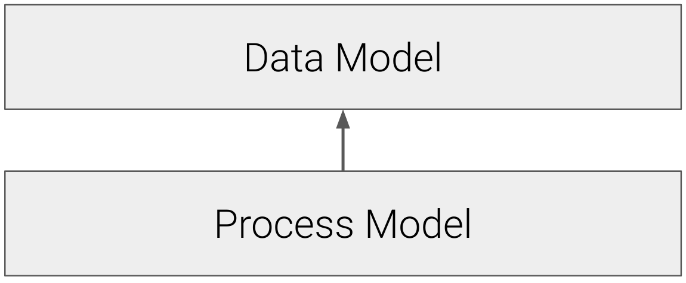
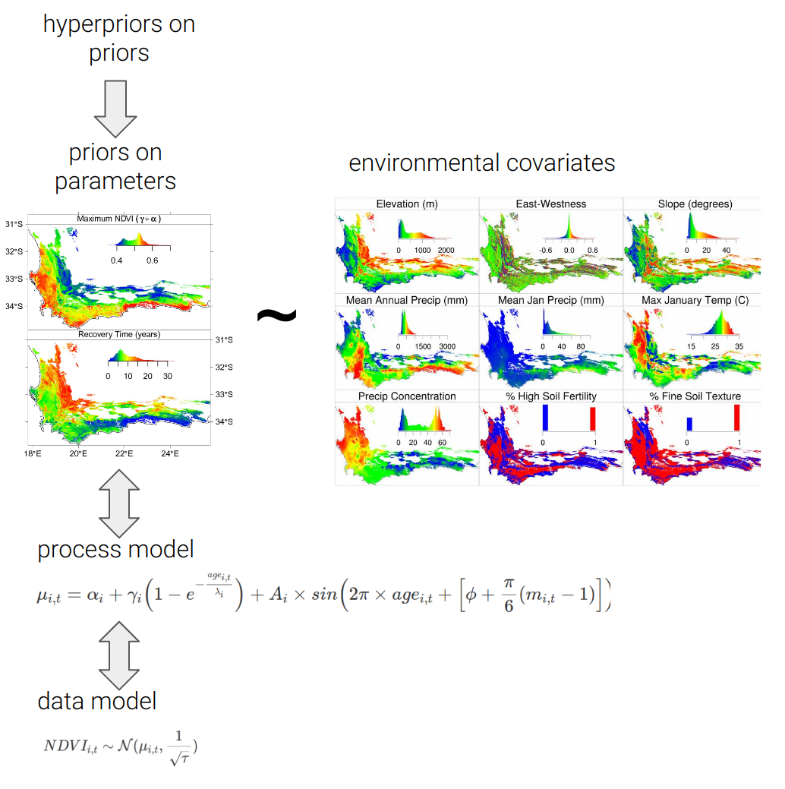

# Data Fusion {#datafusion}

This lecture builds on section \@ref(bayesian), "Going Bayesian", focusing on how the opportunities for imputing (or "fusing") data with models increase as one moves from the method of Least Squares to Hierarchical Bayesian models.

First a little revision of our last lecture...

<br>

## A reminder of Bayes Theorem and its benefits

<br>

Bayes' Rule:

$$
\underbrace{p(\theta|D)}_\text{posterior} \; \propto \; \underbrace{p(D|\theta)}_\text{likelihood} \;\; \underbrace{p(\theta)}_\text{prior} \;
$$
<br>

Where the ***posterior*** is a probability distribution representing the credibility of the parameter values $\theta$, taking the data, $D$, into account.

The ***likelihood***, $p(D|\theta)$ represents the probability that the data could be generated by the model with parameter values $\theta$. This term looks for the best estimate of the parameters using Maximum Likelihood Estimation, where the likelihood of the parameters are maximized by choosing the parameters that maximize the probability of the data.

The ***prior*** probability distribution is the marginal probability of the parameters, $p(\theta)$, and represents the credibility of the parameter values, $\theta$, without the data, $D$. Since ***it must not*** be inferred from the data, it is specified using our **prior belief** of what the parameters should be, before interrogating the data. Prior information can be sourced from previous analyses (of other data!), literature, meta-analyses, expert opinion or ecological theory. We need to be very careful about how we specify our priors so as not to bias the analysis!

<br>

### The benefits of Bayes

1. They are **focused on estimating what properties are** (i.e. the actual values of particular parameters) and not null hypothesis testing.
2. They are highly **flexible**, allowing one to build relatively **complex models with varied data sources** (and/or of varying quality), especially Hierarchical Bayesian models.
    - This is important for ***Data Fusion*** that we'll discuss today.

3. They can easily treat all terms as probability distributions, making it **easier to quantify, propagate, partition and represent uncertainties throughout the analysis probabilistically**. 
    - Which is the focus of section \@ref(uncertainty).

4. They provide an **iterative probabilistic framework** that makes it easier to update predictions as new data become available, mirroring the scientific method and completing the forecasting cycle.
    - This closing of the forecast loop is termed ***Data Assimilation*** and we'll discuss it in the final lecture in section \@ref(decisions).

<br>

## Data fusion

Data can enter (or be fused with) a model in a variety of ways. Here we'll discuss these and then give an example of the Fynbos postfire recovery model used in the practical.

The **opportunities for data fusion are linked to model structure**, so we'll revisit how some aspects of model structure change as we move from Least Squares to Maximum Likelihood Estimation to "single-level" Bayes to Hierarchical Bayes and the data fusion opportunities provided by each.

<br>

### Model layers

***Least Squares***

The method of **Least Squares** makes no explicit distinction between the **process model** (that models the drivers determining the pattern observed) and the **data model** (that models the observation error or data observation process, i.e. the factors that may cause mismatch between the process model and the data). This is because we require homogeneity of variance in order to minimize the sums of squares, so the data model can only ever be a **normal (also called Gaussian) distribution**.

In the practical, we start by using Nonlinear Least Squares to fit a negative exponential model to describe the recovery of the Normalised Difference Vegetation Index (NDVI - a measure of vegetation "greenness" measured from satellite) after a fire in Fynbos. Here's the process model:

\begin{gather}
  \text{NDVI}_{i,t}=\alpha_i+\gamma_i\Big(1-e^{-\frac{age_{i,t}}{\lambda_i}}\Big)
\end{gather}

Which when fitted to the data looks like so:

```{r, echo = F}
## Load required functions by running source() on the individual function files
if(file.exists("praccode/01_download.NDVI.R")) source("praccode/01_download.NDVI.R")
if(file.exists("praccode/02_plot.NDVI.R"))     source("praccode/02_plot.NDVI.R")
if(file.exists("praccode/03_negexp.R"))        source("praccode/03_negexp.R")

## Download NDVI data
URL = "https://raw.githubusercontent.com/jslingsby/BIO3019S_Ecoforecasting/master/data/modisdata.csv"
dat <- download.NDVI(URL)

# Convert "calendar_date" to postfire age in days since fire - assuming the first date in the times series is the time of the fire 
dat$age <- (as.numeric(dat$calendar_date) - min(as.numeric(dat$calendar_date), na.rm = T))/365.25

## Simple model

# set parameters
par <- c(alpha = 0.2, gamma = 0.4, lambda = 0.5)

# fit model
fit_negexp <- nls(NDVI ~ alpha + gamma * (1 - exp(- age/lambda)),
                  data = dat, start = par, trace = F, 
                  control = nls.control(maxiter = 500))

# plot
plot.NDVI(dat = dat, fit = fit_negexp)
```

**The process model is the only opportunity for inputting data**, and here we input time series for NDVI and date (or postfire age, since our time series started at the time of a fire). 

The only way to add more data sources is to make your model more complex. For example, to capture the seasonal fluctuations in NDVI we can add a sine term that requires us to specify the month (m) of the fire, like so:

<br/>

\begin{gather}
  \text{NDVI}_{i,t}=\alpha_i+\gamma_i\Big(1-e^{-\frac{age_{i,t}}{\lambda_i}}\Big)+
      A_i\text{sin}\Big(2\pi\times\text{age}_{i,t}+\Big[\phi+\frac{\pi}{6}(m_{i,t}-1)\Big]\Big)
\end{gather}

<br/>

Which looks like:

```{r, echo = F}
## Full model

# set parameters
par <- c(alpha = 0.2, gamma = 0.4, lambda = 0.5, A = 0.6, phi = 0)

# fit model
fit_negexpS <- nls(NDVI ~ alpha + gamma * (1 - exp(- age/lambda))
                   + A*sin(2*pi*age + (phi + pi/6*(3 - 1))), 
                   data = dat, start = par, trace = F, 
                   control = nls.control(maxiter = 500))

# plot
plot.NDVI(dat = dat, fit = fit_negexpS)
```

<br>

***Maximum Likelihood***

MLE does make a distinction between the **data model** and the **process model**, like so:

<br>

```{r mlelayers, echo=F, out.width='40%', fig.align='center', fig.cap='Maximum Likelihood makes a distinction between the process and data models.'}

```

<br>

I don't make the distinction in the equations presented in the practical, but do in the functions, where we included the **data model**:

\begin{gather}
NDVI_{i,t}\sim\mathcal{N}(\mu_{i,t},\frac{1}{\sqrt{\tau}}) \\
\end{gather}

In this case we specified a Gaussian (normal) distribution around the mean, $\mu$, which is described by the process model. We then have a separate function for the **process model**, which describes $\mu$ as a function of the covariate (vegetation $age$), with parameters $\alpha$, $\gamma$ and $\lambda$:

\begin{gather}  
\mu_{i,t}=\alpha_i+\gamma_i\Big(1-e^{-\frac{age_{i,t}}{\lambda_i}}\Big)\\
\end{gather}

$\mu$ is now the mean of the process model, not accounting for the residual error described by the data model - similar to the open circles in Figure \@ref(fig:leastsquares2).

What splitting the data and process models means, is that **we are now feeding our dependent variable (NDVI) to the data model, and our independent variable (time or postfire age) to the process model**.

The beauty of having a separate data model is that you are no longer restricted to the normal distribution and have flexibility to specify probability distributions that suit the data observation process, e.g. Binomial coin flips, Poisson counts of individuals, Exponential waiting times, etc. **You can even specify custom data models with their own covariates**, which is useful if you have information on things like instrument drift and calibration, etc - i.e. **another opportunity for data fusion**.

<br>

> **Side note:** You'd be interested to know that specifying a normal distribution in the data model means that our MLE analysis is identical to the NLS analysis. In fact, you can do the maths to show that **MLE with a normal likelihood is exactly the same as Least Squares**. Any differences between the parameter estimates the two methods provide in the practical are purely because we had to solve the equations numerically (i.e. estimate) rather than analytically (i.e. direct calculation). Where MLE (and Bayes) get useful is when you start doing interesting things with the data model.

<br>

***Single-level Bayes***

When we use Bayesian models we now have the **priors**, which are essentially models describing our prior expectation for each of the parameters in the process model, like so: 

<br>

```{r bayeslayers, echo=F, out.width='40%', fig.align='center', fig.cap='Bayesian models include an additional layer; parameter models that describe our prior expectation for the parameters in the process.'}
knitr::include_graphics("img/bayeslayers.png")
```

<br>

When implementing Bayesian models, we just specify the priors as **parameter models**, e.g.:

\begin{gather}
\alpha_i\sim\mathcal{N}(\mu_{\alpha},\frac{1}{\sqrt{\tau_{\alpha}}})\\
\gamma_i\sim\mathcal{N}(\mu_{\gamma},\frac{1}{\sqrt{\tau_{\gamma}}})\\
\lambda_i\sim\mathcal{N}(\mu_{\lambda},\frac{1}{\sqrt{\tau_{\lambda}}})\\
\end{gather}

Where (in this case) we're saying we believe the three parameters from our simpler postfire recovery model are all sampled from normal distributions with independent means and variances.

Note that **you need priors (i.e. parameter models) for all parameters**. They don't all have to be independent though, which can be useful, for example if you have multiple separate sets drawn from the same population, etc.

While you can't specify new data in the priors in single-level Bayes (because that is then a Hierarchical model, coming next) it does still provide new opportunities for data fusion, because **the conditional nature of Bayes Theorem allows you to chain multiple likelihoods (with multiple data models) together**. I'm not going to go into the details of this, but one important consideration is that there need to be links between all terms - e.g. two datasets ($D_1$ and $D_2$) that share the same parameters ($\theta$):

$$
\underbrace{p(D_1|\theta)}_\text{likelihood 1} \;\;
\underbrace{p(D_2|\theta)}_\text{likelihood 2} \;\;\underbrace{p(\theta)}_\text{prior} \;
$$
or one dataset ($D_1$) is conditional on another ($D_2$), that is conditional on the parameters ($\theta$):

$$
\underbrace{p(D_1|D_2)}_\text{likelihood 1} \;\;
\underbrace{p(D_2|\theta)}_\text{likelihood 2} \;\;\underbrace{p(\theta)}_\text{prior} \;
$$
etc.

<br>

***Hierarchical Bayes***

Hierarchical Bayes is a form of multilevel modelling that provides **incredible flexibility** for model specification. Of course, greater flexibility brings more opportunities to tie yourself into knots, but such is life.

Most of this flexibility comes from **specifying the priors as models with inputs and specifying relationships among the priors, or from one prior to multiple layers in the model**. We don't have time to explore all the options (because they're almost endless). In the example I give below, we used a set of **environmental covariates** (soil, climate, topography, etc.) to explain the variation in the priors and constrain the parameters of the postfire recovery curve.

In other words, **Hierarchical Bayesian models allow you to fuse data through the parameter model**. Of course, when you start treating your priors as parameters like this, you have to specify priors on your priors (**hyperpriors**) to your parameter model.

<br>

```{r hbayeslayers, echo=F, out.width='40%', fig.align='center', fig.cap='Hierarchical Bayesian models allow considerable flexibility through the inclusion of hyperparameters that can drive the priors.'}
knitr::include_graphics("img/hbayeslayers.png")
```

<br>

### Hierarchical Bayes and postfire recovery example

Until now we have only been considering a single postfire recovery curve in isolation, but one can fit every MODIS satellite pixel in the Fynbos Biome in one model, like @Wilson2015 did, (here including the seasonality term in the process model):

```{r hbpostfire, echo=F, out.width='90%', fig.align='center', fig.cap='Schematic of the Hierarchical Bayesian model of postfire NDVI recovery developed by @Wilson2015.'}

```

<br>

Here the priors are specified with a parameter model that defines the parameters as a function of a set of environmental covariates (topography, climate, soils, etc), allowing the introduction of even more data!

The beauty of this model is that it **simultaneously estimates** the posterior distributions of **the parameters** (by maximizing their likelihood given the observed NDVI data) while also estimating their relationship with a set of **environmental covariates**. This was done by **fusing multiple data sources** at different levels of the model.

- to the **data model** we've passed the $NDVI$ time-series for each pixel
  - note that we could fuse more data here as covariates or additional likelihood functions if we thought that additional complexity was useful
- to the **process model** we've passed the fire history for each pixel (as a time-series of vegetation $age$ since fire) and the month ($m$) in which each fire occurred (needed for the seasonality term)
- to the **parameter model** we've passed static layers of each environmental covariate (i.e. raster grids of the entire CFR)
- we then define the priors on the priors (the **hyperparameters**), also known as **hyperpriors**

<br>

**The advantages** of including the regression of the parameters on environmental covariates are many:

- It allows us to **explore the dependence** of recovery trajectories on environmental covariates
- This allows us to **predict the expected postfire recovery trajectory** for any site with known environmental covariates
- It also allows us to **project the expected parameters** (and recovery trajectories) under altered environments (e.g. future climate - as @Wilson2015 did)
- It puts an additional constraint on the parameter estimates for each pixel (i.e. "borrowing strength" across the analysis), **down-weighting the effects of anomalous or noisy NDVI data**
- The structure of the model allows you to easily **estimate any missing data** (i.e. *inverse modelling*) all within one model run

<br>

> **A brief note on data fusion, model complexity and uncertainty:** Increasing model complexity can provide many opportunities for fusing new data into your model, but you should be aware that this comes with trade-offs. 
>
> - Firstly, all data are uncertain (even if they don't come with with uncertainty estimates), so **adding new data sets or types to your model includes adding new sources of uncertainty**. For example, a major failing of the postfire recovery model is that we did not include estimates of uncertainty in the environmental covariates. This falsely reduces the uncertainty, resulting in overconfidence in our parameter estimates...
> - Secondly, more terms and interactions in the model creates greater opportunity for **strange feedbacks and trade-offs in the model's mechanics**, especially where there is non-identifiability (where multiple parameters can influence the outcome, but there's not enough information in the model for it to partition their influence). This can bias or produce unrealistic estimates etc... 
> - Lastly, this is all over and above the usual [dangers of overfitting](https://en.wikipedia.org/wiki/Overfitting).

<br>

**Utility of this model for decision makers**

While the model **does not make explicit near-term forecasts** in its current form, it can give us an estimate of the **expected NDVI signal** for any location for a given vegetation age since fire and time of year, which **can be very useful!**

@Slingsby2020 used the model to develop a proof of concept for a near-real time satellite change detection system for the Fynbos Biome.

<br>

```{r emma, echo=F, out.width='70%', fig.align='center', fig.cap='Overview of the near-real time satellite change detection workflow from @Slingsby2020.'}
knitr::include_graphics("img/emmaprocessdiagram.png")
```

<br>

The work flow comprises four major steps (Figure \@ref(fig:emma)): 

1. Fit the **model** to get parameter estimates that describe the postfire recovery trajectory for all pixels 
2. **Evaluate** the deviation of the observed NDVI from model expectation using departure metrics to identify areas that are not 'behaving' as expected. 
3. **Diagnose** the change agents driving deviations through a combination of: 
    - interpreting the model predictions and observed NDVI signal 
    - exploring high resolution imagery like Sentinel or PlanetLabs
    - field visits
4. Finally, as new information is learned or false deviations are detected, the model is iteratively **updated** (manually at this stage) to improve its predictive accuracy.

<br>

Preliminary results from the Cape Peninsula are very promising for detecting fire scars, vegetation clearing, vegetation mortality (e.g. drought impacts), and alien plant invasions.

<br>

```{r emmachange, echo=F, out.width='90%', fig.align='center', fig.cap="Examples of changes detected by @Slingsby2020. Postfire recovery curves (a, d, g, j, l, n) show the model predictions (dark grey $=$ 50% Confidence Interval, light grey $=$ 95% Confidence Interval) and observed MODIS NDVI signal (blue line) for different impacts. Satellite images and ground photos allow for diagnosis of detected anomalies, including fire at Karbonkelberg (a-c), gradual clearing of alien vegetation at Miller's Point (d-f), clearing of indigenous vegetation for a housing development near Silvermine (g-i, labeled 1), high mortality in a dense stand of *Leucadendron coniferum* near Silvermine (h-k, labelled 2), a flush of alien Australian Port Jackson Willow (*Acacia saligna*) recruitment from seed at Silvermine triggered by fire (l, m), and retarded postfire vegetation recovery and high mortality of the large fire-resistant shrub *Mimetes fimbriifolius* due to drought near the Cape of Good Hope (n, o). Satellite imagery &copy; 2017 Planet Labs Inc."}
knitr::include_graphics("img/emmachange.jpg")
```

<br>

So managers can get an overview of change in the landscape every time new MODIS data are collected (daily, or 16-day averages).

<br>

```{r emmaexceedmap, echo=F, out.width='90%', fig.align='center', fig.cap='Overview map highlighting some of the major changes detected by @Slingsby2020.'}
knitr::include_graphics("img/emmaexceedmap.png")
```

<br>

We currently have a grant from NASA and are working with CapeNature, SANParks, SANBI, SAEON and others to develop into a fully operational system - currently called [EMMA (Ecosystem Monitoring for Management Application)](https://www.emma.eco/). We're also exploring methods to turn it into a *bona fide* near-term iterative ecological forecasting system.

<br>

