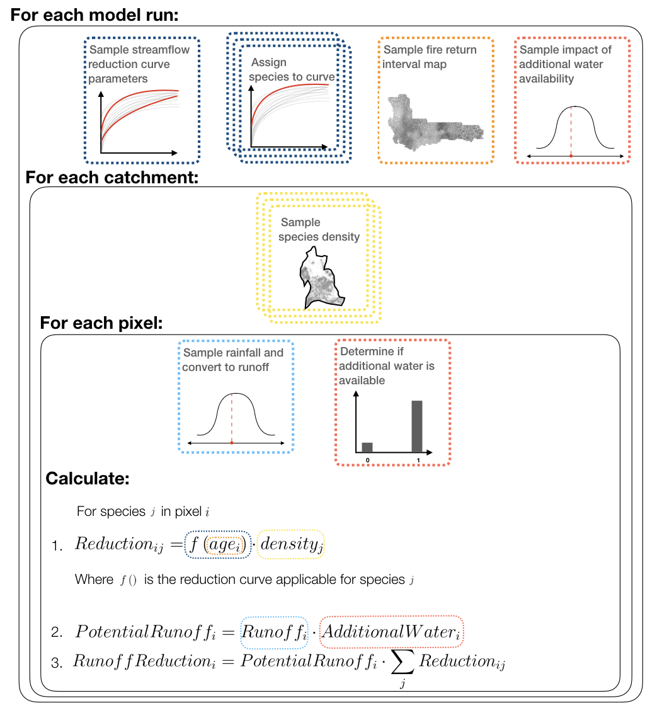
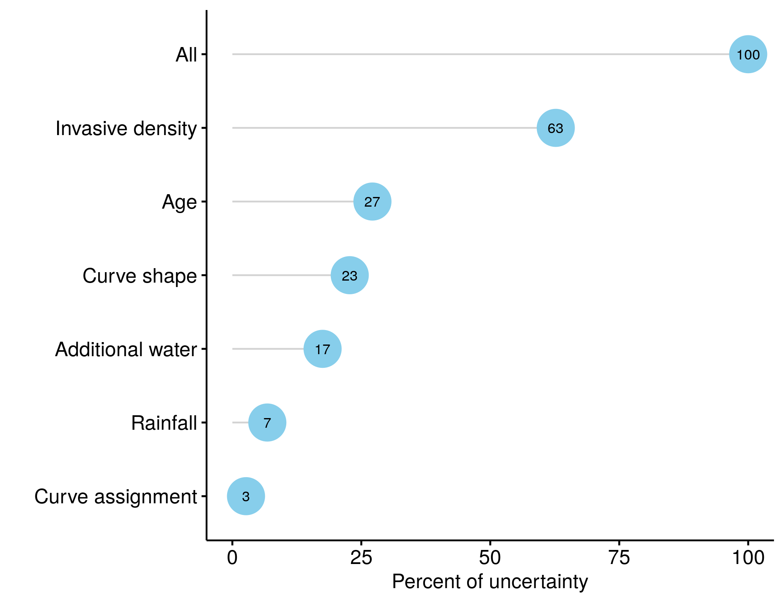

# Uncertainty {#uncertainty}

Uncertainty determines the utility of a forecast. If the uncertainty in a forecast is too high, then it is of no utility to a decision maker. Similarly, if the uncertainty is not properly quantified and presented, it can lead to poor decisions. This leaves forecasters with four overarching questions:

1. What determines the limits to the utility of predictions?
2. What determines prediction uncertainty?
3. How can we propagate uncertainty through our models and into our predictions?
4. How can we reduce prediction uncertainty?

<br>

**Question 1** is very much dependent on question 2, but more specifically it depends on the combination of the rate of **accumulation of uncertainty** (or loss of proficiency) through time, as it tends towards being no better than chance, combined with the precision or **"forecast proficiency threshold" required** for the decision in question. Together these determine the ***"ecological forecast horizon"*** (Figure \@ref(fig:forecasteventhorizon); @Petchey2015). Some forecasts may lose proficiency very quickly, crossing (or starting below) the forecast proficiency threshold. Conversely, if the forecast loses proficiency more slowly, or the proficiency threshold requirements are lower, the forecast horizon is further into the future.

<br>

```{r forecasteventhorizon, echo=F, out.width='80%', fig.align='center', fig.cap='The ecological forecast horizon (from @Petchey2015).'}
knitr::include_graphics("img/forecasteventhorizon.jpg")
```

<br>

## Sources and types of uncertainty

Addressing **question 2**, *"What determines prediction uncertainty?"* involves exploring the sources and types of uncertainty.

Dietze provides a nice classification of prediction uncertainty in his book [@Dietze2017] and subsequent paper [@Dietze2017b] in the form of **an equation** (note that I've spread it over multiple lines): 

<br>

$$
\underbrace{Var[Y_{t+1}]}_\text{predictive variance} \approx \; 
\underbrace{stability*uncertainty}_\text{initial conditions} \; +  \\
\space\\
\underbrace{sensitivity*uncertainty}_\text{drivers} \; +  \\
\space\\
\underbrace{sensitivity*(uncertainty+variability)}_\text{(parameters + random effects)} \; + \\
\space\\
\underbrace{Var[\epsilon]}_\text{process error} \; \;
$$

<br>

If we break the terms down into (something near) English, we get:

The dependent variable:

<br>

$$Var[Y_{t+1}] \approx$$

<br>

*"The uncertainty in the prediction for the variable of interest ($Y$) in the next time step ($t+1$) is approximately equal to..."*

<br>

And now the independent variables (or terms in the model):

<br>

$$\underbrace{stability*uncertainty}_\text{initial conditions} \; +$$

<br>

*"The stability multiplied by the uncertainty in the initial conditions, plus"*

- Here, the initial conditions = the state of $Y$ at time $t$ (our starting time point).
- **Stability** refers to whether it is a variable with **stabilizing feedbacks** (think of alternate stable states), versus whether it changes very quickly (with the extreme being one that **tends towards chaos** such as atmospheric conditions often do). Another example may be the populations of $r$ (unstable) versus $K$ (stable) selected species.
- **Uncertainty** is just uncertainty in the state of $Y$ due to **observation error**.

<br>

Then

$$\underbrace{sensitivity * uncertainty}_\text{drivers} \; + $$

<br>

*"The sensitivity to, multiplied by the uncertainty in, external drivers, plus"*

- The **external drivers are just the independent variables** in the model (i.e. the covariates).
- So the predictability of $Y$ depends on its **sensitivity** to each covariate (i.e. how much change would we expect in $Y$ for a given change in the covariate), and the **uncertainty** in those covariates. Worst case scenario would be if $Y$ was highly sensitive and the covariates were highly uncertain. Note that given we are forecasting through time, uncertainty in each covariate reflects **how well we can forecast that covariate** (e.g. future climate). If we can't predict $X$, we can't use it to predict $Y$... That said, if $Y$ is relatively insensitive to $X$, then there's less of a problem (apart from the question of why we've included it in the model in the first place?).

<br>

Then

$$\underbrace{sensitivity*(uncertainty+variability)}_\text{(parameters + random effects)} + $$

<br>

*"The sensitivity to, multiplied by the uncertainty and variability in, the parameters of the model, plus"*

- ***Parameter uncertainty*** pertains to **how good our estimates of the parameters** are. This is usually a question of sample size - *"Do we have enough data to obtain a good estimate (i.e. accurate mean, low uncertainty) of the parameters?"*. It is also linked to the **number of parameters** in the model. The more parameters, the more data you need to obtain good parameter estimates. This is another reason to avoid overly complex models.
- ***Parameter sensitivity*** is similar to driver sensitivity - **"How much change do we expect in $Y$ for a given change in the parameter?"**
- The **overall contribution** of a parameter to the predictive variance (i.e. uncertainty in the forecast) depends on its **sensitivity multiplied by its uncertainty**. 
    - Targeting fieldwork etc to better constrain poorly estimated parameters is one of the best ways to reduce prediction uncertainty.
- ***Parameter variability*** reflects factors that cause deviation (or offsets) from the mean of the parameter that may be known, but may either be poorly estimated or not included in the rest of the model. These are **random effects** that can be caused by factors like space, time, phylogeny, etc.

<br>

Then

$$\underbrace{Var[\epsilon]}_\text{process error}$$
*"The process error."*

- This refers to **errors in the model** due to structural uncertainty and stochasticity.
- **Stochasticity** refers to ecological phenomena of relevance that are very difficult to predict (at least within the context of the focal model). Examples include the occurrence of **fire, dispersal or mortality** that are often **chance events** similar to a coin toss.
- Model **structural uncertainty** simply reflects that **all models are simplifications** of reality and none are perfect. We'll always be missing something. That said, this could also include **"user error"** where the forecaster specified the wrong process model, or applied the wrong probability distribution in the data model, etc. Working with multiple models and employing model selection or averaging can help reduce structural uncertainty (in addition to thinking really hard about how to specify a better model of course...).

<br>

## Propagating uncertainty 

There are many methods to address question 3, *"How can we propagate uncertainty through our models and into our predictions?"*, but it's worth recognizing that these are actually two steps:

1. Propagating uncertainty **through the model** 
    + i.e. in **fitting the model**, so we can include uncertainty in our parameter estimates
    + This is typically focused on *"How does the uncertainty in X affect the uncertainty in Y?"*
2. Propagating uncertainty **into our forecasts**
    + i.e. exploring the implications of uncertainty in our model (parameters etc) for our confidence in the forecast **when making predictions with our fitted model**
    + Here we focus on *"How do we forecast Y with uncertainty?"*
    + This second step is actually the first step in ***data assimilation***, which we'll discuss tomorrow

<br>

I'm not going to spend much time on this, but suffice to say it could be a lecture series of its own. In (very) short, there are 5 methods to address step 1, and most of these cross-walk to related methods for step 2 (see Table \@ref(tab:propagatinguncertainty)). Among these methods are distinctions among whether they:

- Return **distributions** (e.g. Gaussian curve) or **moments** (means, medians, standard deviations, etc)
- They have **analytical** solutions, or need to be approximated **numerically**

They also have trade-offs between **efficiency vs flexibility**, with the most efficient having the most rigid requirements and assumptions (analytical), while the most flexible (numeric) can be very computationally taxing (or impossible given a complex enough model).

<br>

```{r propagatinguncertainty, echo=F}

upm <- data.frame(
  Approach = c("Analytical", "", "Numerical"),
  Distribution = c("Variable Transform", "", "Monte Carlo (Particle Filter)"),
  Moments = c("Analytical Moments (Kalman Filter)", "Taylor Series (Extended Kalman Filter)", "Ensemble (Ensemble Kalman Filter)")
)

knitr::kable(upm, caption = "**Methods for propagating uncertainty through models (and into forecasts)**")

```

<br>

>***Note:*** It is possible to propagate uncertainty through the model and into your forecast in one step with Bayesian methods, by treating the forecast states as "missing data" values and estimating posterior distributions for them. This would essentially fit with Monte Carlo methods in Table \@ref(tab:propagatinguncertainty). This approach may not suit all forecasting circumstances though.

<br>

## Analyzing and reducing uncertainty

Question 4, *"How can we reduce prediction uncertainty?"* requires:

1. Working out **where it's coming from** (by analyzing and partitioning the sources of uncertainty).
2. **Targeting sources of uncertainty** that can be reduced with the best return on investment (important to note that these may not be the biggest sources of uncertainty, just the cheapest and easiest to resolve).

**Addressing 1** requires looking at the two ways in which things can be important for the uncertainty in predictions (largely covered in Dietze's equation above):

- because they're **highly uncertain**, which requires you: 
  - **propagating** uncertainty through the model as above
  - **partitioning** uncertainty among your different drivers (covariates) and parameters
- because they're **highly sensitive**, requiring you to perform:
  - **sensitivity analysis**
    - I assume you covered these when you did matrix models. I'm not going to go into them here, but they focus on **how a change in X translates into a change in Y**. The bigger the relative change in Y, the more sensitive.


**Addressing 2** may not be as straightforward as you'd hope. Parameters that are highly uncertain and to which your state variable (Y) are highly sensitive will cause the most uncertainty in your predictions. That said, **given limited resources**, they may not be the best target for reducing uncertainty for a number of reasons, e.g.

- they may be **inherently uncertain** and uncertainty may remain high even with vast sampling effort 
  - **power analysis** can help here (i.e. exploring how uncertainty changes with sample size)
- they may be **hugely costly or time-consuming**, trading off against resources you could focus on reducing other sources of uncertainty

In fact, by this stage you should have most of the pieces of the puzzle to help you **build a model to predict where your effort is best invested** by exploring the relationship between sample size and variance contribution to overall model uncertainty! You can even include economic principles to estimate monetary or person-hour implications. This is called *observational design*.

<br>

## Propagating and partitioning uncertainty in the impacts of invasive alien plants on streamflow

### The background

During the "Day Zero" drought municipalities like the City of Cape Town scrambled to access "alternative sources" of water for bulk supply. The options they explored (beyond demand management) included:

- Desalination
- Reclamation (i.e. purifying waste water)
- Groundwater (from two very different aquifers, the Cape Flats Sand Aquifer and the Table Mountain Group Aquifer)

At that stage there was published peer-reviewed research by @Le_Maitre2016 indicating that as of 2008 invasive alien plants were estimated to be **using around 5% of runoff (almost as much as Wemmershoek Dam or ~80 days worth of water under restrictions)**. There was additional research showing that the extent of alien invasions had become much worse since 2008, so these figures were likely to be an underestimate.

When asked why they were not considering clearing invasive alien plants from the major mountain catchments, one of the excuses was ***[paraphrased] "because we don't trust the estimates, they don't provide any estimates of uncertainty"***.

While we knew this was a load of crock (they didn't have uncertainty estimates for any of the other options either) @Moncrieff2021 decided that it'd be a good idea to explore this issue and:

1. use a **Bayesian framework** to update and **include uncertainty** in the estimates of the volume and percent of streamflow lost to IAPs from the catchments
2. explore the relative contribution of sources of uncertainty to overall uncertainty in streamflow losses to **guide efforts to improve future estimates**
3. make it easy for anyone to recalculate estimates as and when updated data become available by adopting an open science approach, using only open-source software and sharing all data and code to provide **a fully repeatable workflow**

<br>

### The Analysis

The impacts of invasive alien plants (IAPs) on streamflow is predominantly determined from **streamflow reduction curves from long-term catchment experiments**, whereby the proportional reduction in streamflow is expressed as a function of plantation age and/or density. These can take 40 years to collect, and the [Jonkershoek catchment study](https://fynbos.saeon.ac.za/authors/jonkershoek/) has been running for >80 years [@Slingsby2021]!!!

<br>

```{r moncrieffcurve, echo=F, out.width='100%', fig.align='center', fig.cap='Streamflow reduction curves for pine and eucalypt plantations under normal (suboptimal) or wet (optimal) conditions (from @Moncrieff2021).'}
knitr::include_graphics("img/moncrieff_figure2.png")
```

<br>

These curves are then used to extrapolate spatially to MODIS pixels (250m) nested within catchments, informed by the naturalized runoff and IAP density.

<br>

**Propagating uncertainty in streamflow reduction**

For our analysis, we made sure that we only used **inputs** (rainfall, streamflow reduction curves, fire history, soil moisture, invasion density) that could be **sampled with uncertainty** (i.e. from probability distributions) and then propagated that uncertainty through to our streamflow reduction estimates using a **Monte Carlo (MC)** approach.

<br>

```{r moncrieffmethod, echo=F, out.width='70%', fig.align='center', fig.cap='Overview of the simulations run by @Moncrieff2021 to estimate the impacts of IAPs on streamflow in the catchments of the Cape Floristic Region including uncertainty (from @Moncrieff2021)'}

```

<br>

**The MC simulation steps** follow a series of nested loops:

1. For each model run we:
    a. Assigned each species to a streamflow reduction curve (optimal or sub-optimal, Eucalypt or Pine)
    b. Sampled a map of vegetation age from the distribution of fire return time
    c. Estimated proportional streamflow reduction for every IAP species from the assigned curve (sampled from posterior distribution of curves) and age.
    d. Determined additional water usage by IAPs in riparian zones and areas where groundwater is accessible
2. Within each run, for each catchment we sample the density of each IAP species
3. Within each catchment, for each pixel we:
    a. Estimated pixel-level naturalized runoff by sampling precipitation and converting to runoff
    b. Corrected for bias in naturalized runoff by summing naturalized runoff across all pixels within each quaternary catchment and rescaling to match estimates from Bailey and Pitman (2015)
    c. Determined whether additional water in riparian zones or groundwater is accessible to IAPs
    d. Calculated the runoff lost to IAPs by multiplying potential runoff from each pixel by the proportional streamflow reduction for every IAP species, and summing across all species.

<br>

### The Results

```{r moncrieffrunoff, echo=F, out.width='80%', fig.align='center', fig.cap=' Posterior probability distributions showing uncertainty in the impacts of IAPs on streamflow in the catchments feeding Cape Towns major dams (from @Moncrieff2021).'}
knitr::include_graphics("img/moncrieff_fig_s3.png")
```

<br>

This process provided us with estimates of the impacts of IAPs on streamflow for all catchments in the Cape Floristic Region as posterior probability distributions - i.e. *with uncertainty*.   

The posterior mean estimated streamflow loss to IAPs in the quaternary catchments surrounding Cape Town's major dams was **25.5 million m$^3$ per annum**, with lower and upper estimates of **20.3 and 43.4** million m$^3$ respectively. Given the City's target water use of 0.45 million m$^3$ per day at the height of the drought, this translates to between **45 and 97 days of water supply!!!** Note that this was still using the **2008** estimates of IAP invasions...

<br>

**Partitioning sources of uncertainty**

Beyond estimating the impacts of IAPs with uncertainty, @Moncrieff2021 performed additional analyses to **partition the uncertainty** among the various potential sources. For this we examined the relative contribution of a each source to overall uncertainty in streamflow reduction by **setting the uncertainty in all other inputs to zero**.

<br>

```{r moncrieffuncertainty, echo=F, out.width='80%', fig.align='center', fig.cap='The estimated uncertainty attributed to each of the model inputs [@Moncrieff2021]'}

```

<br>

From this it's clear that the data we need most is better estimates of the extent and density of invasions!!! Fortunately, this is easier to get than more 40-year catchment experiments!

<br>

**How did our results compare to the original estimates?**

```{r moncrieffresults, echo=F, out.width='60%', fig.align='center', fig.cap='Comparison of estimates of IAP impacts on streamflow with [@Moncrieff2021] and without [@Le_Maitre2016] uncertainty.'}
knitr::include_graphics("img/moncrieff_figure3.png")
```

<br>

By comparing our results to @Le_Maitre2016 we can see that our estimates are very similar, albeit slightly higher for low density invasions and lower for high density invasions. Either way, the losses are huge and likely to have been much worse during the "Day Zero" drought. Fortunately, a lot of effort has been invested in advocating for alien clearing and catchment restoration and this is starting to happen at scale through interventions like [The Greater Cape Town Water Fund](https://www.nature.org/en-us/about-us/where-we-work/africa/south-africa/).

While Glenn is adamant that these differences aren't the result of Jensen's Inequality, I thought it worth flagging Jensen's inequality since (a) it's likely to trip you up one day, and (b) I find it to be another good reason why we should always estimate things with uncertainty!

***Jensen's Inequality*** takes many forms, but in this context it indicates that *the mean of a nonlinear function is not equal to the function evaluated at the mean of its inputs...* (i.e. If you run your model under your mean parameter set and your model contains non-linear components, what comes out is not your mean outcome...)

<br>

Incidentally, this entire analysis is completely reproducible, with all data, code and a docker container on GitHub [here](https://github.com/GMoncrieff/streamflow-reduction).

<br>
