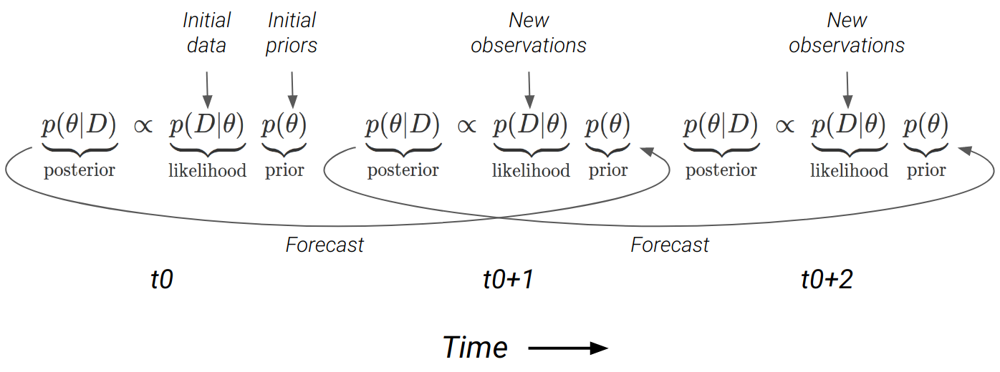

# Completing the forecast cycle {#decisions}

Here we'll complete the forecast cycle (through data assimilation)     and spend a little time discussing decision support.

## Data assimilation

```{r ecoforecastingloop3, echo=FALSE, fig.cap = "The iterative ecological forecasting cycle in the context of the scientific method, demonstrating how we stand to learn from making iterative forecasts. From [lecture on data assimilation by Michael Dietze](https://www.dropbox.com/s/pqjozune75m7wl0/09_DataAssimilation.pptx?dl=0). (Please excuse that the colours of the distributions have changed from above...).", fig.width=3, fig.align = 'center', out.width="70%"}
knitr::include_graphics("img/ecoforecastingloop.png")
```

<br>

You'll recall from the introductory lecture on models and decision making (section \@ref(models)) that we outlined iterative ecological forecasting and the scientific method as closely aligned cycles or loops. You'll also recall that I made the point in section \@ref(bayesian) that **Bayes Theorem provides an iterative probabilistic framework** that makes it easier to update predictions as new data become available, mirroring the scientific method and completing the forecasting cycle. Here we'll unpack this in a bit more detail.

### Operational data assimilation

Most modelling workflows are set up to **(a) fit the available data** and estimate parameters etc (we'll call this ***analysis***), which they then often use to **(b) make predictions** (which if made forward through time are typically ***forecasts***). They usually stop there. Few workflows are set up to make forecasts repeatedly or iteratively, updating predictions as new observations are made.

When making iterative forecasts, one **could just refit the model** and entire dataset with the new observations added, but there are a few reasons this may not be ideal:

1. If it's a complex model and/or a large dataset this could be very **computationally taxing** (e.g. @Slingsby2020 ran the Hierarchical postfire model for the Cape Peninsula (~4000 MODIS pixels) and it took 4 days on a computing cluster with 64 cores and 1TB of RAM...).
2. Refitting the model **doesn't make the most of learning** from new observations and the forecast cycle...

The alternative is to **assimilate the data sequentially**, through forecast cycles, imputing observations a bit at a time as they're observed. This approach has several advantages:

1. They can handle larger datasets, because **you don't have to assimilate all data in one go**.
2. If you start the model far in the past and update towards present day, you have **the opportunity to validate your predictions**, telling you how well the model does, and whether it improves with each iteration (i.e. is it learning), which gives you a good feel for how well it should do at forecasting into the future. Think of it as letting your model get a run-up like a sportsperson before jumping/bowling/throwing.

Assimilating data sequentially is known as the ***sequential or operational data assimilation problem*** and occurs through two steps (the main components of the forecast cycle), ***the forecast step***, where we project our estimates of the current state forward in time, and ***the analysis step***, where we update our estimate of the state based on new observations.

<br>

```{r forecaststeps, echo=F, message=F, fig.cap = "The two main components of the forecast cycle are **the forecast step** (stippled lines), where we project from the initial state at time 0 (t0) to the next time step (t0+1), and **the analysis step**, where we use the forecast and new observations to get an updated estimate of the current state at t0+1.", fig.align = 'center', out.width="75%"}
ddat <- data.frame(x = c(rnorm(5000, 0, 1), rnorm(5000, 5, 2), rnorm(5000, -1, 1), rnorm(5000, 1, 1)), 
                   Steps = factor(c(rep("1. Determine initial state", 5000), rep("2. Make forecast", 5000), rep("3. Collect new observations", 5000), rep("4. Update state", 5000)), levels = c("1. Determine initial state", "2. Make forecast", "3. Collect new observations", "4. Update state")), 
                   Facet = c(rep("t0", 5000), rep("t0+1", 15000))) 

ggplot(ddat, aes(x, fill = Steps, colour = Steps)) +
  geom_density(alpha = 0.1, bw = 1) +
  geom_segment(aes(x = 4, y = 0, xend = 10, yend = 0.4), col = "gray50", size = 0.5, alpha = .2, linetype = 3, data = subset(ddat, Facet == "t0")) +
    geom_segment(aes(x = 0, y = 0, xend = 5, yend = 0.4), col = "gray50", size = 0.5, alpha = .2, linetype = 3, data = subset(ddat, Facet == "t0")) +
    geom_segment(aes(x = -4, y = 0, xend = 0, yend = 0.4), col = "gray50", size = 0.5, alpha = .2, linetype = 3, data = subset(ddat, Facet == "t0")) +
  ylab("Density") +
  coord_flip() +
  facet_wrap(vars(Facet))

```

<br>

### The Forecast Step

While it gets a bit like [the chicken and the egg dilemma](https://en.wikipedia.org/wiki/Chicken_or_the_egg), the first step has to be analysis, because you have to fit your model before you can make your first forecast (although you could argue that your first analysis requires priors, which could be viewed as your first forecast...).

Either way, the forecast step is probably easier to explain first.

The goals of the forecast step are to:

1. To **predict** what we think may happen (or what the focal variable(s) will be) at the next time step
2. Indicate the **uncertainty** in our forecast (based on the uncertainty that we have propagated through our model from various sources (data, priors, etc))

In short, we want to ***propagate uncertainty in our variable(s) of interest forward through time*** (and sometimes through space, depending on the goals).

There are **a number of methods** for propagating uncertainty into a forecast, mostly based on the same methods one would use to propagate the uncertainty through a model (see Table \@ref(tab:propagatinguncertainty)). Explaining the different methods more than I did in section (\@ref(uncertainty)) is beyond the scope of this module, but just a reminder that (as with almost everything in statistics) there's **a trade-off** between the methods whereby the most efficient (the Kalman filter in this case) also come with the most stringent assumptions (linear models and homogeneity of variance only), while the most flexible (Markov chain Monte Carlo (MCMC) in this case) are the most computationally taxing. In short, if your model isn't too taxing, or you have cheap access to a very large computer and time to kill, MCMC is probably easiest and best...

<br>

### The Analysis Step

This step involves using Bayes Theorem to combine our prior knowledge (our forecast) with our new observations (at t0+1 in Figure \@ref(fig:forecaststeps)) to generate an updated state for the next forecast (i.e. to t0+2). 

<br>

```{r dataassimilation, echo=FALSE, fig.cap = "The forecast cycle chaining together applications of Bayes Theorem at each timestep (t0, t1, ...). The forecast from one timestep becomes the prior for the next. Note that the forecast is directly sampled as a posterior distribution when using MCMC, but can also be propagated using other methods (see Table \\@ref(tab:propagatinguncertainty)).", fig.width=3, fig.align = 'center', out.width="100%"}

```

<br>

This is better than just using the new data as your updated state, because:

- it **uses our prior information** and understanding
- it allows our model to **learn and (hopefully) improve** with each iteration
- there is likely **error (noise) in the new data**, so it can't necessarily be trusted more than our prior understanding anyway

Fortunately, **Bayes Theorem deals with all of this very nicely**, because if the forecast (prior) is uncertain and the new data precise then the data will prevail, whereas if the forecast is precise and the new data uncertain, then the posterior will retain the legacy of previous observations (Figure \@ref(fig:analysissteps)).

<br>

```{r analysissteps, echo=F, message=F, fig.cap = "The result of (A) high forecast uncertainty (the prior) and low observation error (data), and (B) low forecast uncertainty and high observation error on the posterior probability from the analysis step.", fig.align = 'center', out.width="75%"}
ddat <- data.frame(x = c(rnorm(5000, 0, 1), rnorm(5000, 0, 3), rnorm(5000, 1, 0.75), rnorm(5000, 4, 0.75), rnorm(5000, 5, 3), rnorm(5000, 5, 1)), 
                   Label = c(rep("Data", 10000), rep("Posterior", 10000), rep("Prior", 10000)), 
                   Facet = rep(c(rep("A", 5000), rep("B", 5000)), 3)) 
ggplot(ddat, aes(x, fill = Label, colour = Label)) +
  geom_density(alpha = 0.1, bw = 1) +
  ylab("Density") +
  coord_flip() +
  facet_wrap(vars(Facet))
```

<br>

Lastly, just a note that I've mostly dealt with single forecasts and haven't talked about how to deal with ***ensemble forecasts***. In short, there are data assimilation methods to deal with them, but we don't have time to cover them. The methods, and how you apply them, depend on what kind of ensemble you are dealing with. Usually, ensembles can be divided into **three kinds**, but you can have mixes of all three:

1. Where you use the **same model**, but vary the inputs to explore **different scenarios**.
2. Where you have a set of **nested models** of increasing complexity (e.g. like our postfire models with and without the seasonality term).
3. A mix of models with **completely different model structures** aimed at forecasting the same thing.

<br>

## Decision support

This is probably the hardest part of the whole ecological forecasting business - people...

It is also a huge topic and not one I can cover in half a lecture. Here I just touch on a few hints and difficulties.

<br>

First and foremost, **the decision at hand may not be amenable to a quantitative approach**. Ecological forecasting requires a **clearly defined** information need with a **measurable** (and modelable) state variable, framed within one or multiple **decision alternatives** (scenarios). There's also the risk of **external factors making the forecasts unreliable**, especially if they are not controlled by the decision maker and/or their probability is unknown (e.g. fire, pandemics, etc). 

These external factors are where developing **scenarios with different boundary conditions can be very useful** e.g. a scenario with versus a scenario without a fire, or the different future climate states under the alternative development pathways, etc. Scenarios are often *"what if"* statements designed to address major sources of uncertainty that make it near-impossible to make accurate predictions with a single forecast.

> It's perhaps useful to note the distinction between **predictions _versus_ projections** at this point:

>  - **predictions** are statements about the probability of the occurrence of events or the state of variables in the future **based on what we currently know**
>  - **projections** are statements about the probability of the occurrence of events or the state of variables in the future **given specific scenarios with clear boundary conditions**

<br>

If the prerequisites to be able to do ecological forecasting are met, then...

<br>

### In an ideal world...

You'll be working with an organized team that is a well-oiled machine at implementing **Adaptive Management** and **Structured Decision Making** and you can naturally slot into their workflow.

The advantages of Adaptive Management and Structured Decision Making are that they are founded on the concept of **iterative learning cycles**, which they have in common with the ecological forecasting cycle and the scientific method.

<br>

```{r dietze2018F1b, echo=FALSE, fig.cap = "Conceptual relationships between iterative ecological forecasting, adaptive decision-making, adaptive monitoring, and the scientific method cycles [@Dietze2018].", fig.width=3, fig.align = 'center'}
knitr::include_graphics("img/dietze2018_F1.jpg")
```

<br>

You're already familiar with how the iterative ecological forecast cycle integrates with the Adaptive Management Cycle...

The beauty for the forecaster in this scenario is that **a lot of the work is already done**. The decision alternatives (scenarios) have been well framed, the performance measures, state variables of interest and associated covariates identified. Iterations of the learning cycle may even have already begun (through the Adaptive Management Cycle) and all you need do is **develop the existing qualitative model into something more quantitative** as more data and understanding are accumulated. Think of the *Protea* example in section \@ref(forecasts), where the demography of these species is already used for decision making using semi-quantitative "rules of thumb".

<br>

```{r structureddecisions, echo=FALSE, fig.cap = "The Structured Decision Making Cycle *sensu* @Gregory2012.", fig.width=3, fig.align = 'center', out.width='60%'}
knitr::include_graphics("img/structureddecisions.png")
```

<br>

Structured Decision Making, as the name suggests, is far more **focused on** assisting with the process of **coming to a decision** than the process of management, but it is particularly useful in the **first iteration** of the Adaptive Management Cycle. @Gregory2012 provide a very nice magnum opus on Structured Decision Making in natural resource management. It is particularly valuable when there are many stakeholders with **disparate interests**. 

We can model properties and performance measures, but **decisions are ultimately about values** and often require evaluating trade-offs among properties with **incomparable units**, e.g. people housed/fed/watered vs species saved from extinction... This can rapidly become a highly emotive space. It is also a space where the values that dominate are often the ones that are shouted the loudest and other important values are marginalized. One of the major goals of Structured Decision Making is to make sure **all issues and values are brought to light** and considered in a transparent framework so that **trade-offs** can be clearly identified and considered. It also aims to **ensure that all alternatives are considered**, since ***it's impossible to make the right choice if it isn't even on the table***. 

A key strength in Structured Decision Making is in **attempting to directly address the social, political or cognitive biases that limit** the ability to highlight all values or alternatives. 
    - e.g. many decisions in South Africa (and globally) pit people's immediate needs (water, housing, etc) against the environment. These are incredibly difficult decisions, and while people (especially politicians) would rather ignore the fact that choosing one is choosing against the other, ***if we're not transparent about this we're not going to learn from our decisions and improve them in the next iteration.***

<br>

### In reality... 

***Many (if not most) decisions are made with very little information and/or within institutional structures that are not well designed for iterative learning and adaptation.***

In fact, you'll often encounter situations where **people aren't interested** in the information you have to offer, even if it's exactly what they need. You may often find **they don't know what they need**, so you may need to tell them, if you can get the chance... This may well be met with **resistance**, because you're adding what is perceived to be **unnecessary complexity** to an otherwise straightforward decision scenario (e.g. most engineers prefer to ignore environmental concerns - ***the first step is often just making sure that the environment is even considered among the objectives and performance measures...***). 

That said, you should also have the **humility** recognize that it is very possible that what you have to offer is not what the decision maker needs, despite **your preconceptions**. 

Effective engagement with decision makers requires a lot of **empathy** (putting yourself in their shoes) and willingness to listen, combined with a good dose of **taking them to task** when needed (i.e. when they're ignoring important information out if ignorance or conveniance). You're unlikely to know the full **complexity and constraints** of the institutional (and legal) frameworks within which they have to work. They may well be on your side personally, but can't show that formally. That said, they may be **overly blinkered** by their institutional frameworks and norms and need a little disruption to force them to **think outside the box**.

There's also a tricky **balance between knowing what you can offer** (based on the available data and the various factors that determine whether you can develop a useful forecast) and learning **what is needed** (either from or by working with decision makers). On the one hand, designing an **"over-the-wall"** forecasting solution without engagement with stakeholders is unlikely to be well received. On the other hand, discussion of potential forecasting solutions with decision makers does need to be **constrained by the reality of the limits to forecasting**, otherwise you may be asked to (or worse - you may promise to) deliver on an impossible forecasting task. "Unconstrained" discussions typically lead to **time-wasting and anymosity** - *"Why were we discussing this if it was never a possibility?!"*

In many ways working with decision makers is about **slowly building relationships** and exploring possibilities together, possibly focusing on one or a few **allies** who see the potential value early. If you can use their input to help develop something useful, it becomes much easier **to demonstrate realistic value** to the broader group, often championed by your allies. Then you're well placed to refine and improve it.

<br>

## Final words

We need to move past **the traditional ecologist's view** that *after decades' years worth of data collection and hypothesis testing, maybe we'll know enough to start building a predictive model...*

And start adopting an **engineering (or decision-makers') view** (at least one that subscribes to some iterative learning paradigm) - *start building a model with no or very little data, and use that to guide what data to collect and how to improve the it. It may be completely wrong to begin with, but will rapidly improve.*

<br>

## Revision questions

Because you asked so nicely...

These would all be essay questions (30-50 marks, with how much you write depending on the mark and time allocation).

- Discuss the main requirements for data used in ecological forecasts and how they may (or may not) be resolved through adherence to the Data Life Cycle.

- Why is there a crisis in the way we do science, what can we do about it, and what are the additional benefits?

- What are the benefits of Bayesian approaches over other statistical frameworks in the context of ecological forecasting and how does the Bayesian framework make them possible? 

- Discuss the ways in which one can fuse data with models and how this may be limited by your statistical approach.

- You have been tasked with improving the proficiency of an ecological forecasting model. Discuss the potential sources of uncertainty, how you would identify them and deploy limited resources to reduce them. 

- Discuss the ecological forecasting cycle and how it integrates with and accelerates learning within existing management and knowledge generation frameworks.

<br>

