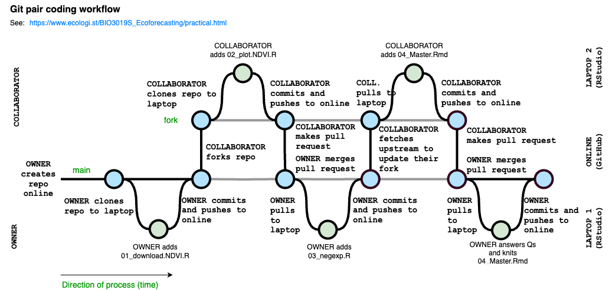
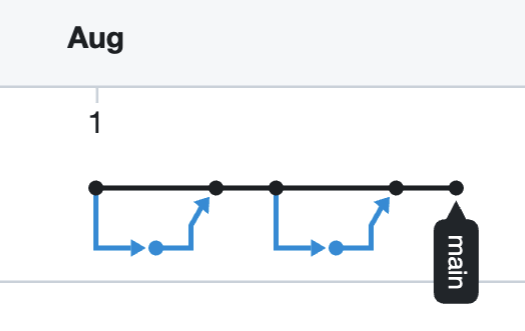

# Practical: Pair coding with GitHub {#practical}

<br>

> *Just a quick acknowledgement that I have adapted much of the framework for the following from Michael Dietze's [**Pair coding practical**](https://github.com/EcoForecast/EF_Activities/blob/master/Exercise_04_PairCoding.Rmd) that is a living online supplement to the book [@Dietze2017]. Thanks for sharing the code under an MIT license Mike! The main differences are that I've changed the subject matter from looking at phenology in Tall Grass Prairie using PhenoCam data to looking at postfire vegetation growth in Fynbos using MODIS satellite Normalized Difference Vegetation Index (NDVI), a measure of vegetation "greenness". This includes changing the core model we fit too. I've also used it to build familiarity with Least Squares versus Maximum Likelihood versus Bayes.*

<br>

***To complete this practical, you need to have done the preparation outlined in section*** \@ref(pracprep)***.***

<br>

## Objectives

The primary goal of this exercise is to gain experience working collaboratively to develop a reproducible scientific workflow. As such, this assignment must be completed with a partner. Specifically, we will outline an analysis, break the overall job into parts, and have each person complete part of the project. To put these parts together we will be using GitHub.

Along the way we will also be exploring the statistical concepts of Least Squares, Likelihood and Bayes by fitting the same model and estimating the parameters with each of the different approaches.

<br>

## Postfire regeneration

The goal of our analysis is to investigate the regeneration of Fynbos vegetation after fire by exploring a time-series of 16-day composite Normalized Difference Vegetation Index (NDVI) from the MODIS satellite mission, a measure of vegetation "greenness". You can read up on the data product [here](https://modis.gsfc.nasa.gov/data/dataprod/mod13.php). We'll be using data for one location (250m by 250m pixel) from the Silvermine section of Table Mountain National Park, and will be exploring the NDVI trajectory since the March 2015 fire. You can view the raw data in comma-separated value (.csv) format [here](https://github.com/jslingsby/BIO3019S_Ecoforecasting/blob/master/data/modisdata.csv). I describe the model in more detail throughout section \@ref(datafusion).

<br>

## Modular Design

The workflow for this analysis has five components:

1.  Download MODIS NDVI data
2.  Visualize the data
3.  Fit two competing negative exponential models using non-linear least squares (NLS)
4.  Fit the same models using Maximum Likelihood Estimation (MLE) and compare them using Akaike's Information Criterion (AIC)
5.  Fit the same models with Bayes

From this overall design, let's next outline the specific steps involved as pseudocode

    ### Fynbos Postfire Workflow
    ## 1. Download NDVI data for one postfire recovery cycle
    ## 2. Visualize data
    ## 3. Fit two variants of the negative exponential model with NLS
    ## 4. Visualize models and data
    ## 5. Fit two variants of the negative exponential model with MLE
    ## 6. Visualize models and data
    ## 7. Compare MLE model variants using AIC
    ## 8. Fit two variants of the negative exponential model with Bayes


From this overall design we can look for ways to modularize the analysis. One feature that jumps out is that we need to visualize the data three times (steps 2, 4 and 6), so we should definitely make a function to do that. The inputs to the function would be an independent variable (`age`) and a dependent variable (`NDVI`), which we might pass to the function as a dataframe for convenience. Since this is a graphing function, we'd also like the ability to set all the usual plotting parameters. This can be done in R by passing `...` as an argument to our new function, which allows us to pass other arguments to the internal *plot()* call. The proposed function interface (i.e. metadata about inputs and outputs, but excluding the code) would thus be:

    ##' Plot NDVI data
    ##'
    ##' @param dat  dataframe that contains columns "age" and "NDVI"
    ##' @param fit  a fitted model to overlay on the data if present
    ##' @param ...  additional graphing parameters
    ##' 
    plot.NDVI <- function(dat, fit = NA, ...)

Next, because the raw data will be downloaded off the web and we need to convert the dates from "character" to "Date" class and convert the NDVI data from Digital Numbers (DN; most satellite sensors store and transmit data as DN for various reasons such as because they are smaller and easier to transmit) to true NDVI values, let's go ahead and create a download function. This function just needs to know the URL for where to find the data. Unlike the plot function, this function will return something (the data that was downloaded), so it would be good design to document what is returned and how it will be formatted:

    ##' Download NDVI data
    ##' 
    ##' @param URL  web address where data is located
    ##' @return data.frame with 16-day windows as rows, variables as columns. Variables include calendar date (as class "Date" and NDVI values as class "numeric" ranging -1 to 1.)
    download.NDVI <- function(URL)

Next we'll fit two variants of a negative exponential model to the postfire NDVI trajectory data, and we're going to do this twice - once using non-linear least squares (NLS), and again using Maximum Likelihood Estimation (MLE). Fortunately, there is already an efficient base R function for fitting the NLS model `nls()`, so we'll only need to define functions for the MLE fits.

The input to such a fit would obviously be the same dataframe that we're using to make the plot. We'll also need to input a vector of initial guesses at the model parameters to help the numerical optimization converge (**NOTE: these are not priors as per a Bayesian analysis!**), and we'll want to return the full output from that numerical optimization so that we can check if it converged successfully. Finally, optimizing MLE requires:

a)  defining the model, and
b)  defining a function to optimize the parameters by minimizing the negative log of the likelihood

We're going to make (a) - the model - an independent function that we can call within (b), but can also call independently. The reason we want to be able to call the model independently is that the MLE optimization will only return the list if parameters of the model (and not the model itself), so we won't be able to plot the curve. If we make (a) a separate function, we can feed it the estimated model parameters to perform the model calculation and predict the shape of the curve, allowing us to plot it. In short, since we need the same function for two separate applications (the optimization and the plotting), it's more efficient to define it as a separate function.

First, we'll do the functions for the simpler variant of the model (don't be alarmed by the mysterious parameter names, they'll be explained in [in a later section](#task-4-owner-adds-functions-for-model-fitting-using-mle):

    ##' Function (a) to define the model for the simple negative exponential model using MLE:
    ##' @param theta  vector of model parameters in order: alpha, gamma, lambda
    ##' @param x      vector of x values
    ##' @return vector of model predictions
    pred.negexp <- function(theta, x)

    ##' Function (b) to fit the simple negative exponential model and minimize the -ln.likelihood
    ##' @param dat  dataframe of NDVI, age
    ##' @param par  vector of initial parameter guesstimates (in order of theta in function (a))
    ##' @return  output from numerical optimization
    fit.negexp.MLE <- function(dat, par)

Then we'll do the functions for the full model:

    ##' Function (a) to define the full model using MLE:
    ##' @param theta  vector of model parameters in order: alpha, gamma, lambda, A, phi (NOTE THE TWO EXTRA PARAMETERS!)
    ##' @param x      vector of x values
    ##' @return vector of model predictions
    pred.negexpS <- function(theta, x)

    ##' Function (b) to fit the full model and minimize the -ln.likelihood
    ##' @param dat  dataframe of NDVI, age
    ##' @param par  vector of initial parameter guesstimates (in order of theta in function (a))
    ##' @return  output from numerical optimization
    fit.negexpS.MLE <- function(dat, par)

At this point we've spent a good bit of time up front on organization -- we have a detailed plan of attack and have thought carefully about what each module is responsible for doing. Each task has well-defined inputs, outputs, and goals. Rather than facing a thankless job of documenting our code after we're done, even though we haven't written a single line of code yet, we are largely done with our documentation. What remains to do is implementation.

<br>

## Building the R workflow using Github

> For the rest of this prac you are going to work in pairs to collaboratively develop the workflow. At this point I reveal that I have written all the functions outlined above for you. All you are going to need to do is put them together using Github by carefully following the tasks below.

The rest of the workflow looks can be visualised below. Essentially, it is a series of steps where two individuals are developing our workflow in collaboration. At each step edits to the workflow are made offline (in RStudio on local laptops) and then synced back to GitHub (online). There is the OWNER of the _main_ branch of the git repository and the COLLABORATOR, who is contributing to the _main_ branch by creating their own _fork_ of the repository, which they edit offline (on their laptops) and make _pull requests_ to the OWNER to have their modifications _merged_ back into the _main_. Moving changes between either laptop and the online repositories requires _pulling_ the latest changes from the online repository to the laptop or _committing_ (naming a version) and _pushing_ changes from the laptop to online. Ultimately, it is the _main_ branch that we hope to have up to date, whereas the _fork_ can usually be discarded once all proposed changes (pull requests) are _merged_.



Interestingly, since all that's tracked are the _commits_, whereby versions are named (the nodes in the image). All that the online Git repo records is this figure below. The black is the the OWNER's _main_ branch and the blue is the COLLABORATOR's _fork_.

<br>



<br>


## Task 1: Create & Clone Repository

**Ok, let's get started**

Because we're going to employ version control in our project, our first step is to create the repository that our project will be stored in. **To ensure that both you and your partner get to see every step of how to work with version control, for the rest of this exercise you are going to complete every step, either from the perspective of the OWNER of the repository or as the COLLABORATOR**.

<br>

### OWNER

We begin with each of you creating a repository for which you are the "Owner" and your partner will be the "Collaborator" on.

1.  Go to your account on [github.com](https://github.com/) and under the Repositories tab click on the "New" button (green with a picture of a book on it)
2.  Choose a name for your repository, but **make sure it's different from your partner's** (Don't choose a "Repository template", and keep it a "Public" repository)
3.  Click the "Initialize this repository with a README" checkbox
4.  Optionally also provide a Description, Add a licence (e.g. MIT), and add R to the .gitignore (check ".gitignore" and search for the *R* template)
5.  Click "Create Repository"
6.  Copy the URL of your new repository
7.  To clone the repository to your computer, open RStudio so we can create a New Project using this URL. **Note:** If you already have a project open it will close when you do so. Don't worry, you can return to that project after the prac using the drop-down in the top-right of the RStudio window.

-   Select `New Project` from the drop-down menu in the top right corner
-   Select `Version Control` then `Git`
-   Paste the URL in and click `Create Project`

<br>

## Task 2: Add the first function: download.NDVI

Within this project we'll create separate files for each function in the analysis and then call them from a master script (or makefile) at the end. To make the order of the workflow clear, we'll want to name the files systematically. In the first file we'll implement the download.NDVI() function.

> NOTE: You'll see that I've provided the R code for how I actually accessed the data using library("MODISTools"), but have left that commented out. The function can take quite a long time so I thought best that we just read the output of that call from a file I've saved to the GitHub repository.

```{r}
##' Download MODIS NDVI data
##' @param URL  web address where data is located
##'
## 1) How I really did it. For the prac we'll use option 2 because it's faster
## library("MODISTools") #Call R library MODISTools that allows us to download MODIS satellite data directly into R
##
## ndvi <- mt_subset(product = "MOD13Q1",
##                         lat = -34.100875,
##                         lon = 18.449375,
##                         band = "250m_16_days_NDVI",
##                         start = "2000-01-01",
##                         end = "2021-10-01",
##                         progress = FALSE)
##

## 2) How we'll do it for the prac: Read the data from a .csv file in my github repository for the course notes
##
download.NDVI <- function(URL) {

  # Wrap function in an if/else loop that checks if the URL is valid
  if (length(URL) == 1 & is.character(URL) & substr(URL,1,4)=="http") {

    # Read in data
    modat <- read.csv(URL)

    # Convert Digital Numbers (more efficient for data storage) to NDVI
    modat$NDVI <- modat$value*0.0001

    # Convert calendar_date to class "Date"
    modat$calendar_date <- as.Date(as.character(modat$calendar_date))

    # Return the data
    return(modat)

  } else {

    # If the URL is not valid return...
    print(paste("download.NDVI: Input URL not provided correctly",URL))
  }
}
```

### OWNER

1.  In RStudio, click `File` \> `New File` \> `R Script`
2.  Copy and Paste the above function into this file 
    - Note: There's a copy button in the top right corner of the grey code block

3.  Save the file as "01_download.NDVI.R" in the default directory for the R project
    - Note: Using the exact file name is important, because we'll be calling it from other code later

4.  From the "Git" tab (top-right window in RStudio), click the box next to the file you just created. This is equivalent to *git add* if you were doing this command line in bash or terminal
5.  Click `Commit`, enter a log message, and click `Commit` again. This is equivalent to *git commit* in command line
6.  To "push" the change up to the online Git repo on Github click on the green up arrow. This is equivalent to *git push*.
    - Note: It is generally good practice to always *git pull* by clicking the blue down arrow before pushing, so that you sync any changes any collaborators may have made since you last pulled or pushed. In this case we know this is the first thing added to the repo and no one else has access anyway.

<br>

## Task 3: Collaborator adds plot.NDVI

With the first function complete, let's now imagine that a **COLLABORATOR** has been tasked with adding the second function. To do so they must first fork and clone the repository

### COLLABORATOR

1.  Go to Github and navigate to the project repository within the OWNER's workspace.
2.  Click `Fork`, which will make a copy of the repository to your own Github workspace.
3.  Copy the URL to your own version of the repo and follow the instructions above for cloning _**your copy of the repository**_ to your local machine in RStudio.
4.  Open a new file, enter the code below, and then save the file as "02_plot.NDVI.R"

```{r}
##' Plot NDVI data
##'
##' @param dat  dataframe that contains columns "age" and "NDVI"
##' @param fit  a fitted model to overlay on the data if present
##' @param ...  additional graphing parameters
##'
plot.NDVI <- function(dat, fit = NA, ...){

  if(!is.null(dat)){ # Begin if/else statement

    # Base plot of the data points
    plot(dat$age, dat$NDVI, ylab = "NDVI", xlab = "Postfire age (Years)")

    if(!is.na(fit[1])){ #Begin inner if statement

      # Overlay the fitted model on the plot
      lines(dat$age, predict(fit, list(x = dat$age)), col = 'skyblue', lwd = 3)

            } # End inner if statement

    } else {
    print("plot.NDVI: input data not provided or invalid")
  } # End if/else statement
}
```

5.  Follow the instructions above to Add, Commit, and Push the file back to your Github repo
6.  Next you want to perform a "pull request", which will send a request to the OWNER that they pull your new code into their version. From your Github repo (not the owner's!), click on `Pull requests` (top left) and hit the green `New Pull Request` button.
7.  Follow the instructions, creating a title, message, and confirming that you want to create the pull request (you may be asked to confirm a couple of times!).

### OWNER

1.  Once the COLLABORATOR has created the pull request, you should get an automatic email and also be able to see the pull request under the `Pull Requests" tab on your Github page for the project.
2.  Read the description of the proposed changes and then click on `Files Changed` to view the changes to the project. New code should be in green, while deleted code will be in pink.
3.  The purpose of a pull request is to allow the OWNER to evaluate the code being added before it is added. You can see this option under the `Review` button. You can also hover your mouse over any line of code and insert an inline comment in the code (don't do this during the prac). The COLLABORATOR would then have the ability to respond to any comments. In larger projects, all participants can discuss the code and decide whether it should be accepted or not. Furthermore, if the COLLABORATOR does any further pushes to Github before the pull request is accepted these changes will automatically become part of the pull request. While this is a very handy feature, it can also easily backfire if the COLLABORATOR starts working on something different in the meantime. This is the reason that experienced users of version control will use BRANCHES to keep different parts separate.
4.  Click on the `Conversation` page to return where you started. All participants can also leave more general comments on this page.
5.  If you are happy with the code, click `Merge Pull Request`. Alternatively, to outright reject a pull request you could click `Close pull request` (but please don't do this in the prac unless your partner has made an error - PLEASE CHECK IF THEY'VE ADDED THE RIGHT FUNCTION ETC)

<br>

## Task 4: Owner adds functions for model fitting using MLE {#task-4-owner-adds-functions-for-model-fitting-using-mle}

We are now past the 'set up' stage for both the OWNER and the COLLABORATOR, so for this task we'll explore the normal sequence of steps that the OWNER will use for day-to-day work

### OWNER

1.  Pull the latest code from Github (which includes the new function added by your collaborator). In RStudio this is done by clicking the light blue down arrow on the Git tab. This is equivalent to running the line *git pull origin master* in terminal/bash where origin refers to where you did your original clone from and master refers to your main branch (if you use branches you can pull other branches). Once you've pulled the latest code you should see the latest function file added to the files you can see in the `Files` tab of the bottom-right window of RStudio.
2.  Next, open up a new R file, add the code below for fitting the models with MLE, and save as "03_negexp.R"

```{r}
##' Functions to fit negative exponential model using MLE
##' 
##' 1) Fit SIMPLE negative exponential model using maximum likelihood estimation
##' 
##' Function (a) to define the model for the SIMPLE negative exponential model using MLE:
##' @param theta  parameter vector in order: alpha, gamma, lambda
##' @param x      vector of x values
##' @return vector of model predictions

pred.negexp <- function(theta, x){
  NDVI = theta[1] + theta[2] * (1 - exp(- x/theta[3]))
}


##' Function (b) to fit the SIMPLE negative exponential model and minimize the -ln.likelihood
##' @param dat  dataframe of NDVI, age
##' @param par  vector of initial parameter guesstimates (on order of theta)
##' @return  output from numerical optimization

fit.negexp.MLE <- function(dat,par){

  ## define log likelihood
  lnL.negexp <- function(theta,dat){
    -sum(dnorm(dat$NDVI, pred.negexp(theta, dat$age), 0.001, log=TRUE), na.rm=TRUE) #Note that I added a standard deviation of 0.001 (in reality we should get that from the MODIS data)
  }

  ## fit by numerical optimization
  optim(par, fn = lnL.negexp, dat=dat, control = list(maxit = 1000))
}

##########################################

##' 2) Fit negative exponential plus sine/seasonality term using maximum likelihood estimation
##' Function (a) to define the FULL model using MLE:
##' @param theta  parameter vector in order: alpha, gamma, lambda, A, phi
##' @param x      vector of x values
##' @return vector of model predictions

pred.negexpS <- function(theta, x){
  NDVI = theta[1] + theta[2] * (1 - exp(- x/theta[3])) +
    theta[4] * sin(2*pi*x + (theta[5] + pi/6*(3 - 1)))
}

##' Function (b) to fit the full model and minimize the -ln.likelihood
##'
##' @param dat  dataframe of NDVI, age
##' @param par  vector of initial parameter guesstimates (on order of theta)
##' @return  output from numerical optimization

fit.negexpS.MLE <- function(dat,par){

  ## define log likelihood
  lnL.negexpS <- function(theta,dat){
    -sum(dnorm(dat$NDVI, pred.negexpS(theta, dat$age), 0.001, log=TRUE), na.rm=TRUE) #Note that I added a standard deviation of 0.001 (in reality we should get that from the MODIS data)
  }

  ## fit by numerical optimization
  optim(par, fn = lnL.negexpS, dat=dat, control = list(maxit = 1000))
}

```

3.  As before, add your new file under the Git tab, Commit the change with a message, and push it back to Github

<br>

## A quick explanation of the MLE functions

To estimate the parameters in the model this function uses the likelihood principle which states that "a parameter value is more likely than another if it is the one for which the data are more probable". In other words, the maximum likelihood estimate of a parameter is the value of the parameter for which the probability of obtaining the observed data if the highest.

To use MLE we need to define a Likelihood, which is the relationship between the value of the parameter and the probability of some observed data. [For the record, the Likelihood is not a probability distribution because it does not integrate to 1]. In this case we're assuming a Normal likelihood (hence the use of `dnorm()` in the function) and use a standard deviation (0.001) that I've made up to represent the uncertainty (ideally this should come from the data; e.g. the radiative transfer modelling that was used to estimate the "surface reflectance" MODIS product from the "top of atmosphere reflectance" that is actually observed by the satellite). In a more detailed analysis we'd want to follow up to check both these assumptions, but it's a simple starting point for this practical demonstration.

Applying the likelihood principle we would then look for the most likely value of $\theta$, the vector of parameters in the model ($\alpha$, $\gamma$ and $\lambda$ in the simpler model, and adding $A$ and $\phi$ in the full model - see model equations below), which we call the Maximum Likelihood estimate. For a number or reasons that we won't go into in this module, it is common to work with negative log likelihoods instead of likelihoods, in which case the negative implies that instead of looking for the maximum we're now looking for the minimum (perhaps a bit difficult to get your head around, but it's a small trade-off that makes for much easier mathematics). The fact that logarithm is a monotonic transformation means that taking the log does not change the location of this minimum.

The code for this comes in three parts.

First are the models themselves, *pred.negexp()* and *pred.negexpS()*, which translate the equations:

-   For the "simple" model (*pred.negexp()*) it's just a negative exponential:

```{=tex}
\begin{gather}
  \text{NDVI}_{i,t}=\alpha_i+\gamma_i\Big(1-e^{-\frac{age_{i,t}}{\lambda_i}}\Big)
\end{gather}
```
-   For the "full" model (*pred.negexpS()*) we add a sine term:

```{=tex}
\begin{gather}
  \text{NDVI}_{i,t}=\alpha_i+\gamma_i\Big(1-e^{-\frac{age_{i,t}}{\lambda_i}}\Big)+
      A_i\text{sin}\Big(2\pi\times\text{age}_{i,t}+\Big[\phi+\frac{\pi}{6}(m_{i,t}-1)\Big]\Big)
\end{gather}
```
Where:

-   $\alpha$ is the NDVI at time 0 (i.e. directly after the fire)
-   $\gamma$ is the maximum average *increase* in NDVI
    -   i.e. the maximum NDVI reached by the blue curve is $\alpha + \gamma$
-   $\lambda$ is the rate of increase in NDVI
-   $A$ is the amplitude of the sine term
-   $\phi$ adjusts the timing of the sine term to account for the month the fire occurred
-   $m$ is the month that the fire occurred

Second is the negative log likelihood function, *lnL.negexp()*, which we're trying to minimize. The core of this is the Normal probability density, *dnorm()*. The first argument is the data, the second the is model, and the third is the standard deviation. The fourth argument says that we want to return the log density, which is much more accurate if it's performed internally than if we take the log of what's returned by dnorm. Since we have many data points dnorm returns a vector, which we then sum up and change the sign to turn this into a minimization problem.

The third part is a call to a numerical optimization function, *optim*, that searches through parameter space to find the set of parameters that minimize the negative log likelihood (i.e. that Maximize the Likelihood). Arguments are the initial parameter guesstimates, the function being minimized, and any additional parameters that get passed on to that function.

## Task 5: Collaborator adds the master script, Owner answers the questions

The day-to-day workflow for the COLLABORATOR is similar, but not exactly the same as the OWNER. The biggest differences are that the COLLABORATOR needs to start by making sure they're working on the latest version by pulling any changes from the OWNER's version of the repository, not their own, and need to do a pull request to get the OWNER to merge any of their suggested changes after they've pushed to their own repo.

### COLLABORATOR

1.  Pull latest version from OWNER. There are two ways to do this: (a) by syncing your online repo with the OWNER's repo and then *pull*ing those changes to your local laptop version, or (b) pulling directly to your laptop from the OWNER's repo.
  a) For this:
      - Go to your online repo on the website. You should see a grey box that says something like _"This branch is 1 commit behind names-of-owners-repo"_ and has a button that says `Sync Fork`. Click the button and select "Update branch".
      - Go to RStudio and _pull_ the changes to your local version by clicking the blue down arrow in the git console. You should now be good to go.

  b) Unfortunately, this has to be done from the command line rather than the pull button within RStudio, which just pulls from your own (the COLLABORATOR's) repository:
      - In RStudio go to `Tools` \> `Shell` to open a terminal
      - At the terminal type

```{=html}
<!-- -->
```
    git pull URL main

where URL is the address of the OWNER's Github repository. Because it is a pain to always remember and type in the OWNER's URL, it is common to define this as *upstream*

    git remote add upstream URL

which is a one-time task, after which you can do the pull as

    git pull upstream main

Ok, now that we're up to date we can carry on:

3.  Navigate to <https://github.com/jslingsby/BIO3019S_Ecoforecasting/blob/master/_04_Master.Rmd>, copy the raw contents
4.  Open a new Rmd file in RStudio and paste the contents.
5.  Save this file as "04_Master.Rmd".
6.  Within RStudio's Git tab, add the file and Commit. Use the Push (up arrow) button to push this to your own repository
7.  On Github.com, submit a pull request as before

### OWNER

1.  Evaluate and accept pull request. At this point your workflow should be complete and you should be able to run the analysis.

2.  Pull the updated repo to your local machine

3.  Open "04_Master.Rmd" and answer the questions wherever you see the numbered questions "Q" and "\>Answer:"

4.  Click `Knit` (top-centre of script window in RStudio) to generate an html document (it should pop up). Note that if you change an answer in the .Rmd file you will need to `Knit` it again for it to be reflected in the .html
  - If the file won't knit properly, it suggests you've done something wrong in the workflow... You need to fix this.

5.  Once complete, commit "04_Master.Rmd" and "04_Master.html" and push them back to the repo. Again, if you need to change any answers in the .Rmd you need to do the whole `Knit` \> `Commit` \> `Push`. I will only mark the latest version pushed before the assignment deadline.

6. Finally, upload the same "04_Master.html" to Vula so that your assignment is marked as complete and I can add a grade there.
