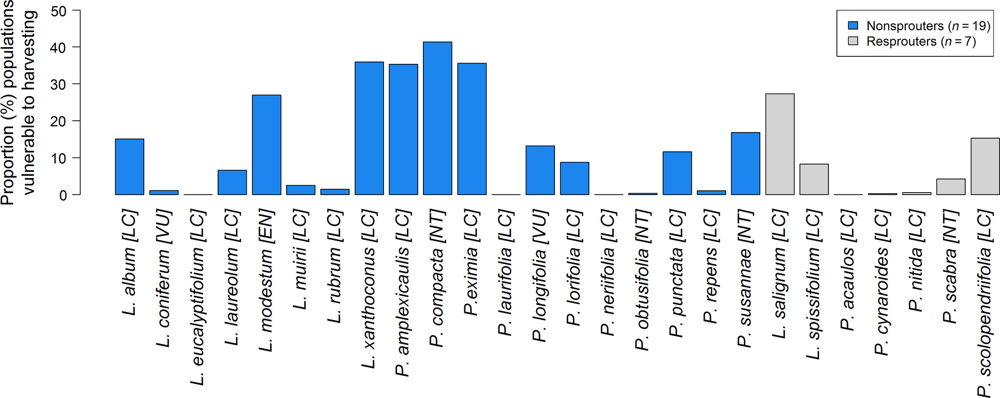

# Making forecasts {#forecasts}

We've got this far, and yet you haven't stopped me and asked _"What are ecological forecasts?"_ or _"Where are we going with all this?"_ The focus of this section is to provide some context with examples of what I believe are some forecasting needs or opportunities in the Fynbos Biome. These examples should hopefully also help provide practical context for some of the issues we'll address in the rest of the module.

> **Note:** These examples have not yet been developed into full _near-term iterative ecological forecasts_ sensu Dietze et al (2018). I also don't think they necessarily have to get all the way there to be useful. Think of it as an "ecological forecasting spectrum" where the gold standard is fully developed and automated near-term iterative ecological forecasts.

## Protea demography

The demography of species in the Proteaceae is used for the management of Fynbos in two ways:

- Firstly, at the ecosystem level, to help determine **acceptable fire return intervals**
- Secondly, at the species level, for setting guidelines for **sustainable wild harvesting** of Proteaceae inflorescences

The management guidelines for these two use cases are currently set by "rule of thumb"^[https://en.wikipedia.org/wiki/Rule_of_thumb]:

> 1. _"No fire should be permitted in fynbos until at least 50% of the population of the slowest-maturing species in an area have flowered for at least three successive seasons (or at least 90% of the individuals of the slowest maturing species in the area have flowered and produced seed). Similarly, a fire is probably not necessary unless a third or more of the plants of these slow-maturing species are senescent (i.e. dying or no longer producing flowers and seed)." [@CapeNatureFire]_
> 2. _"[There should be no] harvesting until at least 50% of the population had commenced flowering, a harvest of up to 50% of current season flower heads after this stage, and no harvesting at least one year prior to a prescribed burn" [@vanWilgen2016]_

<br>

Both these rules are based on the premise that the key to the persistence of Proteaceae populations is ensuring that there is a large enough seed bank present when a fire occurs for the population to recover.

Do you foresee any issues with this premise?

<br>

```{r proteaharvesting, echo=FALSE, fig.cap = "The fire-driven life-cycle of Fynbos Proteaceae species, including harvesting, taken from [@Treurnicht2021]. Population size/stability are determined by ***key demographic rates*** of adult **fecundity** (size of the canopy seed bank), post-fire seedling **recruitment** and adult fire **survival** (blue–grey boxes). These rates are affected in various ways by environmental conditions, density dependence, the timing, intensity and severity of fire, wildflower harvesting, etc", fig.width=3, fig.align = 'center', out.width="90%"}
knitr::include_graphics("img/proteaharvesting.jpg")
```

<br>

### Demographic rates

Based on extensive collection of locality and demographic data by conservation authorities (CapeNature and SANParks), citizen scientists (Protea Atlas Project and iNaturalist) and researchers, we know there are many issues with these rules of thumb, illustrated in Figures \@ref(fig:protearates) and \@ref(fig:proteavariation).

<br>

```{r protearates, echo=FALSE, fig.cap = "Variation in demographic rates of 26 serotinous Proteaceae species of seeder and sprouter life-history types across their distribution range [@Treurnicht2016]. (a) Adult fire survival; (b) Individual fecundity (F); and (c) Per-capita recruitment rate (R).", fig.width=3, fig.align = 'center', out.width="100%"}
knitr::include_graphics("img/protearates.jpg")
```

<br>

These issues include:

- **species differ in their reliance on seed** for their survival (e.g. sprouters vs seeders)
  - sprouters have high persistence of adults through fires and need fewer new recruits from seed
  - seeder adults are killed by fire, so populations depend entirely on recruitment from seed
- **species vary in their fecundity** (total number of seeds)
  - fecundity = number of inflorescences produced multiplied by the number of seeds per inflorescence
- **species vary in seed viability and recruitment success**
  - viability depends on pathogens, seed predators and other factors - many linked to the age of the seed or inflorescence
  - seed-specific recruitment depends on viability and seed properties (size etc), conditions during the establishment phase (rainfall etc), finding suitable microsites, etc.
  - per-capita recruitment is the combination of fecundity and seed-specific recruitment

<br>

```{r proteavariation, echo=FALSE, fig.cap = "Intraspecific variation in (a) fecundity and (b) recruitment in response to range-wide variation in fire return interval (time since fire), adult population density and soil moisture stress (% days with soil moisture stress) for *Protea punctata* [@Treurnicht2016].", fig.width=3, fig.align = 'center', out.width="80%"}
knitr::include_graphics("img/proteavariation.jpg")
```

<br>

- there is also **intraspecific variation** in fecundity and recruitment along climatic, soil, fire regime, population density, pollinator availability and other gradients
- and there is **interspecific variation** in this intraspecific variation 
  - i.e. species vary among populations in their response to climatic, soil, pollinator availability and other gradients

<br>

### Projecting population viability

A huge benefit of the herculean Proteaceae data collection (and management) effort is that it provides all the data we need to parameterize various types of models. In fact, data on the Proteaceae have been hugely important for the global development of species distribution and demographic models (see @Schurr2012, but also many subsequent papers).

In the context of the current discussion, the data have also been used for things like population viability analysis under varying harvesting rates [e.g. @Treurnicht2021]. 

```{r, echo=FALSE}
knitr::include_graphics("img/proteasensitivity.jpg")
```

```{r proteasensitivity, echo=FALSE, fig.cap = "Sensitivity to wildflower harvesting for various Proteaceae species [@Treurnicht2021]. **Above: Intraspecific variation in sensitivity** to harvesting depicted as maps for four different species with pink dots highlighting where the change in population-level extinction probability (the difference between extinction probabilities under 0% and 50% harvesting) is greater than 0.1. The white and black areas depict species-specific occurrence records and the geographical distribution of all Proteaceae in the Cape Floristic Region, respectively. **Below: Interspecific variation in sensitivity** to harvesting depicted as the proportion of populations per species that are highly vulnerable to harvesting.", fig.width=3, fig.align = 'center', out.width="90%"}

```

<br>

These models suggest that following the harvesting guidelines can greatly increase the probability of many populations going extinct (Figure \@ref(fig:proteasensitivity); @Treurnicht2021), but can also be used to explore population viability under changing climate, fire regimes, etc [e.g. @Merow2014] - or a combination of all of the above!

<br>

### Near-term iterative ecological forecasts

While the work by @Merow2014, @Treurnicht2021 and others represent ecological forecasts, they are usually either not specific about when they are forecasting to (e.g. @Treurnicht2021 ran their models to estimate extinction probabilities over 100 years in response to different harvesting regimes), or they are too far into the future to be amenable to iterative assessment, learning and updating (e.g. @Merow2014 project to 2050).

To adapt these into near-term iterative ecological forecasts requires:

- Making the forecasts more **near-term**
  - e.g. a range of scenarios 5-10 years into the future, or 1-2 years into the next fire cycle
- Setting up formalized **data collection and management** systems to feed data back into the modelling workflow
  - i.e. coordinating and guiding the efforts of citizen scientists, conservation authorities, etc.
- Adapting the models and workflow to be able to ingest and **assimilate new data and produce new forecasts automatically**
- Make sure that the models adequately **characterize and propagate uncertainty** throughout the analyses

Clearly, while huge effort has been invested into the demography of Proteaceae, and they are likely to be one of the lowest hanging fruit for development into near-term iterative ecological forecasts, there is a lot more work to be done! Still, the history of productive research on Proteaceae shows it would clearly be worth the effort, and we already have decades of data that allow us to learn by backcasting or forecasting from old to more recently collected data. Even if early forecasts are woefully wrong, they will help us learn and improve.

> "The need to start forecasting is now; the time for making ecology more predictive is here, and learning by doing is the fastest route to drive the science forward." - @Dietze2018

<br>

And some specific to fire management

- The fire requirements for **Proteaceae are not necessarily representative** of all Fynbos species (including animals!)
- What do you do in areas where there are **no Proteaceae**?


<br>

## Post-fire recovery trajectories

- Wilson paper
- FRI diagram
- link to Protea dem models

- Change detection...
- emma.eco
- Developing into a state-space model with near-real time inputs?

## Impacts of IAPs on runoff
