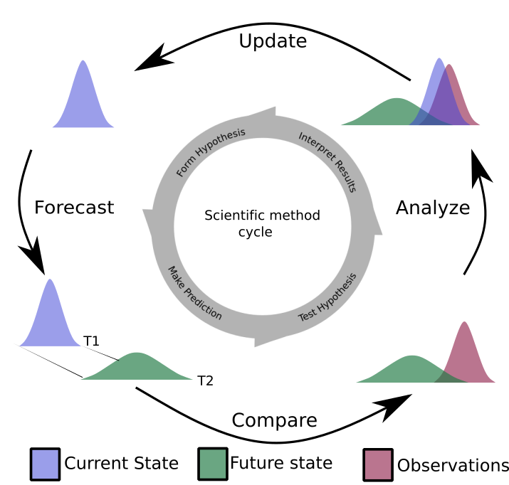
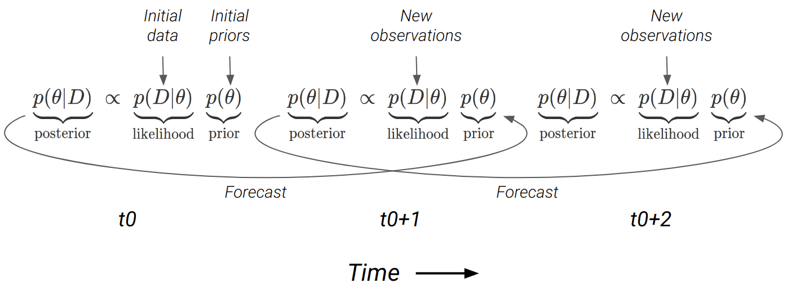
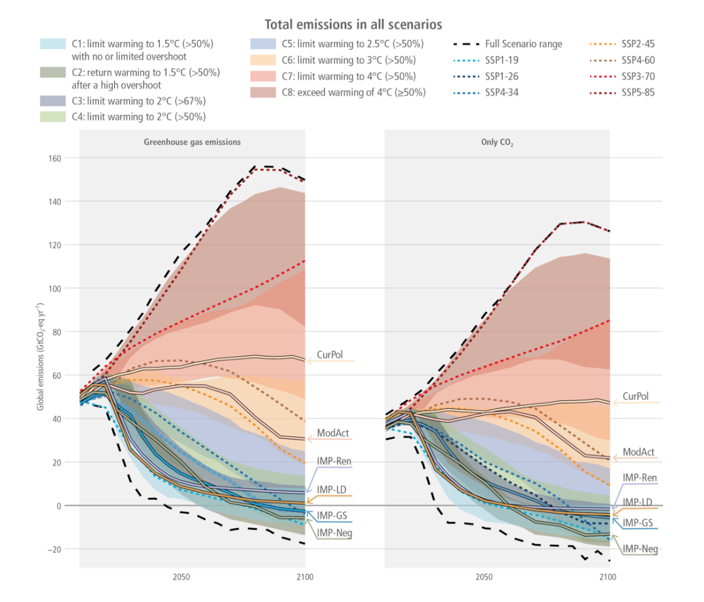
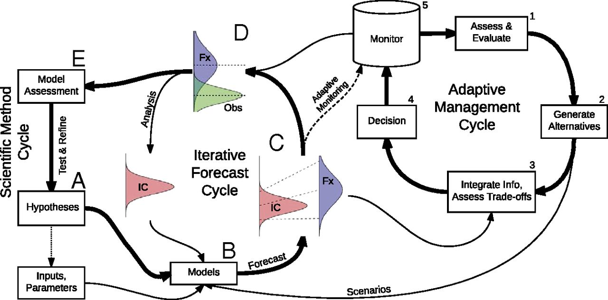
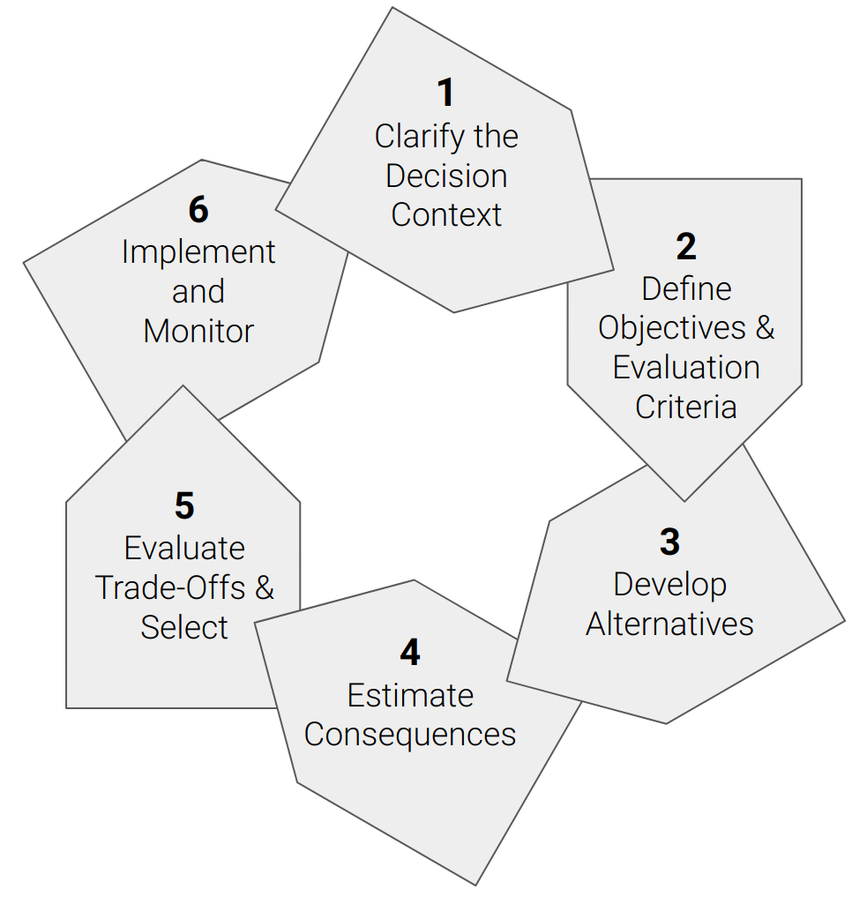
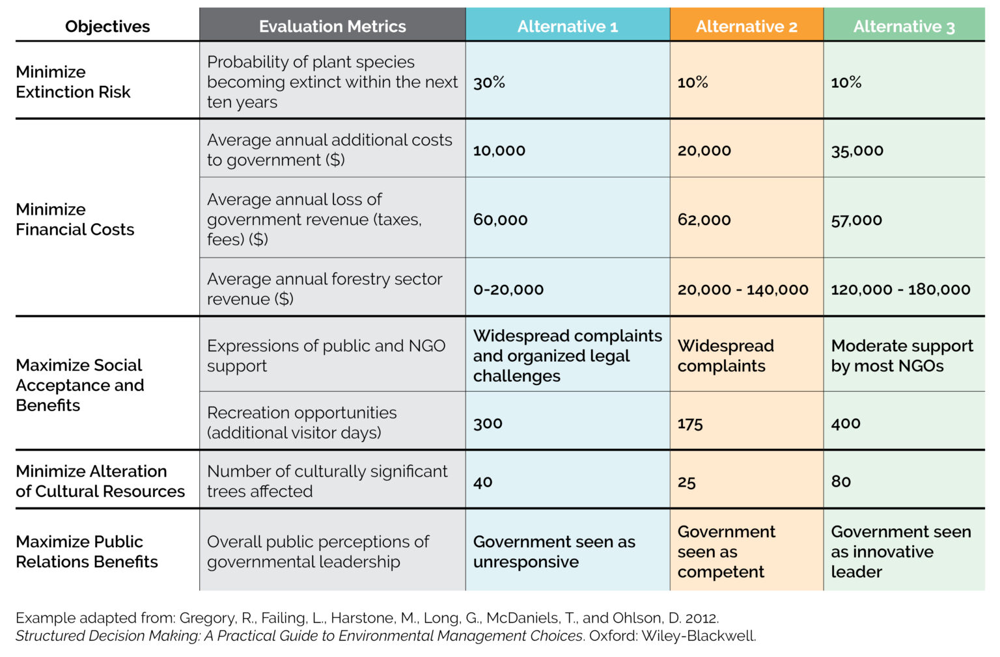

# Completing the Forecast Cycle {background-color="#33431e"}

Jasper Slingsby

## Completing the Forecast {background-color="#33431e"}

<br/>

<br/>

Today we'll complete the forecast cycle (through ***data assimilation***) and spend a little time discussing ***decision support***.

## Data assimilation {.smaller background-color="#c2c190"}

::: columns

::: {.column width="50%"}

```{r ecoforecastingloop3, echo=FALSE, fig.cap = "The iterative ecological forecasting cycle in the context of the scientific method, demonstrating how we stand to learn from making iterative forecasts. From [lecture on data assimilation by Michael Dietze](https://www.dropbox.com/s/pqjozune75m7wl0/09_DataAssimilation.pptx?dl=0).", fig.width=3, fig.align = 'center', out.width="100%"}

```

::: 

::: {.column width="50%"}

***Recap:*** 

The iterative ecological forecasting and the scientific method are closely aligned cycles or loops. 

<br>

**Bayes Theorem provides an iterative probabilistic framework** that makes it easier to update predictions as new data become available, mirroring the scientific method and completing the forecasting cycle. 

<br>

Today we'll unpack this in a bit more detail.

:::

:::


## Operational data assimilation {.smaller background-color="#33431e"}

Most modelling workflows are set up to: 

**(a) fit the available data** and estimate parameters etc (we'll call this ***analysis***), which they then often use to

**(b) make predictions** (which if made forward through time are typically ***forecasts***)

<br/>

::: {.fragment}

They usually stop there. Few workflows are set up to make forecasts repeatedly or iteratively, updating predictions as new observations are made.

<br/>

When making iterative forecasts, one ***could just refit the model*** and entire dataset with the new observations added, but there are a few reasons why this may not be ideal...

:::

## Operational data assimilation {.smaller background-color="#33431e"}

***Why not just refit the model?***

::: {.incremental}

1. Complex models and/or large datasets can be very ***computationally taxing*** 
  -e.g. @Slingsby2020 ran the Hierarchical postfire model for the Cape Peninsula (~4000 MODIS pixels) over 4 days on a computing cluster with 64 cores and 1TB of RAM...
2. Depending on the model, ***you may not be able to reuse older data*** in the new model fit, meaning you can't take advantage of all available data...
3. Refitting the model ***doesn't make the most of learning*** from new observations and the forecast cycle...

:::

::: {.fragment}

The alternative is to ***assimilate the data sequentially***, through forecast cycles, imputing observations a bit at a time as they're observed. 

:::


## Operational data assimilation {.smaller background-color="#33431e"}

Sequential data assimilation has several advantages:

::: {.incremental}

1. They ***can handle larger datasets***, because you don't have to assimilate all data at once.
2. If you start the model in the past and update towards present day, you have ***the opportunity to validate your predictions***, and see how well the model does. 
  
  - Does it improve with each iteration (i.e. is it learning)?
  - Think of it as letting your model get a run-up like a sportsperson before jumping/bowling/throwing.

:::

::: {.fragment}

Assimilating data sequentially is known as the ***sequential or operational data assimilation problem*** and occurs through two steps (the main components of the forecast cycle):

- ***the forecast step***, where we project our estimates of the current state forward in time
- ***the analysis step***, where we update our estimate of the state based on new observations

:::

## Operational data assimilation {.smaller background-color="#33431e"}

```{r forecaststeps, echo=F, message=F, fig.cap = "The two main components of the forecast cycle are ***the forecast step*** (stippled lines), where we project from the initial state at time 0 ($t_0$) to the next time step ($t_{0+1}$), and ***the analysis step***, where we use the forecast and new observations to get an updated estimate of the current state at $t_{0+1}$, which would be used for the next forecast to $t_{0+2}$.", fig.align = 'center', out.width="75%"}

library(tidyverse)

ddat <- data.frame(x = c(rnorm(5000, 0, 1), rnorm(5000, 5, 2), rnorm(5000, -1, 1), rnorm(5000, 1, 1)), 
                   Steps = factor(c(rep("1. Determine initial state", 5000), rep("2. Make forecast", 5000), rep("3. Collect new observations", 5000), rep("4. Update state", 5000)), levels = c("1. Determine initial state", "2. Make forecast", "3. Collect new observations", "4. Update state")), 
                   Facet = c(rep("t0", 5000), rep("t0+1", 15000))) 

ggplot(ddat, aes(x, fill = Steps, colour = Steps)) +
  geom_density(alpha = 0.1, bw = 1) +
  geom_segment(aes(x = 4, y = 0, xend = 10, yend = 0.4), col = "gray50", size = 0.5, alpha = .2, linetype = 3, data = subset(ddat, Facet == "t0")) +
    geom_segment(aes(x = 0, y = 0, xend = 5, yend = 0.4), col = "gray50", size = 0.5, alpha = .2, linetype = 3, data = subset(ddat, Facet == "t0")) +
    geom_segment(aes(x = -4, y = 0, xend = 0, yend = 0.4), col = "gray50", size = 0.5, alpha = .2, linetype = 3, data = subset(ddat, Facet == "t0")) +
  ylab("Density") +
  coord_flip() +
  facet_wrap(vars(Facet))

```


## The Forecast Step {.smaller background-color="#33431e"}

While the first step has to be analysis, because you have to fit your model before you can make your first forecast, the forecast step is probably easier to explain first.

<br/>

::: {.fragment}

The goals of the forecast step are to:

1. To ***predict*** the value of the state variable(s) at the next time step
2. Indicate the ***uncertainty*** in our forecast (based on uncertainty that we have propagated through our model from various sources (data, priors, parameters, etc))

:::

::: {.fragment}

In short, we want to ***propagate uncertainty in our variable(s) of interest forward through time*** (and sometimes through space, depending on the goals).

:::


## The Forecast Step {.smaller background-color="#33431e"}

There are a number of methods for propagating uncertainty into a forecast, mostly based on the same methods one would use to propagate the uncertainty through a model as discussed in the previous lecture.

<br/>

```{r propagatinguncertainty, echo=F}

upm <- data.frame(
  Approach = c("Analytical", "", "Numerical"),
  Distribution = c("Variable Transform", "", "Monte Carlo (Particle Filter)"),
  Moments = c("Analytical Moments (Kalman Filter)", "Taylor Series (Extended Kalman Filter)", "Ensemble (Ensemble Kalman Filter)")
)

knitr::kable(upm, caption = "**Methods for propagating uncertainty through models (and into forecasts)**")

```

## The Forecast Step {.smaller background-color="#33431e"}

Explaining the different methods is beyond the scope of this module, but just a reminder that there's ***a trade-off*** between the methods whereby:

- the ***most efficient*** (the Kalman filter) also come with the most stringent assumptions (linear models and homogeneity of variance only) and only provide moments (means, standard deviations, etc)
- the ***most flexible*** (particle filter - often called sequential Monte Carlo (SMC) - a Bayesian approach) are the most computationally taxing, but provide full distributions

::: {.fragment}

In short, if your model isn't too taxing, or you have access to a large computer and time to kill, SMC is probably best (and often easiest if you're already working in Bayes)...

:::


## The Analysis Step {.smaller background-color="#33431e"}

```{r forecaststeps2, echo=F, message=F, fig.cap = "The two main components of the forecast cycle are ***the forecast step*** (stippled lines), where we project from the initial state at time 0 ($t_0$) to the next time step ($t_{0+1}$), and ***the analysis step***, where we use the forecast and new observations to get an updated estimate of the current state at $t_{0+1}$, which would be used for the next forecast to $t_{0+2}$.", fig.align = 'center', out.width="75%"}

library(tidyverse)

ddat <- data.frame(x = c(rnorm(5000, 0, 1), rnorm(5000, 5, 2), rnorm(5000, -1, 1), rnorm(5000, 1, 1)), 
                   Steps = factor(c(rep("1. Determine initial state", 5000), rep("2. Make forecast", 5000), rep("3. Collect new observations", 5000), rep("4. Update state", 5000)), levels = c("1. Determine initial state", "2. Make forecast", "3. Collect new observations", "4. Update state")), 
                   Facet = c(rep("t0", 5000), rep("t0+1", 15000))) 

ggplot(ddat, aes(x, fill = Steps, colour = Steps)) +
  geom_density(alpha = 0.1, bw = 1) +
  geom_segment(aes(x = 4, y = 0, xend = 10, yend = 0.4), col = "gray50", size = 0.5, alpha = .2, linetype = 3, data = subset(ddat, Facet == "t0")) +
    geom_segment(aes(x = 0, y = 0, xend = 5, yend = 0.4), col = "gray50", size = 0.5, alpha = .2, linetype = 3, data = subset(ddat, Facet == "t0")) +
    geom_segment(aes(x = -4, y = 0, xend = 0, yend = 0.4), col = "gray50", size = 0.5, alpha = .2, linetype = 3, data = subset(ddat, Facet == "t0")) +
  ylab("Density") +
  coord_flip() +
  facet_wrap(vars(Facet))

```


## The Analysis Step {.smaller background-color="#33431e"}

> _NOTE: I'm only explaining the general principles for Bayes. There are frequentist approaches, but I'm not going to go there._

::: {.fragment}

This step involves using Bayes Theorem to combine our prior knowledge (our forecast) with new observations (at $t_{0+1}$) to generate an updated state for the next forecast ($t_{0+2}$). 


```{r dataassimilation, echo=FALSE, fig.cap = "The forecast cycle chaining together applications of Bayes Theorem at each timestep ($t_0, t_1, ...$). The forecast from one timestep becomes the prior for the next. The forecast is directly sampled as a posterior distribution when using MCMC.", fig.align = 'center', out.width="75%"}

```

:::

## The Analysis Step {.smaller background-color="#33431e"}

This is essentially sequential Monte Carlo (SMC), also known as a particle filter.


{width=80%}


## The Analysis Step {.smaller background-color="#33431e"}

<br>

This is better than just using the new data as your updated state, because:

::: {.incremental}

- it ***uses our prior information*** and understanding
- it allows our model to ***learn and (hopefully) improve*** with each iteration
- there is likely ***error (noise) in the new data***, so it can't necessarily be trusted more than our prior understanding anyway

:::

::: {.fragment}

Fortunately, ***Bayes deals with this very nicely***: 

- if the forecast (prior) is uncertain and new data precise then the data will prevail
- if the forecast is precise and the new data uncertain, then the posterior will retain the legacy of previous observations

:::


## The Analysis Step {.smaller background-color="#33431e"}

```{r analysissteps, echo=F, message=F, fig.cap = "Comparison of situations where there is (A) high forecast uncertainty (the prior) and low observation error (data), versus (B) low forecast uncertainty and high observation error on the posterior probability from the analysis step. Note that the data and prior have the same means in panels A and B, but the variances differ.", fig.align = 'center', out.width="75%"}
ddat <- data.frame(x = c(rnorm(5000, 0, 1), rnorm(5000, 0, 3), rnorm(5000, 1, 0.75), rnorm(5000, 4, 0.75), rnorm(5000, 5, 3), rnorm(5000, 5, 1)), 
                   Label = c(rep("Data", 10000), rep("Posterior", 10000), rep("Prior", 10000)), 
                   Facet = rep(c(rep("A", 5000), rep("B", 5000)), 3)) 
ggplot(ddat, aes(x, fill = Label, colour = Label)) +
  geom_density(alpha = 0.1, bw = 1) +
  ylab("Density") +
  coord_flip() +
  facet_wrap(vars(Facet))
```


## Ensemble forecasts  {.smaller background-color="#33431e"}

Lastly, just a note that I've mostly dealt with single forecasts and haven't talked about how to deal with ***ensemble forecasts***. There are data assimilation methods to deal with them, but we don't have time to cover them. 

<br/>

::: {.fragment}

The methods, and how you apply them, depend on the kind of ensemble. Usually, ensembles can be divided into ***three kinds***, but you can have mixes of all three:

1. Where you use the ***same model***, but vary the inputs to explore ***different scenarios***.
2. Where you have a set of ***nested models*** of increasing complexity (e.g. like our postfire models with and without the seasonality term).
3. A mix of models with ***completely different model structures*** (or even approaches: empirical vs mechanistic, frequentist vs Bayesian, etc) aimed at forecasting the same thing.

:::

## Decision Support {background-color="#33431e"}

<br/>

Probably the hardest part of the whole ecological forecasting business... people!

<br/>

It is also a huge topic. Here I just touch on a few hints and difficulties.


## Decision Support {background-color="#33431e"}

<br/>

First and foremost, ***the decision at hand may not be amenable to a quantitative approach***.

  - Ecological forecasting requires a ***clearly defined*** information need with ***measurable*** (and modelable) state variables, framed within one or multiple ***decision alternatives*** (scenarios). 

## Decision Support {background-color="#33431e"}

<br/>

Secondly, there's also the risk of ***external factors making the forecasts unreliable***, especially if they are not controlled by the decision maker and/or their probability is unknown (e.g. fire, pandemics, etc). 


## Decision Support {.smaller background-color="#33431e"}

One way to try to deal with external factors is by developing ***scenarios with different boundary conditions***. 

::: columns
::: {.column width="50%"}

<br>

  - e.g. scenarios with and without a fire, or different future climate states under alternative development pathways, etc. 
  - Scenarios are often *"what if"* statements designed to address major sources of uncertainty that make it near-impossible to make accurate predictions with a single forecast.

::: 

::: {.column width="50%"}

:::

:::

## Decision Support {.smaller background-color="#33431e"}

<br/>

> A reminder of the distinction between ***predictions _versus_ projections***:

>  - _***predictions*** are statements about the probability of the occurrence of events or the state of variables in the future ***based on what we currently know***_
>  - _***projections*** are statements about the probability of the occurrence of events or the state of variables in the future ***given specific scenarios with clear boundary conditions***_


## Decision Support {.smaller background-color="#33431e"}

<br/>

### In an ideal world...

You'll be working with an organized team that is a well-oiled machine at implementing ***Adaptive Management*** and ***Structured Decision Making*** and you can naturally slot into their workflow.

<br>

The advantages of ***Adaptive Management*** and ***Structured Decision Making*** are that they are founded on the concept of ***iterative learning cycles***, which they have in common with the ecological forecasting cycle and the scientific method.


## Decision Support {.smaller background-color="#33431e"}

```{r dietze2018F1b, echo=FALSE, fig.cap = "Conceptual relationships between iterative ecological forecasting, adaptive decision-making, adaptive monitoring, and the scientific method cycles [@Dietze2018].", fig.width=4, fig.align = 'center', out.width='100%'}

```

<br>

The iterative ecological forecast cycle integrates nicely with Adaptive Management...

## Structured Decision Making {.smaller background-color="#33431e"}

::: columns

::: {.column width="40%"}

<br/>

```{r structureddecisions1, echo=FALSE, fig.cap = "The Structured Decision Making Cycle *sensu* @Gregory2012.", fig.width=3, fig.align = 'center', out.width='100%'}

```

:::

::: {.column width="60%"}

<br/>

Focused on the process of ***coming to a decision***, not the process of management, but very useful in the first iteration of the Adaptive Management Cycle. 

<br/>

::: {.fragment}

Could easily be the topic of a whole course in itself, e.g. this [online course by the US Fish and Wildlife Service](https://www.fws.gov/training/ALC3183-an-overview-of-structured-decision-making).

:::    
:::
:::

## Structured Decision Making {.smaller background-color="#33431e"}

::: columns

::: {.column width="40%"}

<br/>

```{r structureddecisions2, echo=FALSE, fig.cap = "The Structured Decision Making Cycle *sensu* @Gregory2012.", fig.width=3, fig.align = 'center', out.width='100%'}

```

:::

::: {.column width="60%"}

<br/>

It is valuable when there are many stakeholders with ***disparate interests***. 

::: {.fragment}

  - ***decisions are ultimately about values*** and often require evaluating trade-offs among properties with ***incomparable units*** - e.g. people housed/fed/watered vs species saved from extinction... 
  - this can be a highly emotive space, and greatly benefits from a structured facilitation process

:::    
:::
:::


## Structured Decision Making {.smaller background-color="#33431e"}

::: columns

::: {.column width="40%"}

<br/>

```{r structureddecisions3, echo=FALSE, fig.cap = "The Structured Decision Making Cycle *sensu* @Gregory2012.", fig.width=3, fig.align = 'center', out.width='100%'}

```

:::

::: {.column width="60%"}

<br/>

It tries to bring ***all issues and values to light*** to be considered in a transparent framework where trade-offs can be identified and considered.

  - You can't make the right choice if it isn't on the table...
  - Step 0 is just identifying the necessary stakeholders (and getting them to the table).
      - e.g. indigenous knowledge holders and other local experts - not just the authorities responsible for making the decisions.

:::
:::

## Structured Decision Making {.smaller background-color="#33431e"}

::: columns

::: {.column width="40%"}

<br/>

```{r structureddecisions4, echo=FALSE, fig.cap = "The Structured Decision Making Cycle *sensu* @Gregory2012.", fig.width=3, fig.align = 'center', out.width='100%'}

```

:::

::: {.column width="60%"}

<br/>

It ***directly addresses the social, political or cognitive biases*** that marginalise some values or alternatives. 

::: {.fragment}

- Many decisions pit people's immediate needs (water, housing, etc) against the environment. We'd rather ignore that choosing one is choosing against the other, but ***if we're not transparent about this we're not going to learn from our decisions and improve them in the next iteration.***

:::
:::
:::

## Structured Decision Making {.smaller background-color="#33431e"}

::: columns

::: {.column width="40%"}

<br/>

```{r structureddecisions5, echo=FALSE, fig.cap = "The Structured Decision Making Cycle *sensu* @Gregory2012.", fig.width=3, fig.align = 'center', out.width='100%'}

```

:::

::: {.column width="60%"}

<br/>

But...

::: {.fragment}

- Very tricky to do well and easy to do badly...
- Requires a good, well-trained facilitator who understands stakeholder and researcher needs
- Needs trust and buy-in from participants
- Can take a lot of time to get right...
- Often simplifies a problem so that it is feasible to analyse

:::
:::
:::

## Ideal world? (see slide 7) {.smaller background-color="#33431e"}

<br/>

The beauty for the forecaster in this scenario is that **a lot of the work is already done**. 

::: {.incremental}

- The decision alternatives (scenarios) have been well framed.
- The performance measures, state variables of interest and associated covariates mostly identified. 
- Iterations of the learning cycle may even have already begun (through the Adaptive Management Cycle) and all you need do is ***develop the existing qualitative model into something more quantitative*** as more data and understanding are accumulated. 
    - Think of the *Protea* example in the second lecture, where the demography of these species is already used for decision making using semi-quantitative "rules of thumb".

:::

## Ideal world? {.smaller background-color="#33431e"}

::: columns

::: {.column width="40%"}

<br/>

```{r structureddecisions6, echo=FALSE, fig.cap = "The Structured Decision Making Cycle *sensu* @Gregory2012.", fig.width=3, fig.align = 'center', out.width='100%'}

```

:::

::: {.column width="60%"}

<br/>

Can focus on estimating (forecasting) consequences and evaluating trade-offs among alternatives (steps 4 and 5), rather than having to do the whole process from scratch.

:::
:::

## Estimating consequences... {.smaller background-color="#33431e"}

::: columns

::: {.column width="40%"}

<br/>

Often one has to forecast multiple state variables, which may or may not be related to each other.

<br/>

Decision-makers may also have to consider trade-offs among qualitative as well as quantitative consequences under different decision scenarios.

::: {.fragment}

<br/>

What's missing?

::: 
::: 

::: {.column width="60%"}

<br/>

```{r consequence_table, echo=FALSE, fig.cap = "An example consequence table adapted from @Gregory2012 by [Environmental Science Associates](https://esassoc.com/news-and-ideas/2022/10/structured-decision-making-for-better-environmental-management/).", fig.width=3, fig.align = 'center', out.width='100%'}

```

:::
:::

## Uncertainty? {.smaller background-color="#33431e"}

::: columns

::: {.column width="50%"}

### Model

Quantify and propagate uncertainty!

> _"It is better to be honestly uncertain than confidently wrong."_

Sensitivity analysis:

- How robust is the decision to uncertainty in the model and assumptions?

- How wrong does your model have to be before the decision changes?


:::

::: {.column width="50%"}

### Communication

- Communicate uncertainty in the model and forecasts clearly to decision-makers.

- Be transparent about the limitations of the model and the assumptions made.

- Use uncertainty visualizations to help decision-makers understand the range of possible outcomes.

- Frame uncertainty in multiple ways - e.g. 5% vs 1 in 20

:::
:::


## References {.smaller background-color="#33431e"}
